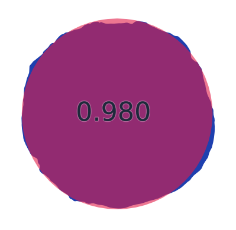
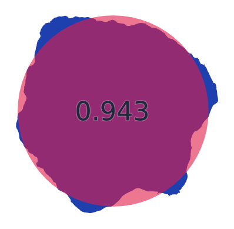
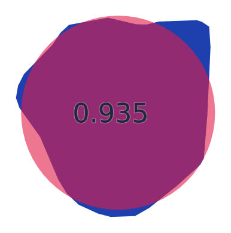
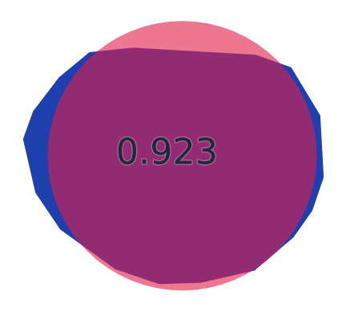
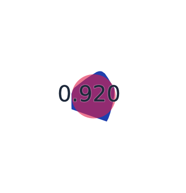

# 「日本で最も丸い湖」を探して

解説: [「日本で最も丸い湖」を探して - GIS, 円形度, 最急降下法](https://zenn.dev/mierune/articles/9f970dc3e61a66)

## 1. 倶多楽湖 （北海道）

- スコア: 0.97819 （9 iterations）
- 円形度: 0.94545
- 面積: 5km&sup2;, 周囲長: 8km

## 2. 田沢湖 （秋田県）

- スコア: 0.94299 （13 iterations）
- 円形度: 0.77460
- 面積: 26km&sup2;, 周囲長: 20km

## 3. 巣鷹湖 （長野県）

- スコア: 0.93466 （17 iterations）
- 円形度: 0.90200
- 面積: 28,807m&sup2;, 周囲長: 634m

## 4. 明月湖 （山形県）

- スコア: 0.92257 （16 iterations）
- 円形度: 0.95455
- 面積: 978m&sup2;, 周囲長: 113m

## 5. 南伊奈ヶ湖 （山梨県）

- スコア: 0.92024 （9 iterations）
- 円形度: 0.87667
- 面積: 13,808m&sup2;, 周囲長: 445m

## 6. ~ 556.

[results.md](./results.md) で見ることができます。
