## 1. 倶多楽湖 （北海道）

- スコア: 0.980 （2 iters）
- 円形度: 0.945
- 面積: 4,712,454, 周囲長: 7,914

## 2. 田沢湖 （秋田県）

- スコア: 0.943 （5 iters）
- 円形度: 0.775
- 面積: 25,876,605, 周囲長: 20,489

## 3. 巣鷹湖 （長野県）

- スコア: 0.935 （6 iters）
- 円形度: 0.902
- 面積: 28,807, 周囲長: 634

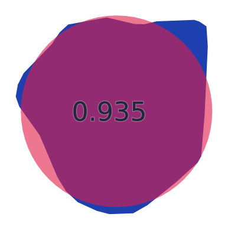

## 4. 明月湖 （山形県）

- スコア: 0.923 （8 iters）
- 円形度: 0.955
- 面積: 978, 周囲長: 113

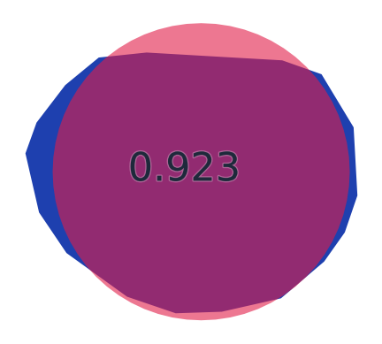

## 5. 鰻池 （鹿児島県）

- スコア: 0.920 （3 iters）
- 円形度: 0.860
- 面積: 1,206,303, 周囲長: 4,199

## 6. 南伊奈ヶ湖 （山梨県）

- スコア: 0.920 （4 iters）
- 円形度: 0.877
- 面積: 13,808, 周囲長: 445

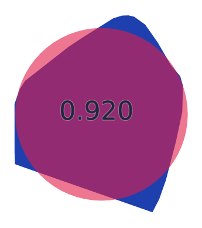

## 7. 東雲湖（東小沼） （北海道）

- スコア: 0.918 （8 iters）
- 円形度: 0.920
- 面積: 48,387, 周囲長: 813

## 8. パンケ沼 （北海道）

- スコア: 0.911 （6 iters）
- 円形度: 0.736
- 面積: 3,566,827, 周囲長: 7,806

## 9. 宇曽利山湖 （青森県）

- スコア: 0.907 （14 iters）
- 円形度: 0.665
- 面積: 2,690,288, 周囲長: 7,131

## 10. 池田湖 （鹿児島県）

- スコア: 0.901 （13 iters）
- 円形度: 0.610
- 面積: 10,953,687, 周囲長: 15,025

## 11. 大沼 （北海道）

- スコア: 0.898 （9 iters）
- 円形度: 0.597
- 面積: 4,907,926, 周囲長: 10,164

## 12. 洞爺湖 （北海道）

- スコア: 0.891 （3 iters）
- 円形度: 0.329
- 面積: 71,055,532, 周囲長: 52,090

## 13. 大月湖 （長野県）

- スコア: 0.890 （16 iters）
- 円形度: 0.626
- 面積: 28,466, 周囲長: 756

## 14. 一碧湖 （静岡県）

- スコア: 0.887 （6 iters）
- 円形度: 0.376
- 面積: 188,945, 周囲長: 2,513

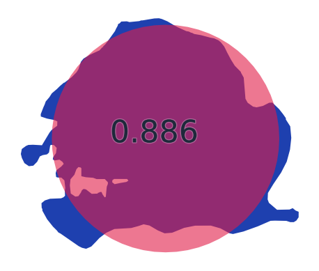

## 15. 四尾連湖 （山梨県）

- スコア: 0.884 （7 iters）
- 円形度: 0.907
- 面積: 67,535, 周囲長: 967

## 16. 昭和湖 （岩手県）

- スコア: 0.883 （18 iters）
- 円形度: 0.808
- 面積: 2,428, 周囲長: 194

## 17. 白竜湖 （山形県）

- スコア: 0.882 （44 iters）
- 円形度: 0.447
- 面積: 57,895, 周囲長: 1,275

## 18. すずらん湖 （長野県）

- スコア: 0.878 （4 iters）
- 円形度: 0.733
- 面積: 10,890, 周囲長: 432

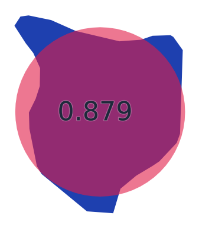

## 19. 白樺湖 （長野県）

- スコア: 0.876 （6 iters）
- 円形度: 0.788
- 面積: 10,738, 周囲長: 414

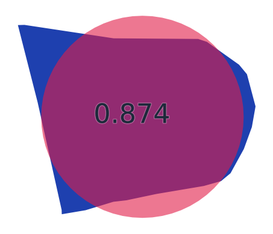

## 20. 沼沢湖 （福島県）

- スコア: 0.873 （13 iters）
- 円形度: 0.628
- 面積: 3,004,250, 周囲長: 7,751

## 21. 兜沼 （北海道）

- スコア: 0.873 （10 iters）
- 円形度: 0.675
- 面積: 807,548, 周囲長: 3,878

## 22. 西ノ湖 （栃木県）

- スコア: 0.869 （18 iters）
- 円形度: 0.459
- 面積: 169,975, 周囲長: 2,156

## 23. 聖湖 （長野県）

- スコア: 0.869 （15 iters）
- 円形度: 0.683
- 面積: 67,506, 周囲長: 1,115

## 24. 厚岸湖 （北海道）

- スコア: 0.869 （5 iters）
- 円形度: 0.582
- 面積: 32,814,846, 周囲長: 26,628

## 25. 千代田湖 （長野県）

- スコア: 0.868 （6 iters）
- 円形度: 0.724
- 面積: 16,384, 周囲長: 533

## 26. 知西別湖 （北海道）

- スコア: 0.868 （10 iters）
- 円形度: 0.804
- 面積: 31,941, 周囲長: 707

## 27. 霊仙寺湖 （長野県）

- スコア: 0.868 （22 iters）
- 円形度: 0.575
- 面積: 131,366, 周囲長: 1,695

## 28. 照月湖 （群馬県）

- スコア: 0.866 （11 iters）
- 円形度: 0.497
- 面積: 30,151, 周囲長: 873

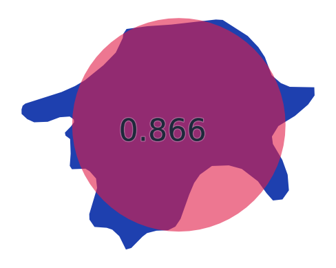

## 29. 能取湖 （北海道）

- スコア: 0.866 （5 iters）
- 円形度: 0.454
- 面積: 58,984,695, 周囲長: 40,384

## 30. 駒止湖（西小沼） （北海道）

- スコア: 0.862 （7 iters）
- 円形度: 0.754
- 面積: 28,528, 周囲長: 690

## 31. 水月湖（三方五湖） （福井県）

- スコア: 0.862 （23 iters）
- 円形度: 0.427
- 面積: 4,200,303, 周囲長: 11,123

## 32. 田代湖 （群馬県）

- スコア: 0.862 （12 iters）
- 円形度: 0.334
- 面積: 759,668, 周囲長: 5,342

## 33. 金鱗湖 （大分県）

- スコア: 0.860 （13 iters）
- 円形度: 0.775
- 面積: 4,300, 周囲長: 264

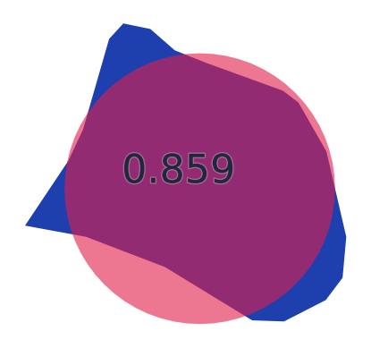

## 34. 十和田湖（東湖・中湖・西湖） （秋田県/青森県）

- スコア: 0.858 （16 iters）
- 円形度: 0.256
- 面積: 61,442,692, 周囲長: 54,886

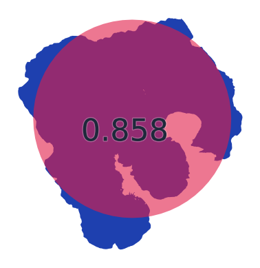

## 35. 鳥海湖 （山形県）

- スコア: 0.854 （5 iters）
- 円形度: 0.803
- 面積: 34,270, 周囲長: 732

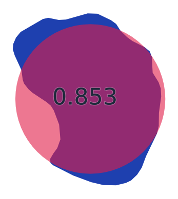

## 36. 越口ノ池（十二湖） （青森県）

- スコア: 0.853 （17 iters）
- 円形度: 0.621
- 面積: 32,570, 周囲長: 812

## 37. 外浪逆浦 （茨城県/千葉県）

- スコア: 0.852 （5 iters）
- 円形度: 0.545
- 面積: 5,788,451, 周囲長: 11,552

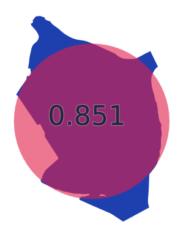

## 38. 猪苗代湖 （福島県）

- スコア: 0.851 （10 iters）
- 円形度: 0.407
- 面積: 103,620,523, 周囲長: 56,584

## 39. 神西湖 （島根県）

- スコア: 0.851 （23 iters）
- 円形度: 0.450
- 面積: 1,152,512, 周囲長: 5,673

## 40. ポロ沼 （北海道）

- スコア: 0.845 （33 iters）
- 円形度: 0.674
- 面積: 1,992,305, 周囲長: 6,095

## 41. 一湖（知床五湖） （北海道）

- スコア: 0.843 （27 iters）
- 円形度: 0.485
- 面積: 16,191, 周囲長: 648

## 42. 廻堰大溜池 （青森県）

- スコア: 0.843 （36 iters）
- 円形度: 0.254
- 面積: 2,071,809, 周囲長: 10,124

## 43. 橘湖 （北海道）

- スコア: 0.842 （7 iters）
- 円形度: 0.858
- 面積: 95,611, 周囲長: 1,184

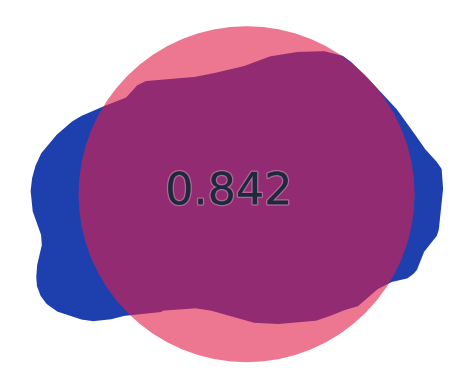

## 44. 濁池（十二湖） （青森県）

- スコア: 0.840 （39 iters）
- 円形度: 0.503
- 面積: 17,539, 周囲長: 662

## 45. 諏訪湖 （長野県）

- スコア: 0.839 （9 iters）
- 円形度: 0.519
- 面積: 12,914,584, 周囲長: 17,685

## 46. 東条湖 （兵庫県）

- スコア: 0.839 （14 iters）
- 円形度: 0.332
- 面積: 282,432, 周囲長: 3,269

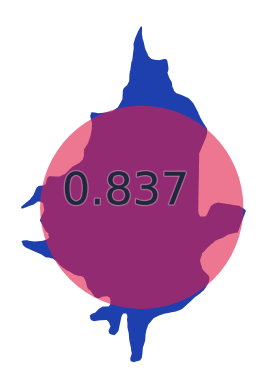

## 47. 日向湖（三方五湖） （福井県）

- スコア: 0.838 （9 iters）
- 円形度: 0.615
- 面積: 918,967, 周囲長: 4,332

## 48. 涛釣沼 （北海道）

- スコア: 0.838 （19 iters）
- 円形度: 0.773
- 面積: 406,788, 周囲長: 2,572

## 49. 豊似湖 （北海道）

- スコア: 0.837 （17 iters）
- 円形度: 0.634
- 面積: 46,078, 周囲長: 956

## 50. 本栖湖 （山梨県）

- スコア: 0.837 （4 iters）
- 円形度: 0.421
- 面積: 4,711,332, 周囲長: 11,857

## 51. 松原湖 （長野県）

- スコア: 0.835 （12 iters）
- 円形度: 0.533
- 面積: 104,292, 周囲長: 1,568

## 52. 太郎湖 （北海道）

- スコア: 0.830 （24 iters）
- 円形度: 0.605
- 面積: 13,227, 周囲長: 524

## 53. リヤウシ湖 （北海道）

- スコア: 0.830 （22 iters）
- 円形度: 0.555
- 面積: 430,567, 周囲長: 3,123

## 54. 玉原湖 （群馬県）

- スコア: 0.827 （16 iters）
- 円形度: 0.332
- 面積: 426,592, 周囲長: 4,016

## 55. バラギ湖 （群馬県）

- スコア: 0.822 （29 iters）
- 円形度: 0.648
- 面積: 91,090, 周囲長: 1,329

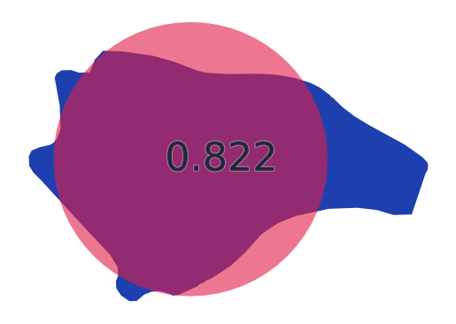

## 56. シブノツナイ湖 （北海道）

- スコア: 0.820 （7 iters）
- 円形度: 0.477
- 面積: 2,657,738, 周囲長: 8,366

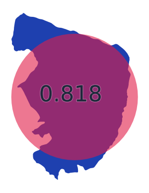

## 57. 八鶴湖 （千葉県）

- スコア: 0.817 （5 iters）
- 円形度: 0.579
- 面積: 31,635, 周囲長: 828

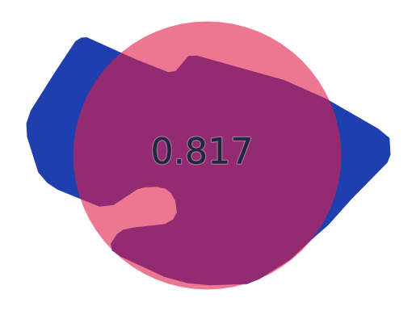

## 58. 青木湖 （長野県）

- スコア: 0.815 （31 iters）
- 円形度: 0.508
- 面積: 1,727,164, 周囲長: 6,534

## 59. 榛名湖 （群馬県）

- スコア: 0.814 （11 iters）
- 円形度: 0.666
- 面積: 1,230,089, 周囲長: 4,817

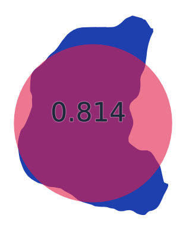

## 60. 浅科湖 （長野県）

- スコア: 0.814 （30 iters）
- 円形度: 0.765
- 面積: 38,148, 周囲長: 791

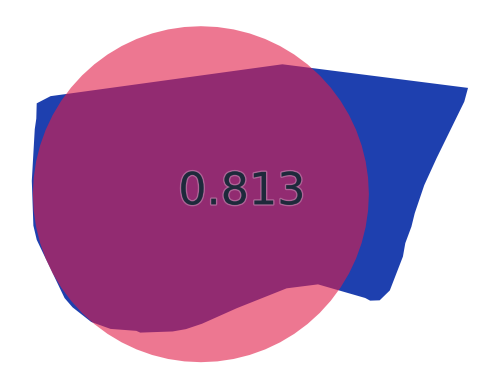

## 61. 根ノ上湖 （岐阜県）

- スコア: 0.812 （9 iters）
- 円形度: 0.523
- 面積: 65,099, 周囲長: 1,251

## 62. 湖山池 （鳥取県）

- スコア: 0.807 （7 iters）
- 円形度: 0.268
- 面積: 6,989,746, 周囲長: 18,102

## 63. 万石浦 （宮城県）

- スコア: 0.806 （12 iters）
- 円形度: 0.199
- 面積: 7,235,327, 周囲長: 21,377

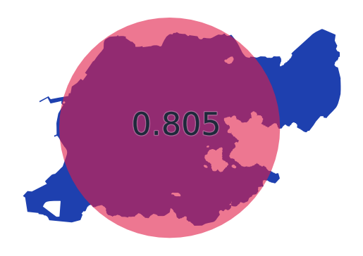

## 64. 猪鼻湖 （静岡県）

- スコア: 0.806 （12 iters）
- 円形度: 0.292
- 面積: 5,427,250, 周囲長: 15,292

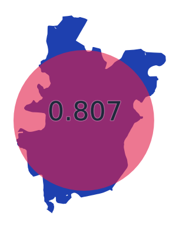

## 65. ペンケ沼 （北海道）

- スコア: 0.801 （17 iters）
- 円形度: 0.434
- 面積: 1,354,538, 周囲長: 6,263

## 66. 平湖 （滋賀県）

- スコア: 0.801 （15 iters）
- 円形度: 0.573
- 面積: 130,483, 周囲長: 1,691

## 67. クッチャロ湖（小沼） （北海道）

- スコア: 0.801 （52 iters）
- 円形度: 0.278
- 面積: 5,272,986, 周囲長: 15,453

## 68. 御釜湖 （岩手県）

- スコア: 0.799 （14 iters）
- 円形度: 0.813
- 面積: 1,826, 周囲長: 168

## 69. 須川湖 （長野県）

- スコア: 0.797 （11 iters）
- 円形度: 0.603
- 面積: 57,384, 周囲長: 1,093

## 70. 柴山潟 （石川県）

- スコア: 0.796 （9 iters）
- 円形度: 0.345
- 面積: 1,964,788, 周囲長: 8,457

## 71. 五湖（知床五湖） （北海道）

- スコア: 0.794 （17 iters）
- 円形度: 0.775
- 面積: 8,676, 周囲長: 375

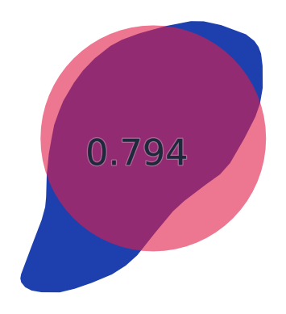

## 72. 塩沢湖 （長野県）

- スコア: 0.793 （24 iters）
- 円形度: 0.354
- 面積: 33,000, 周囲長: 1,082

## 73. 尾瀬沼 （群馬県/福島県）

- スコア: 0.793 （15 iters）
- 円形度: 0.213
- 面積: 1,815,171, 周囲長: 10,355

## 74. 伊奈ヶ湖 （山梨県）

- スコア: 0.793 （10 iters）
- 円形度: 0.682
- 面積: 8,435, 周囲長: 394

## 75. 仙禄湖 （長野県）

- スコア: 0.792 （3 iters）
- 円形度: 0.742
- 面積: 6,808, 周囲長: 340

## 76. 鮎川湖 （群馬県）

- スコア: 0.789 （31 iters）
- 円形度: 0.377
- 面積: 92,357, 周囲長: 1,755

## 77. 羽高湖 （広島県）

- スコア: 0.789 （26 iters）
- 円形度: 0.394
- 面積: 43,096, 周囲長: 1,172

## 78. 市柳沼 （青森県）

- スコア: 0.789 （21 iters）
- 円形度: 0.457
- 面積: 1,700,613, 周囲長: 6,841

## 79. コムケ湖 （北海道）

- スコア: 0.788 （129 iters）
- 円形度: 0.173
- 面積: 4,892,921, 周囲長: 18,845

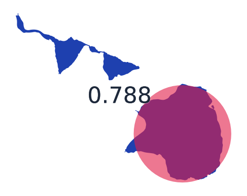

## 80. 藻琴湖 （北海道）

- スコア: 0.788 （24 iters）
- 円形度: 0.164
- 面積: 1,039,301, 周囲長: 8,933

## 81. 中綱湖 （長野県）

- スコア: 0.788 （57 iters）
- 円形度: 0.504
- 面積: 121,472, 周囲長: 1,740

## 82. 東郷池 （鳥取県）

- スコア: 0.786 （28 iters）
- 円形度: 0.273
- 面積: 4,087,328, 周囲長: 13,718

## 83. 田貫湖 （静岡県）

- スコア: 0.785 （45 iters）
- 円形度: 0.259
- 面積: 302,575, 周囲長: 3,834

## 84. 内湖 （滋賀県）

- スコア: 0.785 （14 iters）
- 円形度: 0.780
- 面積: 78,303, 周囲長: 1,123

## 85. クッチャロ湖（大沼） （北海道）

- スコア: 0.784 （18 iters）
- 円形度: 0.511
- 面積: 8,210,604, 周囲長: 14,203

## 86. 佐口湖 （長野県）

- スコア: 0.781 （20 iters）
- 円形度: 0.769
- 面積: 19,070, 周囲長: 558

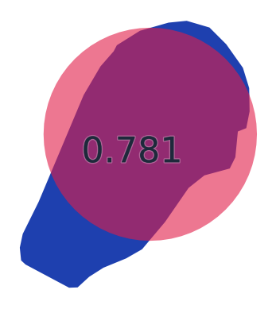

## 87. 支笏湖 （北海道）

- スコア: 0.780 （13 iters）
- 円形度: 0.581
- 面積: 78,896,639, 周囲長: 41,308

## 88. 三方湖（三方五湖） （福井県）

- スコア: 0.778 （20 iters）
- 円形度: 0.374
- 面積: 3,574,722, 周囲長: 10,957

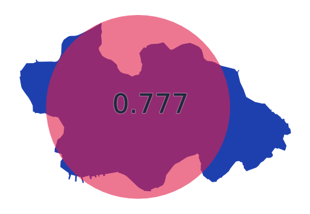

## 89. 瓢湖 （新潟県）

- スコア: 0.776 （16 iters）
- 円形度: 0.243
- 面積: 118,897, 周囲長: 2,479

## 90. 茶臼山湖 （長野県）

- スコア: 0.768 （16 iters）
- 円形度: 0.723
- 面積: 15,883, 周囲長: 525

## 91. 平荘湖 （兵庫県）

- スコア: 0.767 （13 iters）
- 円形度: 0.345
- 面積: 889,962, 周囲長: 5,693

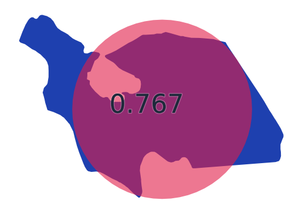

## 92. 菅湖（三方五湖） （福井県）

- スコア: 0.766 （24 iters）
- 円形度: 0.544
- 面積: 916,307, 周囲長: 4,600

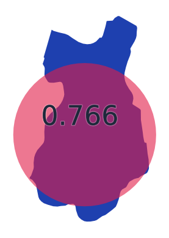

## 93. 御苗代湖 （岩手県）

- スコア: 0.766 （70 iters）
- 円形度: 0.321
- 面積: 16,880, 周囲長: 813

## 94. 明星湖 （山形県）

- スコア: 0.766 （28 iters）
- 円形度: 0.772
- 面積: 1,539, 周囲長: 158

## 95. 中ノ池（十二湖） （青森県）

- スコア: 0.764 （33 iters）
- 円形度: 0.421
- 面積: 11,370, 周囲長: 583

## 96. 松ノ木内湖 （滋賀県）

- スコア: 0.763 （96 iters）
- 円形度: 0.285
- 面積: 130,632, 周囲長: 2,399

## 97. 落口ノ池（十二湖） （青森県）

- スコア: 0.763 （52 iters）
- 円形度: 0.564
- 面積: 20,527, 周囲長: 677

## 98. 鏡湖 （長野県）

- スコア: 0.762 （24 iters）
- 円形度: 0.721
- 面積: 10,254, 周囲長: 423

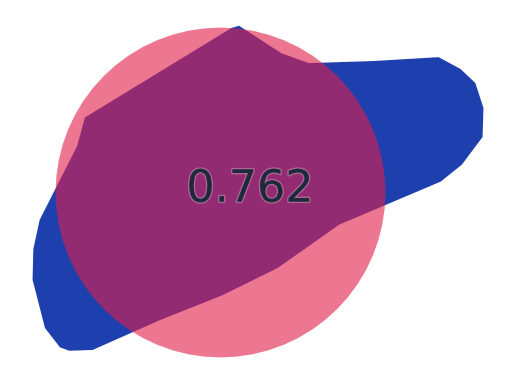

## 99. 摩周湖 （北海道）

- スコア: 0.759 （20 iters）
- 円形度: 0.546
- 面積: 19,481,368, 周囲長: 21,175

## 100. 児島湖 （岡山県）

- スコア: 0.759 （46 iters）
- 円形度: 0.384
- 面積: 7,508,494, 周囲長: 15,671

## 101. 中海 （鳥取県/島根県）

- スコア: 0.756 （75 iters）
- 円形度: 0.044
- 面積: 87,021,341, 周囲長: 156,827

## 102. 美鈴湖 （長野県）

- スコア: 0.754 （22 iters）
- 円形度: 0.402
- 面積: 81,539, 周囲長: 1,596

## 103. 阿寒湖 （北海道）

- スコア: 0.753 （33 iters）
- 円形度: 0.178
- 面積: 13,419,465, 周囲長: 30,764

## 104. 大江湖 （熊本県）

- スコア: 0.752 （29 iters）
- 円形度: 0.430
- 面積: 331,451, 周囲長: 3,111

## 105. 野尻湖（芙蓉湖） （長野県）

- スコア: 0.751 （22 iters）
- 円形度: 0.236
- 面積: 4,440,344, 周囲長: 15,381

## 106. 余呉湖 （滋賀県）

- スコア: 0.750 （26 iters）
- 円形度: 0.575
- 面積: 1,744,512, 周囲長: 6,172

## 107. 羅臼湖 （北海道）

- スコア: 0.749 （49 iters）
- 円形度: 0.312
- 面積: 411,516, 周囲長: 4,070

## 108. 女神湖 （長野県）

- スコア: 0.749 （10 iters）
- 円形度: 0.413
- 面積: 100,907, 周囲長: 1,752

## 109. 屈斜路湖 （北海道）

- スコア: 0.749 （26 iters）
- 円形度: 0.295
- 面積: 80,588,279, 周囲長: 58,638

## 110. 巣山湖 （長野県）

- スコア: 0.748 （24 iters）
- 円形度: 0.727
- 面積: 13,840, 周囲長: 489

## 111. 次郎湖 （北海道）

- スコア: 0.745 （24 iters）
- 円形度: 0.632
- 面積: 17,176, 周囲長: 584

## 112. 久種湖 （北海道）

- スコア: 0.740 （6 iters）
- 円形度: 0.579
- 面積: 533,735, 周囲長: 3,403

## 113. 河北潟 （石川県）

- スコア: 0.740 （9 iters）
- 円形度: 0.283
- 面積: 4,288,654, 周囲長: 13,796

## 114. 城山湖 （神奈川県）

- スコア: 0.738 （21 iters）
- 円形度: 0.351
- 面積: 192,979, 周囲長: 2,629

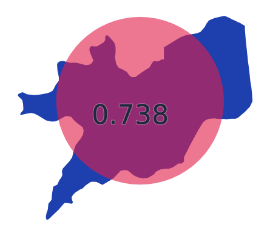

## 115. 半月湖 （北海道）

- スコア: 0.736 （21 iters）
- 円形度: 0.601
- 面積: 45,354, 周囲長: 974

## 116. 蓼ノ湖 （栃木県）

- スコア: 0.734 （65 iters）
- 円形度: 0.480
- 面積: 7,113, 周囲長: 432

## 117. 西の湖 （滋賀県）

- スコア: 0.732 （9 iters）
- 円形度: 0.097
- 面積: 2,131,072, 周囲長: 16,653

## 118. 二湖（知床五湖） （北海道）

- スコア: 0.732 （34 iters）
- 円形度: 0.223
- 面積: 43,252, 周囲長: 1,563

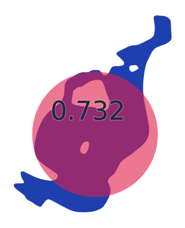

## 119. 達古武湖 （北海道）

- スコア: 0.730 （18 iters）
- 円形度: 0.516
- 面積: 1,326,031, 周囲長: 5,680

## 120. ポンテシオ湖 （北海道）

- スコア: 0.730 （33 iters）
- 円形度: 0.476
- 面積: 183,720, 周囲長: 2,203

## 121. 日暮ノ池（十二湖） （青森県）

- スコア: 0.729 （49 iters）
- 円形度: 0.606
- 面積: 10,701, 周囲長: 471

## 122. みずがき湖 （山梨県）

- スコア: 0.724 （29 iters）
- 円形度: 0.381
- 面積: 228,325, 周囲長: 2,743

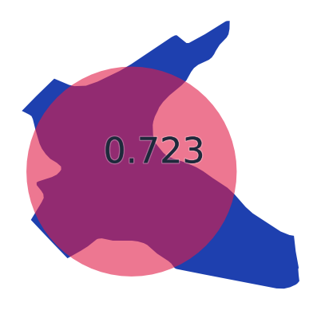

## 123. 南湖 （福島県）

- スコア: 0.724 （34 iters）
- 円形度: 0.508
- 面積: 154,232, 周囲長: 1,952

## 124. オコタンペ湖 （北海道）

- スコア: 0.724 （34 iters）
- 円形度: 0.318
- 面積: 410,548, 周囲長: 4,030

## 125. 破池（十二湖） （青森県）

- スコア: 0.724 （2 iters）
- 円形度: 0.572
- 面積: 27,795, 周囲長: 781

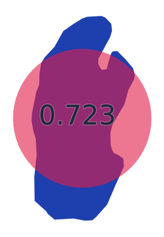

## 126. 鳥の海 （宮城県）

- スコア: 0.723 （20 iters）
- 円形度: 0.289
- 面積: 1,363,122, 周囲長: 7,695

## 127. 三湖（知床五湖） （北海道）

- スコア: 0.720 （17 iters）
- 円形度: 0.381
- 面積: 30,557, 周囲長: 1,003

## 128. 入鹿池 （愛知県）

- スコア: 0.717 （58 iters）
- 円形度: 0.125
- 面積: 1,319,191, 周囲長: 11,516

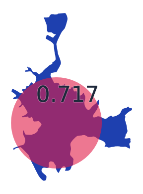

## 129. 暑寒湖 （北海道）

- スコア: 0.717 （60 iters）
- 円形度: 0.234
- 面積: 720,679, 周囲長: 6,226

## 130. 鳴沢湖 （群馬県）

- スコア: 0.716 （7 iters）
- 円形度: 0.297
- 面積: 125,458, 周囲長: 2,303

## 131. 浜名湖 （静岡県）

- スコア: 0.715 （8 iters）
- 円形度: 0.046
- 面積: 64,540,670, 周囲長: 132,310

## 132. ウトナイ湖 （北海道）

- スコア: 0.714 （34 iters）
- 円形度: 0.173
- 面積: 1,949,247, 周囲長: 11,898

## 133. 碓氷湖 （群馬県）

- スコア: 0.713 （16 iters）
- 円形度: 0.343
- 面積: 58,826, 周囲長: 1,468

## 134. えばら湖 （愛媛県）

- スコア: 0.711 （38 iters）
- 円形度: 0.570
- 面積: 22,753, 周囲長: 708

## 135. 精進湖 （山梨県）

- スコア: 0.708 （67 iters）
- 円形度: 0.112
- 面積: 455,985, 周囲長: 7,159

## 136. くりやま湖 （北海道）

- スコア: 0.708 （97 iters）
- 円形度: 0.184
- 面積: 230,924, 周囲長: 3,969

## 137. 朱鞠内湖 （北海道）

- スコア: 0.708 （46 iters）
- 円形度: 0.018
- 面積: 21,894,622, 周囲長: 122,832

## 138. 福林湖 （岡山県）

- スコア: 0.707 （93 iters）
- 円形度: 0.447
- 面積: 48,191, 周囲長: 1,164

## 139. 美笹湖 （長野県）

- スコア: 0.707 （28 iters）
- 円形度: 0.696
- 面積: 14,692, 周囲長: 515

## 140. 志高湖 （大分県）

- スコア: 0.706 （39 iters）
- 円形度: 0.581
- 面積: 82,717, 周囲長: 1,337

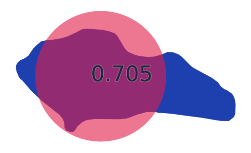

## 141. 曽原湖 （福島県）

- スコア: 0.706 （24 iters）
- 円形度: 0.316
- 面積: 310,583, 周囲長: 3,516

## 142. 鶏頭場ノ池（十二湖） （青森県）

- スコア: 0.706 （22 iters）
- 円形度: 0.366
- 面積: 41,141, 周囲長: 1,188

## 143. 禅淡湖 （大分県）

- スコア: 0.705 （33 iters）
- 円形度: 0.523
- 面積: 10,477, 周囲長: 502

## 144. 山中湖 （山梨県）

- スコア: 0.705 （8 iters）
- 円形度: 0.430
- 面積: 6,413,676, 周囲長: 13,694

## 145. 菅平湖 （長野県）

- スコア: 0.704 （42 iters）
- 円形度: 0.279
- 面積: 174,344, 周囲長: 2,803

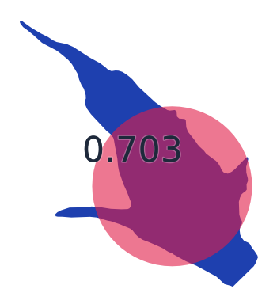

## 146. 尾駮沼 （青森県）

- スコア: 0.704 （19 iters）
- 円形度: 0.256
- 面積: 3,527,314, 周囲長: 13,151

## 147. 蓼科湖 （長野県）

- スコア: 0.700 （31 iters）
- 円形度: 0.485
- 面積: 65,472, 周囲長: 1,303

## 148. 満濃池 （香川県）

- スコア: 0.699 （61 iters）
- 円形度: 0.052
- 面積: 1,336,454, 周囲長: 17,936

## 149. 久美浜湾 （京都府）

- スコア: 0.699 （54 iters）
- 円形度: 0.161
- 面積: 7,166,149, 周囲長: 23,647

## 150. 青池（十二湖） （青森県）

- スコア: 0.699 （24 iters）
- 円形度: 0.636
- 面積: 429, 周囲長: 92

## 151. 十三湖 （青森県）

- スコア: 0.699 （65 iters）
- 円形度: 0.249
- 面積: 18,149,984, 周囲長: 30,271

## 152. 椛ノ湖 （岐阜県）

- スコア: 0.698 （20 iters）
- 円形度: 0.459
- 面積: 105,904, 周囲長: 1,703

## 153. シュンクシタカラ湖 （北海道）

- スコア: 0.698 （31 iters）
- 円形度: 0.383
- 面積: 116,651, 周囲長: 1,956

## 154. 瀬月内ダム湖 （岩手県）

- スコア: 0.697 （55 iters）
- 円形度: 0.285
- 面積: 110,393, 周囲長: 2,206

## 155. 大池（十二湖） （青森県）

- スコア: 0.696 （83 iters）
- 円形度: 0.382
- 面積: 85,808, 周囲長: 1,681

## 156. 石淵湖 （岩手県）

- スコア: 0.696 （87 iters）
- 円形度: 0.132
- 面積: 690,853, 周囲長: 8,104

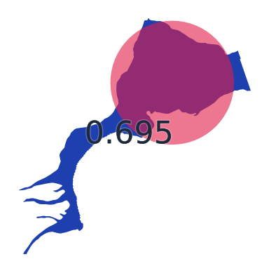

## 157. 離湖 （京都府）

- スコア: 0.695 （54 iters）
- 円形度: 0.306
- 面積: 367,785, 周囲長: 3,886

## 158. 早霧湖 （静岡県）

- スコア: 0.695 （43 iters）
- 円形度: 0.363
- 面積: 41,566, 周囲長: 1,199

## 159. 火散布沼 （北海道）

- スコア: 0.695 （31 iters）
- 円形度: 0.123
- 面積: 3,717,161, 周囲長: 19,477

## 160. 木崎湖 （長野県）

- スコア: 0.694 （70 iters）
- 円形度: 0.392
- 面積: 1,661,823, 周囲長: 7,302

## 161. 四湖（知床五湖） （北海道）

- スコア: 0.693 （54 iters）
- 円形度: 0.539
- 面積: 18,981, 周囲長: 665

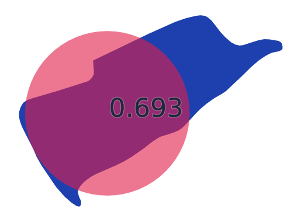

## 162. 然別湖 （北海道）

- スコア: 0.692 （58 iters）
- 円形度: 0.215
- 面積: 3,639,831, 周囲長: 14,594

## 163. 琵琶湖 （滋賀県）

- スコア: 0.692 （60 iters）
- 円形度: 0.124
- 面積: 669,450,112, 周囲長: 260,381

## 164. 小沼 （北海道）

- スコア: 0.691 （21 iters）
- 円形度: 0.132
- 面積: 3,795,340, 周囲長: 18,976

## 165. 頓田第一貯水池 （福岡県）

- スコア: 0.691 （43 iters）
- 円形度: 0.062
- 面積: 434,442, 周囲長: 9,379

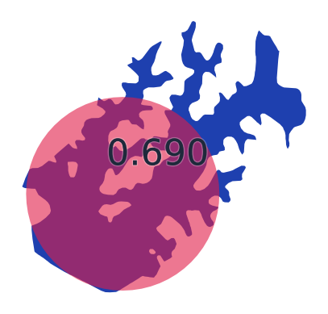

## 166. 宮沢湖 （埼玉県）

- スコア: 0.690 （34 iters）
- 円形度: 0.401
- 面積: 100,277, 周囲長: 1,772

## 167. 相沼湖 （北海道）

- スコア: 0.688 （20 iters）
- 円形度: 0.190
- 面積: 179,794, 周囲長: 3,452

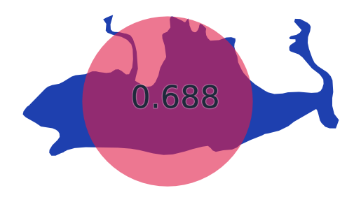

## 168. 奈良田湖 （山梨県）

- スコア: 0.688 （6 iters）
- 円形度: 0.308
- 面積: 69,937, 周囲長: 1,690

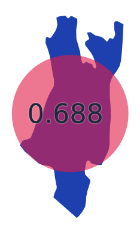

## 169. ポロト湖 （北海道）

- スコア: 0.687 （33 iters）
- 円形度: 0.506
- 面積: 343,940, 周囲長: 2,921

## 170. 洞源湖 （長野県）

- スコア: 0.687 （26 iters）
- 円形度: 0.646
- 面積: 18,391, 周囲長: 598

## 171. 室蘭工業用水池 （北海道）

- スコア: 0.687 （49 iters）
- 円形度: 0.452
- 面積: 1,065,819, 周囲長: 5,443

## 172. 須川湖 （秋田県）

- スコア: 0.686 （58 iters）
- 円形度: 0.588
- 面積: 71,029, 周囲長: 1,232

## 173. 大沼湖 （長野県）

- スコア: 0.685 （34 iters）
- 円形度: 0.680
- 面積: 16,090, 周囲長: 545

## 174. 湯ノ湖 （栃木県）

- スコア: 0.685 （8 iters）
- 円形度: 0.358
- 面積: 320,106, 周囲長: 3,350

## 175. 田光沼 （青森県）

- スコア: 0.685 （4 iters）
- 円形度: 0.326
- 面積: 1,177,273, 周囲長: 6,738

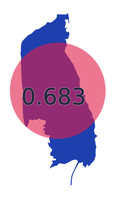

## 176. 野岳湖 （長崎県）

- スコア: 0.684 （28 iters）
- 円形度: 0.299
- 面積: 118,972, 周囲長: 2,237

## 177. 浅内沼 （秋田県）

- スコア: 0.684 （20 iters）
- 円形度: 0.531
- 面積: 1,005,412, 周囲長: 4,876

## 178. 北竜湖 （長野県）

- スコア: 0.684 （21 iters）
- 円形度: 0.460
- 面積: 155,005, 周囲長: 2,058

## 179. 千波湖 （茨城県）

- スコア: 0.684 （82 iters）
- 円形度: 0.466
- 面積: 290,066, 周囲長: 2,798

## 180. 秋葉湖 （新潟県）

- スコア: 0.684 （66 iters）
- 円形度: 0.340
- 面積: 8,742, 周囲長: 568

## 181. 生花苗沼 （北海道）

- スコア: 0.683 （82 iters）
- 円形度: 0.079
- 面積: 1,509,722, 周囲長: 15,449

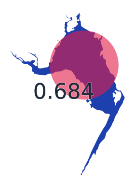

## 182. 宍道湖 （島根県）

- スコア: 0.681 （41 iters）
- 円形度: 0.402
- 面積: 78,998,121, 周囲長: 49,663

## 183. 長節湖 （北海道）

- スコア: 0.681 （19 iters）
- 円形度: 0.314
- 面積: 454,087, 周囲長: 4,263

## 184. 王池（十二湖） （青森県）

- スコア: 0.679 （64 iters）
- 円形度: 0.295
- 面積: 46,003, 周囲長: 1,401

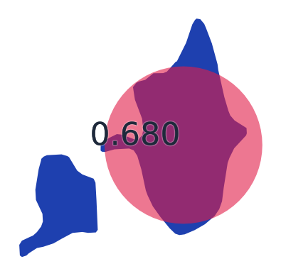

## 185. 八丁湖 （埼玉県）

- スコア: 0.679 （40 iters）
- 円形度: 0.256
- 面積: 39,131, 周囲長: 1,385

## 186. 高峰湖 （岐阜県）

- スコア: 0.678 （71 iters）
- 円形度: 0.332
- 面積: 57,367, 周囲長: 1,473

## 187. なめり湖 （三重県）

- スコア: 0.677 （92 iters）
- 円形度: 0.184
- 面積: 109,931, 周囲長: 2,744

## 188. さまに湖 （北海道）

- スコア: 0.676 （89 iters）
- 円形度: 0.260
- 面積: 197,840, 周囲長: 3,090

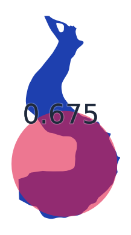

## 189. 駒鳥池 （静岡県）

- スコア: 0.676 （35 iters）
- 円形度: 0.686
- 面積: 903, 周囲長: 129

## 190. 西湖 （山梨県）

- スコア: 0.676 （62 iters）
- 円形度: 0.273
- 面積: 2,134,592, 周囲長: 9,906

## 191. 常盤池 （山口県）

- スコア: 0.673 （37 iters）
- 円形度: 0.089
- 面積: 812,200, 周囲長: 10,702

## 192. 三重湖 （北海道）

- スコア: 0.666 （22 iters）
- 円形度: 0.581
- 面積: 77,658, 周囲長: 1,296

## 193. 竜吟湖 （岐阜県）

- スコア: 0.665 （63 iters）
- 円形度: 0.295
- 面積: 51,132, 周囲長: 1,475

## 194. 愛知池 （愛知県）

- スコア: 0.664 （31 iters）
- 円形度: 0.205
- 面積: 938,704, 周囲長: 7,589

## 195. 松野湖 （岐阜県）

- スコア: 0.664 （35 iters）
- 円形度: 0.099
- 面積: 297,649, 周囲長: 6,134

## 196. 夏海湖 （茨城県）

- スコア: 0.663 （120 iters）
- 円形度: 0.104
- 面積: 112,074, 周囲長: 3,686

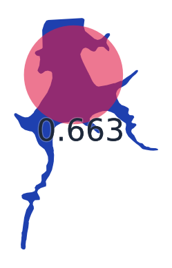

## 197. 金山ノ池（十二湖） （青森県）

- スコア: 0.663 （14 iters）
- 円形度: 0.474
- 面積: 29,941, 周囲長: 891

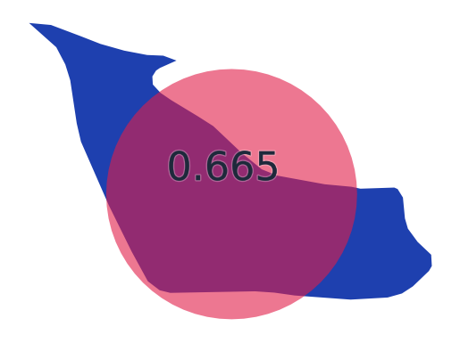

## 198. 頓田第二貯水池 （福岡県）

- スコア: 0.662 （16 iters）
- 円形度: 0.085
- 面積: 528,194, 周囲長: 8,859

## 199. 青海湖 （山口県）

- スコア: 0.662 （56 iters）
- 円形度: 0.387
- 面積: 234,205, 周囲長: 2,757

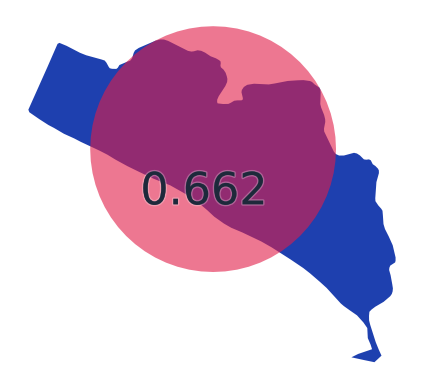

## 200. 加茂湖 （新潟県）

- スコア: 0.658 （18 iters）
- 円形度: 0.205
- 面積: 4,821,272, 周囲長: 17,201

## 201. 長節湖 （北海道）

- スコア: 0.657 （28 iters）
- 円形度: 0.057
- 面積: 1,232,972, 周囲長: 16,441

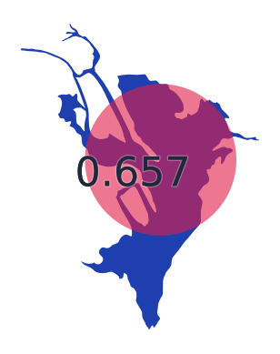

## 202. 八景ノ池（十二湖） （青森県）

- スコア: 0.655 （19 iters）
- 円形度: 0.375
- 面積: 9,256, 周囲長: 557

## 203. 松川湖 （静岡県）

- スコア: 0.653 （41 iters）
- 円形度: 0.209
- 面積: 163,307, 周囲長: 3,132

## 204. 藤枝溜池 （青森県）

- スコア: 0.650 （48 iters）
- 円形度: 0.095
- 面積: 381,786, 周囲長: 7,125

## 205. サロマ湖 （北海道）

- スコア: 0.650 （45 iters）
- 円形度: 0.191
- 面積: 153,406,004, 周囲長: 100,455

## 206. 野反湖 （群馬県）

- スコア: 0.649 （10 iters）
- 円形度: 0.260
- 面積: 1,756,219, 周囲長: 9,208

## 207. 東山湖 （静岡県）

- スコア: 0.649 （50 iters）
- 円形度: 0.634
- 面積: 31,661, 周囲長: 792

## 208. 七ッ森湖 （宮城県）

- スコア: 0.648 （47 iters）
- 円形度: 0.097
- 面積: 667,272, 周囲長: 9,293

## 209. 入笠湖 （長野県）

- スコア: 0.647 （51 iters）
- 円形度: 0.453
- 面積: 17,055, 周囲長: 688

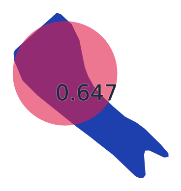

## 210. 鳥屋野潟 （新潟県）

- スコア: 0.646 （58 iters）
- 円形度: 0.245
- 面積: 1,352,673, 周囲長: 8,323

## 211. 黒瀬湖 （愛媛県）

- スコア: 0.645 （65 iters）
- 円形度: 0.144
- 面積: 1,071,039, 周囲長: 9,663

## 212. 阿蘇海 （京都府）

- スコア: 0.645 （32 iters）
- 円形度: 0.285
- 面積: 4,786,999, 周囲長: 14,525

## 213. 水嶺湖 （岐阜県）

- スコア: 0.644 （63 iters）
- 円形度: 0.044
- 面積: 222,419, 周囲長: 7,984

## 214. 野花南湖 （北海道）

- スコア: 0.644 （47 iters）
- 円形度: 0.110
- 面積: 595,786, 周囲長: 8,237

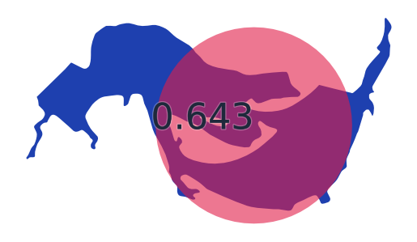

## 215. 網走湖 （北海道）

- スコア: 0.644 （18 iters）
- 円形度: 0.194
- 面積: 32,753,956, 周囲長: 46,007

## 216. 薩摩湖 （鹿児島県）

- スコア: 0.643 （39 iters）
- 円形度: 0.378
- 面積: 107,527, 周囲長: 1,891

## 217. 美笠湖 （長野県）

- スコア: 0.642 （30 iters）
- 円形度: 0.639
- 面積: 8,911, 周囲長: 419

## 218. 八郎潟調整池 （秋田県）

- スコア: 0.642 （60 iters）
- 円形度: 0.319
- 面積: 27,779,059, 周囲長: 33,070

## 219. 千代田湖 （山梨県）

- スコア: 0.642 （37 iters）
- 円形度: 0.334
- 面積: 215,021, 周囲長: 2,845

## 220. 山口貯水池（狭山湖） （埼玉県）

- スコア: 0.641 （81 iters）
- 円形度: 0.060
- 面積: 1,591,781, 周囲長: 18,306

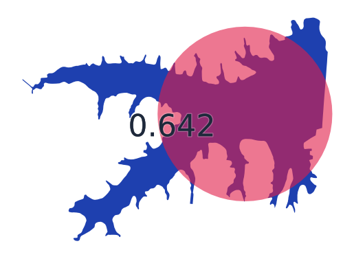

## 221. 田面木沼 （青森県）

- スコア: 0.641 （61 iters）
- 円形度: 0.267
- 面積: 1,567,531, 周囲長: 8,589

## 222. コックリ湖 （北海道）

- スコア: 0.641 （34 iters）
- 円形度: 0.574
- 面積: 43,054, 周囲長: 971

## 223. 面河ダム貯水池 （愛媛県）

- スコア: 0.637 （54 iters）
- 円形度: 0.044
- 面積: 1,185,074, 周囲長: 18,471

## 224. 只見湖 （福島県）

- スコア: 0.635 （59 iters）
- 円形度: 0.511
- 面積: 616,440, 周囲長: 3,894

## 225. 中禅寺湖 （栃木県）

- スコア: 0.634 （35 iters）
- 円形度: 0.236
- 面積: 11,837,582, 周囲長: 25,100

## 226. 金仙寺湖 （兵庫県）

- スコア: 0.633 （93 iters）
- 円形度: 0.183
- 面積: 199,988, 周囲長: 3,705

## 227. オタルナイ湖 （北海道）

- スコア: 0.633 （65 iters）
- 円形度: 0.392
- 面積: 299,800, 周囲長: 3,099

## 228. 幌内ダム貯水池 （北海道）

- スコア: 0.632 （30 iters）
- 円形度: 0.178
- 面積: 409,006, 周囲長: 5,376

## 229. 湧洞沼 （北海道）

- スコア: 0.632 （105 iters）
- 円形度: 0.118
- 面積: 4,485,578, 周囲長: 21,889

## 230. 佐鳴湖 （静岡県）

- スコア: 0.631 （62 iters）
- 円形度: 0.466
- 面積: 1,166,743, 周囲長: 5,611

## 231. 糸畑ノ池（十二湖） （青森県）

- スコア: 0.629 （26 iters）
- 円形度: 0.265
- 面積: 24,448, 周囲長: 1,076

## 232. 漫湖 （沖縄県）

- スコア: 0.624 （91 iters）
- 円形度: 0.155
- 面積: 677,580, 周囲長: 7,412

## 233. 白樺湖 （長野県）

- スコア: 0.622 （60 iters）
- 円形度: 0.226
- 面積: 334,062, 周囲長: 4,313

## 234. 牛久沼 （茨城県）

- スコア: 0.619 （147 iters）
- 円形度: 0.092
- 面積: 3,086,394, 周囲長: 20,507

## 235. 相模湖 （神奈川県）

- スコア: 0.619 （40 iters）
- 円形度: 0.148
- 面積: 1,648,319, 周囲長: 11,829

## 236. 姉沼 （青森県）

- スコア: 0.618 （39 iters）
- 円形度: 0.306
- 面積: 1,527,255, 周囲長: 7,914

## 237. 伊自良湖 （岐阜県）

- スコア: 0.613 （51 iters）
- 円形度: 0.294
- 面積: 85,439, 周囲長: 1,910

## 238. 下湯平成湖 （青森県）

- スコア: 0.610 （114 iters）
- 円形度: 0.157
- 面積: 270,387, 周囲長: 4,647

## 239. 神流湖 （群馬県/埼玉県）

- スコア: 0.610 （41 iters）
- 円形度: 0.161
- 面積: 1,785,083, 周囲長: 11,819

## 240. 糠平湖 （北海道）

- スコア: 0.609 （10 iters）
- 円形度: 0.128
- 面積: 7,884,521, 周囲長: 27,840

## 241. 徳良湖 （山形県）

- スコア: 0.608 （20 iters）
- 円形度: 0.386
- 面積: 227,965, 周囲長: 2,726

## 242. 赤谷湖 （群馬県）

- スコア: 0.608 （70 iters）
- 円形度: 0.193
- 面積: 706,946, 周囲長: 6,785

## 243. 江津湖 （熊本県）

- スコア: 0.607 （168 iters）
- 円形度: 0.086
- 面積: 479,278, 周囲長: 8,359

## 244. 河口湖 （山梨県）

- スコア: 0.607 （78 iters）
- 円形度: 0.159
- 面積: 5,713,504, 周囲長: 21,270

## 245. 活込貯水池 （北海道）

- スコア: 0.606 （88 iters）
- 円形度: 0.273
- 面積: 1,417,177, 周囲長: 8,076

## 246. 木場潟 （石川県）

- スコア: 0.606 （16 iters）
- 円形度: 0.373
- 面積: 1,094,056, 周囲長: 6,068

## 247. 白川湖 （山形県）

- スコア: 0.605 （56 iters）
- 円形度: 0.342
- 面積: 368,627, 周囲長: 3,683

## 248. 白石湖 （三重県）

- スコア: 0.604 （38 iters）
- 円形度: 0.301
- 面積: 456,399, 周囲長: 4,369

## 249. 長老湖 （宮城県）

- スコア: 0.604 （24 iters）
- 円形度: 0.267
- 面積: 63,822, 周囲長: 1,732

## 250. うらら湖 （北海道）

- スコア: 0.603 （36 iters）
- 円形度: 0.214
- 面積: 371,609, 周囲長: 4,667

## 251. 伊豆沼 （宮城県）

- スコア: 0.603 （49 iters）
- 円形度: 0.337
- 面積: 3,336,058, 周囲長: 11,155

## 252. 阿部池 （岡山県）

- スコア: 0.602 （54 iters）
- 円形度: 0.383
- 面積: 593,809, 周囲長: 4,415

## 253. 小平蘂湖 （北海道）

- スコア: 0.601 （121 iters）
- 円形度: 0.083
- 面積: 1,126,994, 周囲長: 13,086

## 254. 盃湖 （山形県）

- スコア: 0.599 （88 iters）
- 円形度: 0.458
- 面積: 19,881, 周囲長: 739

## 255. 刈込湖（切込湖） （栃木県）

- スコア: 0.598 （133 iters）
- 円形度: 0.258
- 面積: 86,969, 周囲長: 2,059

## 256. まほろば湖 （奈良県）

- スコア: 0.598 （48 iters）
- 円形度: 0.197
- 面積: 161,998, 周囲長: 3,213

## 257. 幌満湖 （北海道）

- スコア: 0.597 （50 iters）
- 円形度: 0.237
- 面積: 973,295, 周囲長: 7,188

## 258. 釜房湖 （宮城県）

- スコア: 0.596 （70 iters）
- 円形度: 0.078
- 面積: 3,158,191, 周囲長: 22,562

## 259. サホロ湖 （北海道）

- スコア: 0.595 （56 iters）
- 円形度: 0.220
- 面積: 276,472, 周囲長: 3,973

## 260. りんどう湖 （栃木県）

- スコア: 0.595 （26 iters）
- 円形度: 0.397
- 面積: 74,899, 周囲長: 1,541

## 261. 涸沼 （茨城県）

- スコア: 0.593 （76 iters）
- 円形度: 0.305
- 面積: 9,423,635, 周囲長: 19,716

## 262. 芦ノ湖 （神奈川県）

- スコア: 0.592 （81 iters）
- 円形度: 0.214
- 面積: 6,910,396, 周囲長: 20,133

## 263. 田代湖 （三重県）

- スコア: 0.592 （49 iters）
- 円形度: 0.330
- 面積: 95,175, 周囲長: 1,904

## 264. 五瀬ノ湖 （山口県）

- スコア: 0.591 （67 iters）
- 円形度: 0.218
- 面積: 29,505, 周囲長: 1,305

## 265. 藤ノ湖 （青森県）

- スコア: 0.589 （15 iters）
- 円形度: 0.301
- 面積: 107,661, 周囲長: 2,120

## 266. 霞ヶ浦 （茨城県）

- スコア: 0.588 （35 iters）
- 円形度: 0.132
- 面積: 168,461,263, 周囲長: 126,698

## 267. 米泉湖 （山口県）

- スコア: 0.586 （120 iters）
- 円形度: 0.131
- 面積: 437,820, 周囲長: 6,481

## 268. 朱鞠内湖（宇津内湖） （北海道）

- スコア: 0.586 （29 iters）
- 円形度: 0.083
- 面積: 1,495,055, 周囲長: 15,026

## 269. 大沼 （北海道）

- スコア: 0.586 （56 iters）
- 円形度: 0.078
- 面積: 5,330,186, 周囲長: 29,221

## 270. 久々子湖（三方五湖） （福井県）

- スコア: 0.586 （103 iters）
- 円形度: 0.269
- 面積: 1,422,222, 周囲長: 8,155

## 271. 明神湖 （岐阜県）

- スコア: 0.583 （147 iters）
- 円形度: 0.165
- 面積: 77,325, 周囲長: 2,423

## 272. 乙見湖 （新潟県）

- スコア: 0.583 （49 iters）
- 円形度: 0.167
- 面積: 767,177, 周囲長: 7,589

## 273. 保古ノ湖 （岐阜県）

- スコア: 0.583 （31 iters）
- 円形度: 0.298
- 面積: 120,619, 周囲長: 2,254

## 274. 鳴滝湖 （岡山県）

- スコア: 0.583 （15 iters）
- 円形度: 0.148
- 面積: 107,607, 周囲長: 3,023

## 275. 高滝湖 （千葉県）

- スコア: 0.582 （36 iters）
- 円形度: 0.119
- 面積: 1,049,645, 周囲長: 10,521

## 276. 小川原湖 （青森県）

- スコア: 0.581 （52 iters）
- 円形度: 0.274
- 面積: 62,410,001, 周囲長: 53,545

## 277. 温根沼 （北海道）

- スコア: 0.579 （57 iters）
- 円形度: 0.290
- 面積: 5,831,055, 周囲長: 15,901

## 278. 豊沢湖 （岩手県）

- スコア: 0.578 （24 iters）
- 円形度: 0.130
- 面積: 799,742, 周囲長: 8,806

## 279. シラルトロ沼 （北海道）

- スコア: 0.575 （64 iters）
- 円形度: 0.153
- 面積: 1,828,758, 周囲長: 12,254

## 280. 高遠湖 （長野県）

- スコア: 0.572 （189 iters）
- 円形度: 0.167
- 面積: 209,859, 周囲長: 3,975

## 281. かんな湖 （沖縄県）

- スコア: 0.572 （55 iters）
- 円形度: 0.098
- 面積: 436,578, 周囲長: 7,498

## 282. 海鼠池 （鹿児島県）

- スコア: 0.565 （96 iters）
- 円形度: 0.151
- 面積: 518,068, 周囲長: 6,575

## 283. 小野川湖 （福島県）

- スコア: 0.565 （26 iters）
- 円形度: 0.098
- 面積: 1,726,592, 周囲長: 14,909

## 284. 八幡湖 （千葉県）

- スコア: 0.563 （56 iters）
- 円形度: 0.355
- 面積: 52,127, 周囲長: 1,358

## 285. 能泉湖 （山梨県）

- スコア: 0.563 （97 iters）
- 円形度: 0.197
- 面積: 229,651, 周囲長: 3,829

## 286. みどり湖 （長野県）

- スコア: 0.562 （171 iters）
- 円形度: 0.256
- 面積: 43,318, 周囲長: 1,457

## 287. 日中ひざわ湖 （福島県）

- スコア: 0.560 （143 iters）
- 円形度: 0.075
- 面積: 742,252, 周囲長: 11,163

## 288. 立岩湖 （長野県）

- スコア: 0.559 （55 iters）
- 円形度: 0.352
- 面積: 36,952, 周囲長: 1,149

## 289. おけと湖 （北海道）

- スコア: 0.558 （110 iters）
- 円形度: 0.169
- 面積: 1,300,890, 周囲長: 9,825

## 290. 大沢内溜池 （青森県）

- スコア: 0.557 （89 iters）
- 円形度: 0.038
- 面積: 434,249, 周囲長: 12,052

## 291. 名栗湖 （埼玉県）

- スコア: 0.556 （172 iters）
- 円形度: 0.159
- 面積: 259,685, 周囲長: 4,534

## 292. 内の倉湖 （新潟県）

- スコア: 0.556 （81 iters）
- 円形度: 0.169
- 面積: 772,553, 周囲長: 7,588

## 293. 恩原湖 （岡山県）

- スコア: 0.553 （72 iters）
- 円形度: 0.222
- 面積: 234,960, 周囲長: 3,651

## 294. 千振湖 （栃木県）

- スコア: 0.552 （123 iters）
- 円形度: 0.260
- 面積: 40,710, 周囲長: 1,403

## 295. 羽鳥湖 （福島県）

- スコア: 0.551 （91 iters）
- 円形度: 0.076
- 面積: 1,618,685, 周囲長: 16,358

## 296. 大日湖 （石川県）

- スコア: 0.551 （152 iters）
- 円形度: 0.075
- 面積: 1,225,382, 周囲長: 14,325

## 297. 豊英湖 （千葉県）

- スコア: 0.551 （19 iters）
- 円形度: 0.090
- 面積: 251,799, 周囲長: 5,930

## 298. 白水湖 （岐阜県）

- スコア: 0.551 （62 iters）
- 円形度: 0.235
- 面積: 627,118, 周囲長: 5,796

## 299. 有峰湖 （富山県）

- スコア: 0.549 （21 iters）
- 円形度: 0.063
- 面積: 4,389,677, 周囲長: 29,554

## 300. 窓竜湖 （広島県）

- スコア: 0.546 （61 iters）
- 円形度: 0.298
- 面積: 121,825, 周囲長: 2,265

## 301. ホロピリ湖 （北海道）

- スコア: 0.545 （51 iters）
- 円形度: 0.082
- 面積: 2,675,575, 周囲長: 20,286

## 302. 龍神湖 （長野県）

- スコア: 0.544 （112 iters）
- 円形度: 0.113
- 面積: 499,765, 周囲長: 7,457

## 303. さくら湖 （福島県）

- スコア: 0.543 （68 iters）
- 円形度: 0.031
- 面積: 1,612,354, 周囲長: 25,629

## 304. 花山湖 （宮城県）

- スコア: 0.541 （24 iters）
- 円形度: 0.122
- 面積: 1,626,131, 周囲長: 12,940

## 305. 東山湖 （北海道）

- スコア: 0.540 （70 iters）
- 円形度: 0.266
- 面積: 166,893, 周囲長: 2,808

## 306. 青竜湖 （広島県）

- スコア: 0.540 （89 iters）
- 円形度: 0.161
- 面積: 150,799, 周囲長: 3,428

## 307. 三面貯水池 （新潟県）

- スコア: 0.538 （64 iters）
- 円形度: 0.075
- 面積: 910,789, 周囲長: 12,338

## 308. 翠明湖 （兵庫県）

- スコア: 0.537 （47 iters）
- 円形度: 0.125
- 面積: 754,319, 周囲長: 8,721

## 309. 神楽女湖 （大分県）

- スコア: 0.537 （96 iters）
- 円形度: 0.392
- 面積: 29,205, 周囲長: 967

## 310. 太平湖 （秋田県）

- スコア: 0.536 （124 iters）
- 円形度: 0.035
- 面積: 1,271,298, 周囲長: 21,461

## 311. 龍ヶ鼻湖 （福井県）

- スコア: 0.536 （137 iters）
- 円形度: 0.120
- 面積: 282,258, 周囲長: 5,428

## 312. 阿木川湖 （岐阜県）

- スコア: 0.535 （13 iters）
- 円形度: 0.075
- 面積: 1,142,532, 周囲長: 13,797

## 313. いなさ湖 （静岡県）

- スコア: 0.535 （145 iters）
- 円形度: 0.099
- 面積: 466,784, 周囲長: 7,695

## 314. 銀山湖 （兵庫県）

- スコア: 0.534 （24 iters）
- 円形度: 0.072
- 面積: 670,083, 周囲長: 10,792

## 315. 御所湖 （岩手県）

- スコア: 0.533 （25 iters）
- 円形度: 0.092
- 面積: 4,918,118, 周囲長: 25,936

## 316. 通天湖 （京都府）

- スコア: 0.533 （124 iters）
- 円形度: 0.155
- 面積: 33,158, 周囲長: 1,637

## 317. 松川浦 （福島県）

- スコア: 0.532 （66 iters）
- 円形度: 0.104
- 面積: 6,077,521, 周囲長: 27,160

## 318. 八千代湖 （広島県）

- スコア: 0.531 （35 iters）
- 円形度: 0.109
- 面積: 1,704,864, 周囲長: 13,991

## 319. 薗原湖 （群馬県）

- スコア: 0.529 （96 iters）
- 円形度: 0.086
- 面積: 622,620, 周囲長: 9,512

## 320. 秋元湖 （福島県）

- スコア: 0.527 （71 iters）
- 円形度: 0.089
- 面積: 3,649,081, 周囲長: 22,730

## 321. 奥いび湖 （岐阜県）

- スコア: 0.527 （27 iters）
- 円形度: 0.249
- 面積: 338,069, 周囲長: 4,130

## 322. 鷹架沼 （青森県）

- スコア: 0.527 （33 iters）
- 円形度: 0.150
- 面積: 5,530,562, 周囲長: 21,497

## 323. チミケップ湖 （北海道）

- スコア: 0.525 （38 iters）
- 円形度: 0.179
- 面積: 1,066,330, 周囲長: 8,641

## 324. 美山湖 （青森県）

- スコア: 0.522 （116 iters）
- 円形度: 0.096
- 面積: 1,742,234, 周囲長: 15,103

## 325. 神之瀬湖 （広島県）

- スコア: 0.520 （122 iters）
- 円形度: 0.084
- 面積: 1,120,120, 周囲長: 12,921

## 326. 雨畑湖 （山梨県）

- スコア: 0.520 （81 iters）
- 円形度: 0.146
- 面積: 300,004, 周囲長: 5,074

## 327. 涛沸湖 （北海道）

- スコア: 0.518 （27 iters）
- 円形度: 0.097
- 面積: 8,318,001, 周囲長: 32,895

## 328. 秋扇湖 （秋田県）

- スコア: 0.517 （71 iters）
- 円形度: 0.098
- 面積: 1,150,084, 周囲長: 12,113

## 329. 岩尾内湖 （北海道）

- スコア: 0.517 （113 iters）
- 円形度: 0.089
- 面積: 5,024,138, 周囲長: 26,562

## 330. 風蓮湖 （北海道）

- スコア: 0.517 （43 iters）
- 円形度: 0.071
- 面積: 60,192,431, 周囲長: 103,388

## 331. 宮ヶ瀬湖 （神奈川県）

- スコア: 0.516 （42 iters）
- 円形度: 0.048
- 面積: 3,380,307, 周囲長: 29,740

## 332. 本宮湖 （兵庫県）

- スコア: 0.516 （19 iters）
- 円形度: 0.169
- 面積: 163,139, 周囲長: 3,480

## 333. 津久井湖 （神奈川県）

- スコア: 0.512 （129 iters）
- 円形度: 0.071
- 面積: 2,255,458, 周囲長: 20,000

## 334. 長柄湖 （香川県）

- スコア: 0.512 （113 iters）
- 円形度: 0.059
- 面積: 314,996, 周囲長: 8,224

## 335. 三浦貯水池 （長野県）

- スコア: 0.512 （89 iters）
- 円形度: 0.079
- 面積: 2,302,289, 周囲長: 19,193

## 336. 桂沢湖 （北海道）

- スコア: 0.511 （58 iters）
- 円形度: 0.027
- 面積: 4,453,294, 周囲長: 45,569

## 337. 震生湖 （神奈川県）

- スコア: 0.511 （87 iters）
- 円形度: 0.269
- 面積: 14,512, 周囲長: 823

## 338. 間瀬湖 （埼玉県）

- スコア: 0.511 （136 iters）
- 円形度: 0.267
- 面積: 46,815, 周囲長: 1,484

## 339. 中山湖 （山口県）

- スコア: 0.510 （126 iters）
- 円形度: 0.113
- 面積: 480,580, 周囲長: 7,313

## 340. 七ヶ宿湖 （宮城県）

- スコア: 0.510 （93 iters）
- 円形度: 0.065
- 面積: 3,134,155, 周囲長: 24,639

## 341. 内沼 （青森県）

- スコア: 0.509 （74 iters）
- 円形度: 0.146
- 面積: 913,691, 周囲長: 8,880

## 342. 北山貯水池 （佐賀県）

- スコア: 0.509 （30 iters）
- 円形度: 0.032
- 面積: 1,686,395, 周囲長: 25,734

## 343. 水窪湖 （静岡県）

- スコア: 0.507 （92 iters）
- 円形度: 0.126
- 面積: 668,324, 周囲長: 8,150

## 344. パンケトー （北海道）

- スコア: 0.506 （22 iters）
- 円形度: 0.231
- 面積: 2,894,720, 周囲長: 12,560

## 345. ホロカヤントウ （北海道）

- スコア: 0.504 （46 iters）
- 円形度: 0.158
- 面積: 654,343, 周囲長: 7,214

## 346. 幌尻湖 （北海道）

- スコア: 0.503 （91 iters）
- 円形度: 0.195
- 面積: 287,533, 周囲長: 4,304

## 347. 菊川湖 （山口県）

- スコア: 0.502 （83 iters）
- 円形度: 0.098
- 面積: 505,670, 周囲長: 8,055

## 348. 桧原湖 （福島県）

- スコア: 0.501 （125 iters）
- 円形度: 0.058
- 面積: 10,741,272, 周囲長: 48,448

## 349. かわうち湖 （青森県）

- スコア: 0.498 （84 iters）
- 円形度: 0.051
- 面積: 1,294,923, 周囲長: 17,947

## 350. 錫杖湖 （三重県）

- スコア: 0.493 （83 iters）
- 円形度: 0.113
- 面積: 355,975, 周囲長: 6,295

## 351. 深山湖 （栃木県）

- スコア: 0.493 （154 iters）
- 円形度: 0.185
- 面積: 907,308, 周囲長: 7,854

## 352. 天間ダム貯水池 （青森県）

- スコア: 0.491 （34 iters）
- 円形度: 0.142
- 面積: 773,205, 周囲長: 8,286

## 353. 荒沢湖 （山形県）

- スコア: 0.491 （45 iters）
- 円形度: 0.127
- 面積: 1,148,777, 周囲長: 10,646

## 354. 川俣湖 （栃木県）

- スコア: 0.490 （93 iters）
- 円形度: 0.058
- 面積: 1,860,213, 周囲長: 20,080

## 355. 知明湖 （兵庫県/大阪府）

- スコア: 0.489 （107 iters）
- 円形度: 0.043
- 面積: 1,126,047, 周囲長: 18,190

## 356. 神農湖 （広島県）

- スコア: 0.489 （26 iters）
- 円形度: 0.080
- 面積: 493,882, 周囲長: 8,789

## 357. 定山湖 （北海道）

- スコア: 0.487 （166 iters）
- 円形度: 0.111
- 面積: 1,415,566, 周囲長: 12,676

## 358. 長沼 （宮城県）

- スコア: 0.486 （16 iters）
- 円形度: 0.110
- 面積: 3,641,449, 周囲長: 20,430

## 359. 円良田湖 （埼玉県）

- スコア: 0.484 （182 iters）
- 円形度: 0.160
- 面積: 86,051, 周囲長: 2,598

## 360. 東古屋湖 （栃木県）

- スコア: 0.484 （241 iters）
- 円形度: 0.044
- 面積: 138,368, 周囲長: 6,272

## 361. 畑薙湖 （静岡県）

- スコア: 0.484 （173 iters）
- 円形度: 0.066
- 面積: 2,135,514, 周囲長: 20,226

## 362. 梅林湖 （熊本県/大分県）

- スコア: 0.482 （76 iters）
- 円形度: 0.106
- 面積: 1,482,517, 周囲長: 13,249

## 363. 奥相模湖 （神奈川県）

- スコア: 0.481 （93 iters）
- 円形度: 0.148
- 面積: 74,924, 周囲長: 2,524

## 364. 富里湖 （北海道）

- スコア: 0.478 （47 iters）
- 円形度: 0.235
- 面積: 197,889, 周囲長: 3,253

## 365. 大原湖 （山口県）

- スコア: 0.478 （200 iters）
- 円形度: 0.092
- 面積: 874,218, 周囲長: 10,926

## 366. 白竜湖 （広島県）

- スコア: 0.477 （143 iters）
- 円形度: 0.086
- 面積: 553,045, 周囲長: 8,994

## 367. 湯原湖 （岡山県）

- スコア: 0.476 （43 iters）
- 円形度: 0.025
- 面積: 3,771,991, 周囲長: 43,576

## 368. 下小鳥ダム貯水池 （岐阜県）

- スコア: 0.475 （161 iters）
- 円形度: 0.089
- 面積: 2,621,303, 周囲長: 19,187

## 369. 三河湖 （愛知県）

- スコア: 0.474 （50 iters）
- 円形度: 0.070
- 面積: 685,650, 周囲長: 11,064

## 370. 音水湖 （兵庫県）

- スコア: 0.474 （90 iters）
- 円形度: 0.118
- 面積: 720,267, 周囲長: 8,752

## 371. 大隅湖 （鹿児島県）

- スコア: 0.474 （20 iters）
- 円形度: 0.189
- 面積: 886,133, 周囲長: 7,674

## 372. 朝日貯水池 （岐阜県）

- スコア: 0.472 （181 iters）
- 円形度: 0.118
- 面積: 635,575, 周囲長: 8,244

## 373. 蟠竜湖 （島根県）

- スコア: 0.469 （122 iters）
- 円形度: 0.046
- 面積: 94,440, 周囲長: 5,063

## 374. 南部片富士湖 （岩手県）

- スコア: 0.469 （31 iters）
- 円形度: 0.089
- 面積: 2,885,095, 周囲長: 20,228

## 375. 錦鶏湖 （山口県）

- スコア: 0.467 （165 iters）
- 円形度: 0.210
- 面積: 70,564, 周囲長: 2,056

## 376. 牛旁ノ池（十二湖） （青森県）

- スコア: 0.466 （126 iters）
- 円形度: 0.244
- 面積: 8,518, 周囲長: 662

## 377. 大雪湖 （北海道）

- スコア: 0.464 （132 iters）
- 円形度: 0.129
- 面積: 2,446,341, 周囲長: 15,421

## 378. 青山貯水池 （北海道）

- スコア: 0.463 （25 iters）
- 円形度: 0.094
- 面積: 1,358,804, 周囲長: 13,480

## 379. 北浦 （茨城県）

- スコア: 0.463 （91 iters）
- 円形度: 0.092
- 面積: 34,876,057, 周囲長: 68,932

## 380. シューパロ湖（シュウパロ湖） （北海道）

- スコア: 0.463 （64 iters）
- 円形度: 0.085
- 面積: 2,906,650, 周囲長: 20,772

## 381. 小野湖 （宮崎県）

- スコア: 0.463 （10 iters）
- 円形度: 0.042
- 面積: 1,198,004, 周囲長: 18,991

## 382. 小安峡湖 （秋田県）

- スコア: 0.462 （80 iters）
- 円形度: 0.037
- 面積: 1,176,219, 周囲長: 20,000

## 383. 蛭沢湖 （山形県）

- スコア: 0.462 （85 iters）
- 円形度: 0.176
- 面積: 170,475, 周囲長: 3,493

## 384. 蜂の巣湖 （熊本県/大分県）

- スコア: 0.459 （21 iters）
- 円形度: 0.128
- 面積: 1,115,525, 周囲長: 10,458

## 385. 緑水湖 （鳥取県）

- スコア: 0.457 （24 iters）
- 円形度: 0.077
- 面積: 373,260, 周囲長: 7,786

## 386. 八汐湖 （栃木県）

- スコア: 0.457 （68 iters）
- 円形度: 0.079
- 面積: 1,513,714, 周囲長: 15,516

## 387. 北潟湖 （石川県/福井県）

- スコア: 0.456 （56 iters）
- 円形度: 0.074
- 面積: 2,136,690, 周囲長: 19,084

## 388. 滝里湖 （北海道）

- スコア: 0.455 （89 iters）
- 円形度: 0.181
- 面積: 4,008,478, 周囲長: 16,695

## 389. 御岳湖 （長野県）

- スコア: 0.454 （173 iters）
- 円形度: 0.128
- 面積: 2,181,862, 周囲長: 14,610

## 390. 留久貯水池 （北海道）

- スコア: 0.454 （89 iters）
- 円形度: 0.139
- 面積: 500,044, 周囲長: 6,720

## 391. 沓沢湖 （長野県）

- スコア: 0.454 （39 iters）
- 円形度: 0.149
- 面積: 73,498, 周囲長: 2,487

## 392. 高見湖 （北海道）

- スコア: 0.453 （117 iters）
- 円形度: 0.044
- 面積: 5,026,060, 周囲長: 37,755

## 393. 白鷺湖 （愛媛県）

- スコア: 0.453 （33 iters）
- 円形度: 0.076
- 面積: 320,390, 周囲長: 7,275

## 394. 妙義湖 （群馬県）

- スコア: 0.451 （132 iters）
- 円形度: 0.138
- 面積: 93,152, 周囲長: 2,916

## 395. 田子倉湖 （福島県）

- スコア: 0.447 （122 iters）
- 円形度: 0.020
- 面積: 10,314,213, 周囲長: 81,158

## 396. 仙水湖 （広島県）

- スコア: 0.446 （171 iters）
- 円形度: 0.024
- 面積: 1,013,559, 周囲長: 23,250

## 397. 丹沢湖 （神奈川県）

- スコア: 0.446 （73 iters）
- 円形度: 0.051
- 面積: 1,950,069, 周囲長: 21,969

## 398. びばい湖 （北海道）

- スコア: 0.445 （119 iters）
- 円形度: 0.085
- 面積: 89,797, 周囲長: 3,637

## 399. 若郷湖 （福島県）

- スコア: 0.444 （52 iters）
- 円形度: 0.218
- 面積: 829,248, 周囲長: 6,915

## 400. フンガー湖 （沖縄県）

- スコア: 0.443 （64 iters）
- 円形度: 0.037
- 面積: 136,830, 周囲長: 6,840

## 401. 池原貯水池 （奈良県）

- スコア: 0.443 （138 iters）
- 円形度: 0.025
- 面積: 4,744,241, 周囲長: 49,073

## 402. 洞庭湖 （千葉県）

- スコア: 0.441 （28 iters）
- 円形度: 0.161
- 面積: 32,136, 周囲長: 1,586

## 403. 春採湖 （北海道）

- スコア: 0.440 （94 iters）
- 円形度: 0.215
- 面積: 348,509, 周囲長: 4,510

## 404. 塘路湖 （北海道）

- スコア: 0.439 （6 iters）
- 円形度: 0.204
- 面積: 6,353,526, 周囲長: 19,769

## 405. 上津ダム湖 （奈良県）

- スコア: 0.439 （100 iters）
- 円形度: 0.070
- 面積: 265,023, 周囲長: 6,893

## 406. 明神湖 （兵庫県）

- スコア: 0.439 （215 iters）
- 円形度: 0.163
- 面積: 48,986, 周囲長: 1,946

## 407. 鳩山ダム貯水池 （岐阜県）

- スコア: 0.437 （16 iters）
- 円形度: 0.168
- 面積: 1,290,144, 周囲長: 9,813

## 408. 魚梁瀬貯水池 （高知県）

- スコア: 0.437 （31 iters）
- 円形度: 0.028
- 面積: 2,497,957, 周囲長: 33,588

## 409. 井川湖 （静岡県）

- スコア: 0.436 （192 iters）
- 円形度: 0.068
- 面積: 3,726,356, 周囲長: 26,233

## 410. ならまた湖 （群馬県）

- スコア: 0.435 （25 iters）
- 円形度: 0.076
- 面積: 1,581,923, 周囲長: 16,222

## 411. 奥利根湖 （群馬県）

- スコア: 0.435 （160 iters）
- 円形度: 0.023
- 面積: 4,394,138, 周囲長: 48,642

## 412. 伏美湖 （北海道）

- スコア: 0.434 （206 iters）
- 円形度: 0.145
- 面積: 8,872, 周囲長: 876

## 413. 草木湖 （群馬県）

- スコア: 0.432 （75 iters）
- 円形度: 0.117
- 面積: 1,714,346, 周囲長: 13,582

## 414. 玉川湖 （愛媛県）

- スコア: 0.430 （26 iters）
- 円形度: 0.082
- 面積: 496,783, 周囲長: 8,744

## 415. 宮野湖 （山口県）

- スコア: 0.429 （87 iters）
- 円形度: 0.093
- 面積: 170,250, 周囲長: 4,785

## 416. 赤石ダム湖 （静岡県）

- スコア: 0.428 （111 iters）
- 円形度: 0.126
- 面積: 149,830, 周囲長: 3,861

## 417. 猿田貯水池 （新潟県）

- スコア: 0.428 （49 iters）
- 円形度: 0.056
- 面積: 677,842, 周囲長: 12,364

## 418. 市津湖 （千葉県）

- スコア: 0.426 （83 iters）
- 円形度: 0.051
- 面積: 562,510, 周囲長: 11,801

## 419. 豊田湖 （山口県）

- スコア: 0.426 （35 iters）
- 円形度: 0.037
- 面積: 1,193,873, 周囲長: 20,205

## 420. 芦別湖 （北海道）

- スコア: 0.425 （65 iters）
- 円形度: 0.075
- 面積: 132,565, 周囲長: 4,713

## 421. 奥只見湖 （福島県/新潟県）

- スコア: 0.425 （80 iters）
- 円形度: 0.019
- 面積: 10,502,666, 周囲長: 83,135

## 422. 月山湖 （山形県）

- スコア: 0.423 （123 iters）
- 円形度: 0.078
- 面積: 2,512,945, 周囲長: 20,153

## 423. 小渋湖 （長野県）

- スコア: 0.421 （84 iters）
- 円形度: 0.058
- 面積: 1,364,295, 周囲長: 17,252

## 424. 村山貯水池（多摩湖） （東京都）

- スコア: 0.421 （62 iters）
- 円形度: 0.055
- 面積: 1,421,846, 周囲長: 18,092

## 425. 野木和湖 （青森県）

- スコア: 0.419 （27 iters）
- 円形度: 0.111
- 面積: 87,496, 周囲長: 3,141

## 426. さっぽろ湖 （北海道）

- スコア: 0.418 （79 iters）
- 円形度: 0.075
- 面積: 1,784,306, 周囲長: 17,267

## 427. 二風谷湖（にぶたに湖） （北海道）

- スコア: 0.418 （119 iters）
- 円形度: 0.135
- 面積: 2,985,430, 周囲長: 16,689

## 428. 青蓮寺湖 （三重県）

- スコア: 0.418 （81 iters）
- 円形度: 0.071
- 面積: 789,440, 周囲長: 11,817

## 429. 亀山湖 （千葉県）

- スコア: 0.417 （72 iters）
- 円形度: 0.036
- 面積: 673,701, 周囲長: 15,325

## 430. 奥矢作湖 （岐阜県/愛知県）

- スコア: 0.416 （52 iters）
- 円形度: 0.084
- 面積: 1,824,931, 周囲長: 16,564

## 431. 笠堀湖 （新潟県）

- スコア: 0.413 （45 iters）
- 円形度: 0.152
- 面積: 364,490, 周囲長: 5,485

## 432. 東仙峡金山湖 （岐阜県）

- スコア: 0.412 （35 iters）
- 円形度: 0.040
- 面積: 3,538,505, 周囲長: 33,466

## 433. 岩松湖 （北海道）

- スコア: 0.412 （16 iters）
- 円形度: 0.067
- 面積: 743,722, 周囲長: 11,780

## 434. もみじ湖 （長野県）

- スコア: 0.411 （39 iters）
- 円形度: 0.091
- 面積: 286,256, 周囲長: 6,304

## 435. 五十里湖 （栃木県）

- スコア: 0.411 （32 iters）
- 円形度: 0.059
- 面積: 2,138,241, 周囲長: 21,269

## 436. 天若湖 （京都府）

- スコア: 0.410 （59 iters）
- 円形度: 0.055
- 面積: 1,750,935, 周囲長: 20,007

## 437. 境水道 （鳥取県/島根県）

- スコア: 0.409 （109 iters）
- 円形度: 0.161
- 面積: 1,727,904, 周囲長: 11,625

## 438. 天子湖 （山梨県）

- スコア: 0.408 （67 iters）
- 円形度: 0.192
- 面積: 379,738, 周囲長: 4,981

## 439. 秩父湖 （埼玉県）

- スコア: 0.404 （202 iters）
- 円形度: 0.082
- 面積: 382,521, 周囲長: 7,647

## 440. 大迫貯水池 （奈良県）

- スコア: 0.403 （152 iters）
- 円形度: 0.056
- 面積: 623,415, 周囲長: 11,811

## 441. 御母衣湖 （岐阜県）

- スコア: 0.399 （54 iters）
- 円形度: 0.030
- 面積: 8,215,669, 周囲長: 58,517

## 442. 津風呂湖 （奈良県）

- スコア: 0.397 （96 iters）
- 円形度: 0.019
- 面積: 1,058,867, 周囲長: 26,489

## 443. 長池（十二湖） （青森県）

- スコア: 0.396 （83 iters）
- 円形度: 0.250
- 面積: 3,421, 周囲長: 415

## 444. 船明ダム湖 （静岡県）

- スコア: 0.395 （9 iters）
- 円形度: 0.104
- 面積: 1,185,883, 周囲長: 11,978

## 445. 新冠湖 （北海道）

- スコア: 0.394 （121 iters）
- 円形度: 0.066
- 面積: 3,184,581, 周囲長: 24,575

## 446. 宝仙湖 （秋田県）

- スコア: 0.393 （68 iters）
- 円形度: 0.054
- 面積: 6,457,421, 周囲長: 38,752

## 447. 厚真ダム貯水池 （北海道）

- スコア: 0.393 （103 iters）
- 円形度: 0.070
- 面積: 709,083, 周囲長: 11,301

## 448. 梅田湖 （群馬県）

- スコア: 0.387 （83 iters）
- 円形度: 0.107
- 面積: 322,764, 周囲長: 6,168

## 449. 千丈寺湖 （兵庫県）

- スコア: 0.386 （133 iters）
- 円形度: 0.065
- 面積: 1,124,911, 周囲長: 14,801

## 450. 内川湖 （石川県）

- スコア: 0.385 （173 iters）
- 円形度: 0.072
- 面積: 280,226, 周囲長: 6,998

## 451. 梓湖 （長野県）

- スコア: 0.384 （182 iters）
- 円形度: 0.042
- 面積: 2,527,258, 周囲長: 27,345

## 452. 四万湖 （群馬県）

- スコア: 0.384 （275 iters）
- 円形度: 0.080
- 面積: 85,222, 周囲長: 3,663

## 453. 奥物部湖 （高知県）

- スコア: 0.383 （69 iters）
- 円形度: 0.056
- 面積: 1,203,513, 周囲長: 16,371

## 454. 井土浦 （宮城県）

- スコア: 0.378 （21 iters）
- 円形度: 0.115
- 面積: 326,348, 周囲長: 5,969

## 455. 朝霧湖 （愛媛県）

- スコア: 0.376 （137 iters）
- 円形度: 0.044
- 面積: 867,919, 周囲長: 15,789

## 456. 米山湖 （新潟県）

- スコア: 0.375 （42 iters）
- 円形度: 0.160
- 面積: 101,711, 周囲長: 2,827

## 457. 美和湖 （長野県）

- スコア: 0.375 （41 iters）
- 円形度: 0.136
- 面積: 1,626,140, 周囲長: 12,261

## 458. 虹の湖 （青森県）

- スコア: 0.374 （68 iters）
- 円形度: 0.054
- 面積: 1,796,082, 周囲長: 20,472

## 459. えにわ湖 （北海道）

- スコア: 0.372 （117 iters）
- 円形度: 0.124
- 面積: 554,716, 周囲長: 7,484

## 460. 三日月湖 （福岡県）

- スコア: 0.372 （49 iters）
- 円形度: 0.068
- 面積: 204,849, 周囲長: 6,161

## 461. 来島湖 （島根県）

- スコア: 0.369 （66 iters）
- 円形度: 0.033
- 面積: 1,145,976, 周囲長: 20,783

## 462. 市房ダム貯水池 （熊本県）

- スコア: 0.368 （146 iters）
- 円形度: 0.073
- 面積: 1,051,676, 周囲長: 13,444

## 463. 秩父さくら湖 （埼玉県）

- スコア: 0.368 （11 iters）
- 円形度: 0.090
- 面積: 1,228,845, 周囲長: 13,064

## 464. 印旛沼 （千葉県）

- スコア: 0.367 （138 iters）
- 円形度: 0.066
- 面積: 9,468,619, 周囲長: 42,382

## 465. 奥香肌湖 （三重県）

- スコア: 0.364 （62 iters）
- 円形度: 0.062
- 面積: 913,137, 周囲長: 13,553

## 466. 笠間湖 （茨城県）

- スコア: 0.363 （21 iters）
- 円形度: 0.055
- 面積: 162,922, 周囲長: 6,119

## 467. 高根乗鞍湖 （岐阜県）

- スコア: 0.363 （4 iters）
- 円形度: 0.070
- 面積: 1,080,364, 周囲長: 13,932

## 468. 三島湖 （千葉県）

- スコア: 0.362 （71 iters）
- 円形度: 0.034
- 面積: 414,373, 周囲長: 12,369

## 469. 九頭竜湖 （福井県）

- スコア: 0.360 （37 iters）
- 円形度: 0.021
- 面積: 7,362,565, 周囲長: 66,058

## 470. 日南湖 （鳥取県）

- スコア: 0.359 （6 iters）
- 円形度: 0.094
- 面積: 482,856, 周囲長: 8,032

## 471. 一ツ瀬ダム貯水池 （宮崎県）

- スコア: 0.358 （74 iters）
- 円形度: 0.019
- 面積: 4,444,853, 周囲長: 54,230

## 472. 双珠別湖 （北海道）

- スコア: 0.349 （52 iters）
- 円形度: 0.096
- 面積: 192,121, 周囲長: 5,016

## 473. 桂湖 （富山県/岐阜県）

- スコア: 0.348 （52 iters）
- 円形度: 0.098
- 面積: 1,062,240, 周囲長: 11,677

## 474. 聖湖 （広島県）

- スコア: 0.346 （37 iters）
- 円形度: 0.044
- 面積: 1,022,685, 周囲長: 17,014

## 475. 千歳湖 （北海道）

- スコア: 0.343 （22 iters）
- 円形度: 0.094
- 面積: 38,110, 周囲長: 2,255

## 476. 邑知潟 （石川県）

- スコア: 0.336 （35 iters）
- 円形度: 0.210
- 面積: 622,493, 周囲長: 6,104

## 477. 鎌北湖 （埼玉県）

- スコア: 0.335 （32 iters）
- 円形度: 0.173
- 面積: 26,354, 周囲長: 1,383

## 478. 富栖湖 （兵庫県）

- スコア: 0.334 （63 iters）
- 円形度: 0.108
- 面積: 89,280, 周囲長: 3,224

## 479. 金砂湖 （愛媛県）

- スコア: 0.331 （93 iters）
- 円形度: 0.054
- 面積: 1,220,130, 周囲長: 16,898

## 480. 芹川ダム貯水池 （大分県）

- スコア: 0.329 （9 iters）
- 円形度: 0.033
- 面積: 1,169,173, 周囲長: 21,086

## 481. 奥多摩湖 （東京都/山梨県）

- スコア: 0.328 （30 iters）
- 円形度: 0.026
- 面積: 3,871,016, 周囲長: 43,200

## 482. 錦秋湖 （岩手県）

- スコア: 0.328 （81 iters）
- 円形度: 0.045
- 面積: 3,935,990, 周囲長: 33,023

## 483. 東大雪湖 （北海道）

- スコア: 0.328 （56 iters）
- 円形度: 0.147
- 面積: 1,831,716, 周囲長: 12,534

## 484. 神竜湖 （広島県）

- スコア: 0.328 （55 iters）
- 円形度: 0.035
- 面積: 469,649, 周囲長: 13,074

## 485. 椿原ダム貯水池 （岐阜県）

- スコア: 0.324 （125 iters）
- 円形度: 0.087
- 面積: 562,387, 周囲長: 9,012

## 486. 素波里湖 （秋田県）

- スコア: 0.324 （105 iters）
- 円形度: 0.065
- 面積: 1,627,844, 周囲長: 17,807

## 487. 荒雄湖 （宮城県）

- スコア: 0.323 （85 iters）
- 円形度: 0.096
- 面積: 877,711, 周囲長: 10,733

## 488. 鳳来湖 （愛知県）

- スコア: 0.323 （40 iters）
- 円形度: 0.043
- 面積: 1,110,037, 周囲長: 17,954

## 489. 刀利ダム貯水池 （富山県/石川県）

- スコア: 0.320 （29 iters）
- 円形度: 0.096
- 面積: 812,003, 周囲長: 10,298

## 490. 弥栄湖 （山口県/広島県）

- スコア: 0.319 （10 iters）
- 円形度: 0.032
- 面積: 1,598,217, 周囲長: 24,892

## 491. 備中湖 （岡山県/広島県）

- スコア: 0.317 （84 iters）
- 円形度: 0.037
- 面積: 2,443,106, 周囲長: 28,851

## 492. 母畑湖 （福島県）

- スコア: 0.315 （22 iters）
- 円形度: 0.040
- 面積: 725,427, 周囲長: 15,108

## 493. 麻那姫湖 （福井県）

- スコア: 0.314 （70 iters）
- 円形度: 0.058
- 面積: 927,997, 周囲長: 14,138

## 494. 旭川湖 （岡山県）

- スコア: 0.313 （126 iters）
- 円形度: 0.039
- 面積: 1,897,410, 周囲長: 24,638

## 495. 渡川ダム貯水池 （宮崎県）

- スコア: 0.312 （62 iters）
- 円形度: 0.033
- 面積: 1,120,225, 周囲長: 20,602

## 496. かなやま湖 （北海道）

- スコア: 0.310 （37 iters）
- 円形度: 0.059
- 面積: 5,938,614, 周囲長: 35,453

## 497. 神戸水道千刈水源池 （兵庫県）

- スコア: 0.309 （76 iters）
- 円形度: 0.045
- 面積: 929,349, 周囲長: 16,045

## 498. 穴内川ダム貯水池 （高知県）

- スコア: 0.309 （31 iters）
- 円形度: 0.031
- 面積: 1,245,737, 周囲長: 22,650

## 499. 肥後みどりかわ湖 （熊本県）

- スコア: 0.301 （55 iters）
- 円形度: 0.076
- 面積: 1,192,440, 周囲長: 14,009

## 500. クイナ湖 （沖縄県）

- スコア: 0.299 （19 iters）
- 円形度: 0.047
- 面積: 574,180, 周囲長: 12,381

## 501. 犀川湖 （石川県）

- スコア: 0.299 （137 iters）
- 円形度: 0.058
- 面積: 280,354, 周囲長: 7,782

## 502. 大鶴湖 （鹿児島県）

- スコア: 0.295 （122 iters）
- 円形度: 0.032
- 面積: 2,197,673, 周囲長: 29,506

## 503. つくはら湖 （兵庫県）

- スコア: 0.293 （43 iters）
- 円形度: 0.085
- 面積: 723,512, 周囲長: 10,329

## 504. 猿飛湖 （鳥取県）

- スコア: 0.292 （15 iters）
- 円形度: 0.084
- 面積: 349,784, 周囲長: 7,213

## 505. 田瀬湖 （岩手県）

- スコア: 0.292 （27 iters）
- 円形度: 0.051
- 面積: 2,846,048, 周囲長: 26,494

## 506. 菅野湖 （山口県）

- スコア: 0.288 （54 iters）
- 円形度: 0.027
- 面積: 2,475,055, 周囲長: 33,654

## 507. 手賀沼 （千葉県）

- スコア: 0.287 （51 iters）
- 円形度: 0.148
- 面積: 3,710,982, 周囲長: 17,768

## 508. みどり湖 （愛知県）

- スコア: 0.284 （42 iters）
- 円形度: 0.049
- 面積: 1,303,746, 周囲長: 18,367

## 509. 黒部湖 （富山県）

- スコア: 0.284 （8 iters）
- 円形度: 0.059
- 面積: 2,889,575, 周囲長: 24,717

## 510. 藤原湖 （群馬県）

- スコア: 0.284 （46 iters）
- 円形度: 0.082
- 面積: 915,488, 周囲長: 11,811

## 511. 二川ダム貯水池 （和歌山県）

- スコア: 0.283 （73 iters）
- 円形度: 0.062
- 面積: 766,281, 周囲長: 12,473

## 512. 長安口貯水池 （徳島県）

- スコア: 0.282 （97 iters）
- 円形度: 0.025
- 面積: 1,807,714, 周囲長: 30,099

## 513. 岩洞湖 （岩手県）

- スコア: 0.282 （51 iters）
- 円形度: 0.051
- 面積: 5,029,224, 周囲長: 35,329

## 514. 早明浦湖 （高知県）

- スコア: 0.278 （96 iters）
- 円形度: 0.036
- 面積: 3,856,032, 周囲長: 36,580

## 515. 笹生川貯水池 （福井県）

- スコア: 0.276 （45 iters）
- 円形度: 0.035
- 面積: 1,687,405, 周囲長: 24,677

## 516. 鹿野川湖 （愛媛県）

- スコア: 0.274 （58 iters）
- 円形度: 0.041
- 面積: 1,143,412, 周囲長: 18,666

## 517. 高瀬湖 （山口県）

- スコア: 0.267 （49 iters）
- 円形度: 0.065
- 面積: 494,154, 周囲長: 9,792

## 518. 芦田湖 （広島県）

- スコア: 0.267 （13 iters）
- 円形度: 0.050
- 面積: 1,422,511, 周囲長: 18,962

## 519. 竜神湖 （茨城県）

- スコア: 0.264 （49 iters）
- 円形度: 0.049
- 面積: 73,608, 周囲長: 4,328

## 520. 宮川貯水池 （三重県）

- スコア: 0.263 （96 iters）
- 円形度: 0.022
- 面積: 2,184,912, 周囲長: 35,620

## 521. 福上湖 （沖縄県）

- スコア: 0.260 （24 iters）
- 円形度: 0.013
- 面積: 2,214,969, 周囲長: 46,528

## 522. ひなち湖 （三重県）

- スコア: 0.259 （36 iters）
- 円形度: 0.147
- 面積: 335,401, 周囲長: 5,359

## 523. 兼山ダム貯水池 （岐阜県）

- スコア: 0.255 （49 iters）
- 円形度: 0.061
- 面積: 958,519, 周囲長: 14,003

## 524. 日向椎葉湖 （宮崎県）

- スコア: 0.255 （145 iters）
- 円形度: 0.030
- 面積: 2,357,464, 周囲長: 31,199

## 525. 風屋貯水池 （奈良県）

- スコア: 0.254 （88 iters）
- 円形度: 0.029
- 面積: 3,450,812, 周囲長: 38,793

## 526. 室生湖 （奈良県）

- スコア: 0.252 （43 iters）
- 円形度: 0.036
- 面積: 798,607, 周囲長: 16,722

## 527. 黒又川第二ダム貯水池 （新潟県）

- スコア: 0.250 （32 iters）
- 円形度: 0.037
- 面積: 1,510,372, 周囲長: 22,499

## 528. 小瀬川貯水池 （山口県/広島県）

- スコア: 0.247 （33 iters）
- 円形度: 0.087
- 面積: 324,319, 周囲長: 6,849

## 529. 美穀湖 （岡山県）

- スコア: 0.245 （81 iters）
- 円形度: 0.059
- 面積: 600,991, 周囲長: 11,281

## 530. 合川貯水池 （和歌山県）

- スコア: 0.244 （57 iters）
- 円形度: 0.040
- 面積: 704,568, 周囲長: 14,797

## 531. 大鳥ダム貯水池 （福島県/新潟県）

- スコア: 0.243 （17 iters）
- 円形度: 0.055
- 面積: 955,980, 周囲長: 14,732

## 532. 小野湖 （山口県）

- スコア: 0.241 （64 iters）
- 円形度: 0.036
- 面積: 1,554,353, 周囲長: 23,292

## 533. 府中湖 （香川県）

- スコア: 0.239 （20 iters）
- 円形度: 0.026
- 面積: 1,055,818, 周囲長: 22,712

## 534. 坂本貯水池 （奈良県）

- スコア: 0.235 （32 iters）
- 円形度: 0.021
- 面積: 2,182,405, 周囲長: 35,853

## 535. 丸山蘇水湖 （岐阜県）

- スコア: 0.230 （58 iters）
- 円形度: 0.034
- 面積: 1,301,878, 周囲長: 22,023

## 536. 八久和ダム貯水池 （山形県）

- スコア: 0.227 （61 iters）
- 円形度: 0.047
- 面積: 1,656,878, 周囲長: 21,147

## 537. 洞元湖 （群馬県）

- スコア: 0.227 （134 iters）
- 円形度: 0.047
- 面積: 1,108,255, 周囲長: 17,230

## 538. 長沢貯水池 （高知県）

- スコア: 0.222 （43 iters）
- 円形度: 0.032
- 面積: 1,178,213, 周囲長: 21,557

## 539. 大森川貯水池 （高知県）

- スコア: 0.216 （106 iters）
- 円形度: 0.028
- 面積: 674,565, 周囲長: 17,491

## 540. 琅鶴湖 （長野県）

- スコア: 0.214 （65 iters）
- 円形度: 0.053
- 面積: 729,124, 周囲長: 13,137

## 541. 七色貯水池 （和歌山県/三重県/奈良県）

- スコア: 0.213 （21 iters）
- 円形度: 0.037
- 面積: 1,431,368, 周囲長: 21,984

## 542. 塚原ダム貯水池 （宮崎県）

- スコア: 0.209 （91 iters）
- 円形度: 0.051
- 面積: 963,173, 周囲長: 15,435

## 543. 佐久間湖 （静岡県/愛知県）

- スコア: 0.209 （49 iters）
- 円形度: 0.025
- 面積: 4,607,050, 周囲長: 47,891

## 544. 伊集の湖 （沖縄県）

- スコア: 0.208 （30 iters）
- 円形度: 0.018
- 面積: 281,739, 周囲長: 13,876

## 545. 秋葉湖 （静岡県）

- スコア: 0.200 （75 iters）
- 円形度: 0.116
- 面積: 638,465, 周囲長: 8,303

## 546. みやび湖 （島根県）

- スコア: 0.199 （38 iters）
- 円形度: 0.041
- 面積: 259,819, 周囲長: 8,955

## 547. 山代湖 （山口県）

- スコア: 0.189 （109 iters）
- 円形度: 0.041
- 面積: 912,347, 周囲長: 16,737

## 548. 新川湖 （沖縄県）

- スコア: 0.189 （80 iters）
- 円形度: 0.047
- 面積: 106,635, 周囲長: 5,344

## 549. 向道湖 （山口県）

- スコア: 0.177 （96 iters）
- 円形度: 0.065
- 面積: 565,874, 周囲長: 10,440

## 550. 黒又川第一ダム貯水池 （新潟県）

- スコア: 0.176 （41 iters）
- 円形度: 0.031
- 面積: 1,253,013, 周囲長: 22,431

## 551. 虹の湖 （京都府）

- スコア: 0.164 （81 iters）
- 円形度: 0.023
- 面積: 1,083,538, 周囲長: 24,585

## 552. 阿武湖 （山口県）

- スコア: 0.164 （53 iters）
- 円形度: 0.024
- 面積: 2,948,617, 周囲長: 38,944

## 553. 菅生沼 （茨城県）

- スコア: 0.076 （41 iters）
- 円形度: 0.015
- 面積: 533,526, 周囲長: 21,136

## 554. 野尻湖 （宮崎県）

- スコア: 0.067 （35 iters）
- 円形度: 0.007
- 面積: 1,982,224, 周囲長: 57,760

## 555. しのつ湖 （北海道）

- スコア: 0.000 （1 iters）
- 円形度: 0.120
- 面積: 313,586, 周囲長: 5,721

## 556. 犬吼湖 （北海道）

- スコア: 0.000 （1 iters）
- 円形度: 0.184
- 面積: 22,752, 周囲長: 1,246

