## 1. 倶多楽湖 （北海道）

- スコア: 0.97819 （9 iterations）
- 円形度: 0.94545
- 面積: 5km&sup2;, 周囲長: 8km

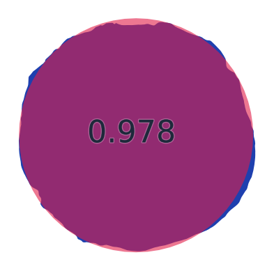

## 2. 田沢湖 （秋田県）

- スコア: 0.94299 （13 iterations）
- 円形度: 0.77460
- 面積: 26km&sup2;, 周囲長: 20km

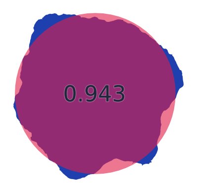

## 3. 巣鷹湖 （長野県）

- スコア: 0.93466 （17 iterations）
- 円形度: 0.90200
- 面積: 28,807m&sup2;, 周囲長: 634m

## 4. 明月湖 （山形県）

- スコア: 0.92257 （16 iterations）
- 円形度: 0.95455
- 面積: 978m&sup2;, 周囲長: 113m

## 5. 南伊奈ヶ湖 （山梨県）

- スコア: 0.92024 （9 iterations）
- 円形度: 0.87667
- 面積: 13,808m&sup2;, 周囲長: 445m

## 6. 鰻池 （鹿児島県）

- スコア: 0.91915 （8 iterations）
- 円形度: 0.85965
- 面積: 1km&sup2;, 周囲長: 4km

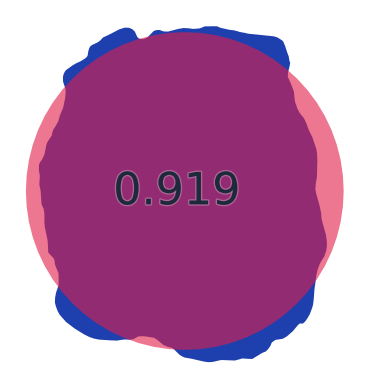

## 7. 東雲湖（東小沼） （北海道）

- スコア: 0.91914 （13 iterations）
- 円形度: 0.92008
- 面積: 48,387m&sup2;, 周囲長: 813m

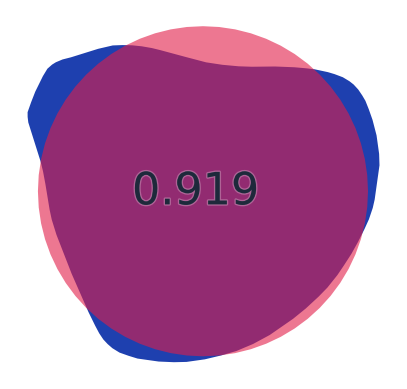

## 8. パンケ沼 （北海道）

- スコア: 0.90997 （10 iterations）
- 円形度: 0.73563
- 面積: 4km&sup2;, 周囲長: 8km

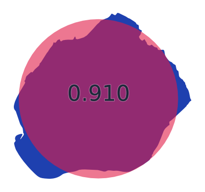

## 9. 宇曽利山湖 （青森県）

- スコア: 0.90723 （10 iterations）
- 円形度: 0.66490
- 面積: 3km&sup2;, 周囲長: 7km

## 10. 池田湖 （鹿児島県）

- スコア: 0.90058 （14 iterations）
- 円形度: 0.60972
- 面積: 11km&sup2;, 周囲長: 15km

## 11. 大沼 （北海道）

- スコア: 0.89704 （13 iterations）
- 円形度: 0.59705
- 面積: 5km&sup2;, 周囲長: 10km

## 12. 洞爺湖 （北海道）

- スコア: 0.89119 （10 iterations）
- 円形度: 0.32908
- 面積: 71km&sup2;, 周囲長: 52km

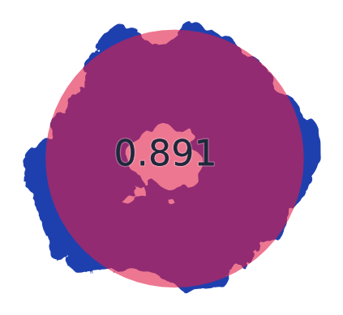

## 13. 大月湖 （長野県）

- スコア: 0.88979 （14 iterations）
- 円形度: 0.62566
- 面積: 28,466m&sup2;, 周囲長: 756m

## 14. 一碧湖 （静岡県）

- スコア: 0.88601 （14 iterations）
- 円形度: 0.37611
- 面積: 188,945m&sup2;, 周囲長: 3km

## 15. 四尾連湖 （山梨県）

- スコア: 0.88395 （13 iterations）
- 円形度: 0.90739
- 面積: 67,535m&sup2;, 周囲長: 967m

## 16. 昭和湖 （岩手県）

- スコア: 0.88245 （15 iterations）
- 円形度: 0.80804
- 面積: 2,428m&sup2;, 周囲長: 194m

## 17. 白竜湖 （山形県）

- スコア: 0.88182 （18 iterations）
- 円形度: 0.44740
- 面積: 57,895m&sup2;, 周囲長: 1km

## 18. すずらん湖 （長野県）

- スコア: 0.87851 （12 iterations）
- 円形度: 0.73260
- 面積: 10,890m&sup2;, 周囲長: 432m

## 19. 白樺湖 （長野県）

- スコア: 0.87420 （17 iterations）
- 円形度: 0.78786
- 面積: 10,738m&sup2;, 周囲長: 414m

## 20. 沼沢湖 （福島県）

- スコア: 0.87394 （14 iterations）
- 円形度: 0.62842
- 面積: 3km&sup2;, 周囲長: 8km

## 21. 兜沼 （北海道）

- スコア: 0.87367 （20 iterations）
- 円形度: 0.67466
- 面積: 807,548m&sup2;, 周囲長: 4km

## 22. 西ノ湖 （栃木県）

- スコア: 0.86967 （18 iterations）
- 円形度: 0.45940
- 面積: 169,975m&sup2;, 周囲長: 2km

## 23. 聖湖 （長野県）

- スコア: 0.86883 （16 iterations）
- 円形度: 0.68252
- 面積: 67,506m&sup2;, 周囲長: 1km

## 24. 千代田湖 （長野県）

- スコア: 0.86870 （16 iterations）
- 円形度: 0.72444
- 面積: 16,384m&sup2;, 周囲長: 533m

## 25. 知西別湖 （北海道）

- スコア: 0.86857 （14 iterations）
- 円形度: 0.80352
- 面積: 31,941m&sup2;, 周囲長: 707m

## 26. 厚岸湖 （北海道）

- スコア: 0.86795 （12 iterations）
- 円形度: 0.58159
- 面積: 33km&sup2;, 周囲長: 27km

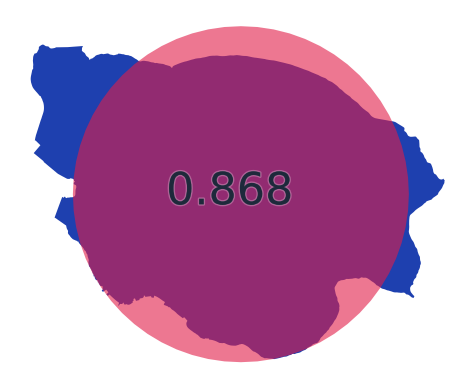

## 27. 霊仙寺湖 （長野県）

- スコア: 0.86742 （13 iterations）
- 円形度: 0.57490
- 面積: 131,366m&sup2;, 周囲長: 2km

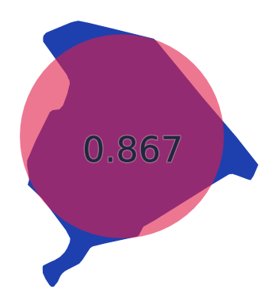

## 28. 能取湖 （北海道）

- スコア: 0.86630 （10 iterations）
- 円形度: 0.45449
- 面積: 59km&sup2;, 周囲長: 40km

## 29. 照月湖 （群馬県）

- スコア: 0.86614 （16 iterations）
- 円形度: 0.49710
- 面積: 30,151m&sup2;, 周囲長: 873m

## 30. 駒止湖（西小沼） （北海道）

- スコア: 0.86248 （10 iterations）
- 円形度: 0.75378
- 面積: 28,528m&sup2;, 周囲長: 690m

## 31. 水月湖（三方五湖） （福井県）

- スコア: 0.86119 （18 iterations）
- 円形度: 0.42665
- 面積: 4km&sup2;, 周囲長: 11km

## 32. 田代湖 （群馬県）

- スコア: 0.86117 （12 iterations）
- 円形度: 0.33448
- 面積: 759,668m&sup2;, 周囲長: 5km

## 33. 金鱗湖 （大分県）

- スコア: 0.85866 （23 iterations）
- 円形度: 0.77451
- 面積: 4,300m&sup2;, 周囲長: 264m

## 34. 十和田湖（東湖・中湖・西湖） （秋田県/青森県）

- スコア: 0.85827 （18 iterations）
- 円形度: 0.25630
- 面積: 61km&sup2;, 周囲長: 55km

## 35. 越口ノ池（十二湖） （青森県）

- スコア: 0.85350 （7 iterations）
- 円形度: 0.62103
- 面積: 32,570m&sup2;, 周囲長: 812m

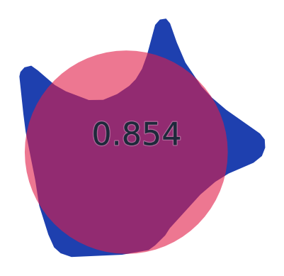

## 36. 鳥海湖 （山形県）

- スコア: 0.85322 （22 iterations）
- 円形度: 0.80293
- 面積: 34,270m&sup2;, 周囲長: 732m

## 37. 外浪逆浦 （茨城県/千葉県）

- スコア: 0.85129 （15 iterations）
- 円形度: 0.54507
- 面積: 6km&sup2;, 周囲長: 12km

## 38. 猪苗代湖 （福島県）

- スコア: 0.85069 （15 iterations）
- 円形度: 0.40669
- 面積: 104km&sup2;, 周囲長: 57km

## 39. 神西湖 （島根県）

- スコア: 0.84950 （16 iterations）
- 円形度: 0.45003
- 面積: 1km&sup2;, 周囲長: 6km

## 40. ポロ沼 （北海道）

- スコア: 0.84553 （10 iterations）
- 円形度: 0.67400
- 面積: 2km&sup2;, 周囲長: 6km

## 41. 一湖（知床五湖） （北海道）

- スコア: 0.84257 （13 iterations）
- 円形度: 0.48528
- 面積: 16,191m&sup2;, 周囲長: 648m

## 42. 橘湖 （北海道）

- スコア: 0.84227 （12 iterations）
- 円形度: 0.85755
- 面積: 95,611m&sup2;, 周囲長: 1km

## 43. 廻堰大溜池 （青森県）

- スコア: 0.84153 （17 iterations）
- 円形度: 0.25404
- 面積: 2km&sup2;, 周囲長: 10km

## 44. 濁池（十二湖） （青森県）

- スコア: 0.83927 （12 iterations）
- 円形度: 0.50337
- 面積: 17,539m&sup2;, 周囲長: 662m

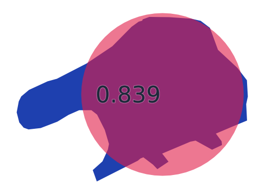

## 45. 諏訪湖 （長野県）

- スコア: 0.83923 （14 iterations）
- 円形度: 0.51891
- 面積: 13km&sup2;, 周囲長: 18km

## 46. 涛釣沼 （北海道）

- スコア: 0.83800 （15 iterations）
- 円形度: 0.77279
- 面積: 406,788m&sup2;, 周囲長: 3km

## 47. 東条湖 （兵庫県）

- スコア: 0.83719 （21 iterations）
- 円形度: 0.33204
- 面積: 282,432m&sup2;, 周囲長: 3km

## 48. 日向湖（三方五湖） （福井県）

- スコア: 0.83713 （15 iterations）
- 円形度: 0.61534
- 面積: 918,967m&sup2;, 周囲長: 4km

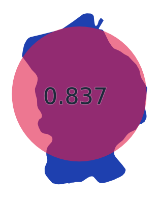

## 49. 豊似湖 （北海道）

- スコア: 0.83620 （15 iterations）
- 円形度: 0.63415
- 面積: 46,078m&sup2;, 周囲長: 956m

## 50. 本栖湖 （山梨県）

- スコア: 0.83609 （17 iterations）
- 円形度: 0.42110
- 面積: 5km&sup2;, 周囲長: 12km

## 51. 松原湖 （長野県）

- スコア: 0.83535 （16 iterations）
- 円形度: 0.53290
- 面積: 104,292m&sup2;, 周囲長: 2km

## 52. 太郎湖 （北海道）

- スコア: 0.82969 （21 iterations）
- 円形度: 0.60543
- 面積: 13,227m&sup2;, 周囲長: 524m

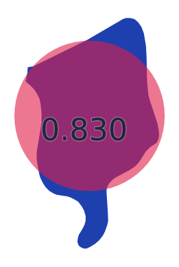

## 53. リヤウシ湖 （北海道）

- スコア: 0.82926 （15 iterations）
- 円形度: 0.55471
- 面積: 430,567m&sup2;, 周囲長: 3km

## 54. 玉原湖 （群馬県）

- スコア: 0.82604 （9 iterations）
- 円形度: 0.33232
- 面積: 426,592m&sup2;, 周囲長: 4km

## 55. バラギ湖 （群馬県）

- スコア: 0.82190 （12 iterations）
- 円形度: 0.64844
- 面積: 91,090m&sup2;, 周囲長: 1km

## 56. シブノツナイ湖 （北海道）

- スコア: 0.81848 （15 iterations）
- 円形度: 0.47717
- 面積: 3km&sup2;, 周囲長: 8km

## 57. 八鶴湖 （千葉県）

- スコア: 0.81744 （13 iterations）
- 円形度: 0.57946
- 面積: 31,635m&sup2;, 周囲長: 828m

## 58. 青木湖 （長野県）

- スコア: 0.81545 （13 iterations）
- 円形度: 0.50834
- 面積: 2km&sup2;, 周囲長: 7km

## 59. 榛名湖 （群馬県）

- スコア: 0.81367 （12 iterations）
- 円形度: 0.66622
- 面積: 1km&sup2;, 周囲長: 5km

## 60. 浅科湖 （長野県）

- スコア: 0.81286 （14 iterations）
- 円形度: 0.76524
- 面積: 38,148m&sup2;, 周囲長: 791m

## 61. 根ノ上湖 （岐阜県）

- スコア: 0.81169 （21 iterations）
- 円形度: 0.52269
- 面積: 65,099m&sup2;, 周囲長: 1km

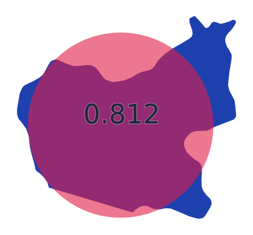

## 62. 猪鼻湖 （静岡県）

- スコア: 0.80714 （19 iterations）
- 円形度: 0.29166
- 面積: 5km&sup2;, 周囲長: 15km

## 63. 湖山池 （鳥取県）

- スコア: 0.80561 （11 iterations）
- 円形度: 0.26807
- 面積: 7km&sup2;, 周囲長: 18km

## 64. 万石浦 （宮城県）

- スコア: 0.80513 （12 iterations）
- 円形度: 0.19897
- 面積: 7km&sup2;, 周囲長: 21km

## 65. 平湖 （滋賀県）

- スコア: 0.80110 （12 iterations）
- 円形度: 0.57335
- 面積: 130,483m&sup2;, 周囲長: 2km

## 66. ペンケ沼 （北海道）

- スコア: 0.80093 （20 iterations）
- 円形度: 0.43401
- 面積: 1km&sup2;, 周囲長: 6km

## 67. クッチャロ湖（小沼） （北海道）

- スコア: 0.79971 （23 iterations）
- 円形度: 0.27750
- 面積: 5km&sup2;, 周囲長: 15km

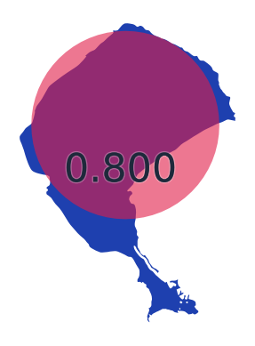

## 68. 御釜湖 （岩手県）

- スコア: 0.79962 （12 iterations）
- 円形度: 0.81283
- 面積: 1,826m&sup2;, 周囲長: 168m

## 69. 柴山潟 （石川県）

- スコア: 0.79627 （24 iterations）
- 円形度: 0.34521
- 面積: 2km&sup2;, 周囲長: 8km

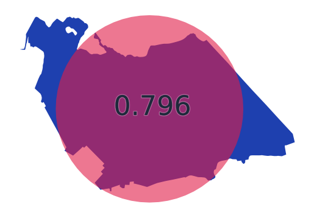

## 70. 須川湖 （長野県）

- スコア: 0.79626 （12 iterations）
- 円形度: 0.60329
- 面積: 57,384m&sup2;, 周囲長: 1km

## 71. 五湖（知床五湖） （北海道）

- スコア: 0.79403 （22 iterations）
- 円形度: 0.77493
- 面積: 8,676m&sup2;, 周囲長: 375m

## 72. 塩沢湖 （長野県）

- スコア: 0.79360 （16 iterations）
- 円形度: 0.35403
- 面積: 33,000m&sup2;, 周囲長: 1km

## 73. 尾瀬沼 （群馬県/福島県）

- スコア: 0.79312 （16 iterations）
- 円形度: 0.21273
- 面積: 2km&sup2;, 周囲長: 10km

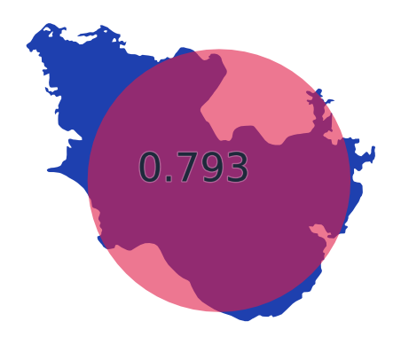

## 74. 伊奈ヶ湖 （山梨県）

- スコア: 0.79206 （12 iterations）
- 円形度: 0.68196
- 面積: 8,435m&sup2;, 周囲長: 394m

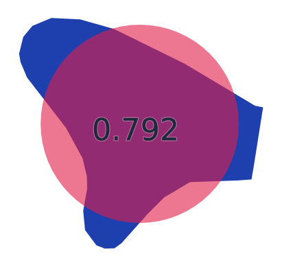

## 75. 仙禄湖 （長野県）

- スコア: 0.79092 （30 iterations）
- 円形度: 0.74207
- 面積: 6,808m&sup2;, 周囲長: 340m

## 76. 市柳沼 （青森県）

- スコア: 0.78918 （13 iterations）
- 円形度: 0.45663
- 面積: 2km&sup2;, 周囲長: 7km

## 77. 中綱湖 （長野県）

- スコア: 0.78863 （19 iterations）
- 円形度: 0.50401
- 面積: 121,472m&sup2;, 周囲長: 2km

## 78. 藻琴湖 （北海道）

- スコア: 0.78830 （16 iterations）
- 円形度: 0.16368
- 面積: 1km&sup2;, 周囲長: 9km

## 79. 鮎川湖 （群馬県）

- スコア: 0.78823 （17 iterations）
- 円形度: 0.37684
- 面積: 92,357m&sup2;, 周囲長: 2km

## 80. コムケ湖 （北海道）

- スコア: 0.78812 （21 iterations）
- 円形度: 0.17314
- 面積: 5km&sup2;, 周囲長: 19km

## 81. 羽高湖 （広島県）

- スコア: 0.78764 （10 iterations）
- 円形度: 0.39438
- 面積: 43,096m&sup2;, 周囲長: 1km

## 82. 東郷池 （鳥取県）

- スコア: 0.78526 （13 iterations）
- 円形度: 0.27294
- 面積: 4km&sup2;, 周囲長: 14km

## 83. 田貫湖 （静岡県）

- スコア: 0.78490 （15 iterations）
- 円形度: 0.25864
- 面積: 302,575m&sup2;, 周囲長: 4km

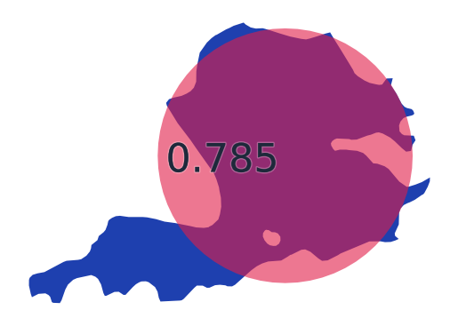

## 84. 内湖 （滋賀県）

- スコア: 0.78401 （8 iterations）
- 円形度: 0.77982
- 面積: 78,303m&sup2;, 周囲長: 1km

## 85. クッチャロ湖（大沼） （北海道）

- スコア: 0.78265 （18 iterations）
- 円形度: 0.51149
- 面積: 8km&sup2;, 周囲長: 14km

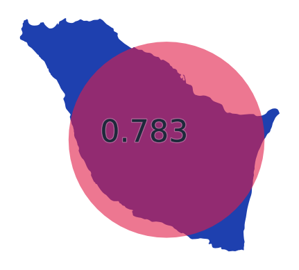

## 86. 佐口湖 （長野県）

- スコア: 0.78054 （15 iterations）
- 円形度: 0.76915
- 面積: 19,070m&sup2;, 周囲長: 558m

## 87. 支笏湖 （北海道）

- スコア: 0.77933 （13 iterations）
- 円形度: 0.58102
- 面積: 79km&sup2;, 周囲長: 41km

## 88. 三方湖（三方五湖） （福井県）

- スコア: 0.77701 （15 iterations）
- 円形度: 0.37418
- 面積: 4km&sup2;, 周囲長: 11km

## 89. 瓢湖 （新潟県）

- スコア: 0.77510 （16 iterations）
- 円形度: 0.24304
- 面積: 118,897m&sup2;, 周囲長: 2km

## 90. 平荘湖 （兵庫県）

- スコア: 0.76727 （17 iterations）
- 円形度: 0.34509
- 面積: 889,962m&sup2;, 周囲長: 6km

## 91. 茶臼山湖 （長野県）

- スコア: 0.76692 （16 iterations）
- 円形度: 0.72310
- 面積: 15,883m&sup2;, 周囲長: 525m

## 92. 明星湖 （山形県）

- スコア: 0.76623 （15 iterations）
- 円形度: 0.77191
- 面積: 1,539m&sup2;, 周囲長: 158m

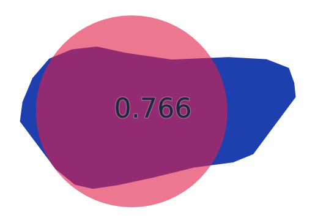

## 93. 菅湖（三方五湖） （福井県）

- スコア: 0.76619 （15 iterations）
- 円形度: 0.54428
- 面積: 916,307m&sup2;, 周囲長: 5km

## 94. 御苗代湖 （岩手県）

- スコア: 0.76483 （14 iterations）
- 円形度: 0.32088
- 面積: 16,880m&sup2;, 周囲長: 813m

## 95. 中ノ池（十二湖） （青森県）

- スコア: 0.76373 （17 iterations）
- 円形度: 0.42082
- 面積: 11,370m&sup2;, 周囲長: 583m

## 96. 松ノ木内湖 （滋賀県）

- スコア: 0.76230 （16 iterations）
- 円形度: 0.28514
- 面積: 130,632m&sup2;, 周囲長: 2km

## 97. 鏡湖 （長野県）

- スコア: 0.76188 （11 iterations）
- 円形度: 0.72125
- 面積: 10,254m&sup2;, 周囲長: 423m

## 98. 落口ノ池（十二湖） （青森県）

- スコア: 0.76169 （17 iterations）
- 円形度: 0.56356
- 面積: 20,527m&sup2;, 周囲長: 677m

## 99. 摩周湖 （北海道）

- スコア: 0.75953 （15 iterations）
- 円形度: 0.54596
- 面積: 19km&sup2;, 周囲長: 21km

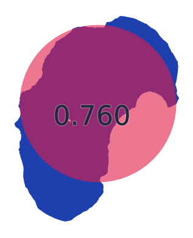

## 100. 児島湖 （岡山県）

- スコア: 0.75891 （14 iterations）
- 円形度: 0.38421
- 面積: 8km&sup2;, 周囲長: 16km

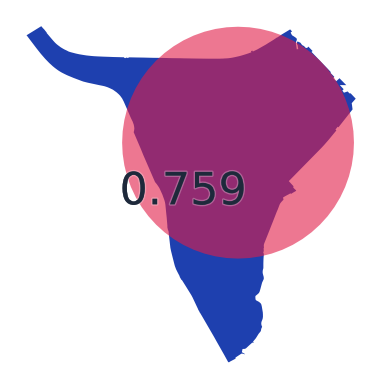

## 101. 中海 （鳥取県/島根県）

- スコア: 0.75563 （19 iterations）
- 円形度: 0.04446
- 面積: 87km&sup2;, 周囲長: 157km

## 102. 美鈴湖 （長野県）

- スコア: 0.75494 （13 iterations）
- 円形度: 0.40242
- 面積: 81,539m&sup2;, 周囲長: 2km

## 103. 大江湖 （熊本県）

- スコア: 0.75194 （12 iterations）
- 円形度: 0.43049
- 面積: 331,451m&sup2;, 周囲長: 3km

## 104. 阿寒湖 （北海道）

- スコア: 0.75184 （13 iterations）
- 円形度: 0.17818
- 面積: 13km&sup2;, 周囲長: 31km

## 105. 野尻湖（芙蓉湖） （長野県）

- スコア: 0.75109 （17 iterations）
- 円形度: 0.23586
- 面積: 4km&sup2;, 周囲長: 15km

## 106. 余呉湖 （滋賀県）

- スコア: 0.74994 （11 iterations）
- 円形度: 0.57540
- 面積: 2km&sup2;, 周囲長: 6km

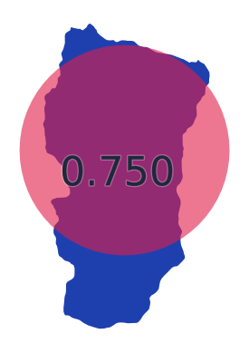

## 107. 羅臼湖 （北海道）

- スコア: 0.74897 （17 iterations）
- 円形度: 0.31223
- 面積: 411,516m&sup2;, 周囲長: 4km

## 108. 屈斜路湖 （北海道）

- スコア: 0.74793 （17 iterations）
- 円形度: 0.29452
- 面積: 81km&sup2;, 周囲長: 59km

## 109. 女神湖 （長野県）

- スコア: 0.74776 （16 iterations）
- 円形度: 0.41320
- 面積: 100,907m&sup2;, 周囲長: 2km

## 110. 巣山湖 （長野県）

- スコア: 0.74665 （20 iterations）
- 円形度: 0.72699
- 面積: 13,840m&sup2;, 周囲長: 489m

## 111. 次郎湖 （北海道）

- スコア: 0.74509 （17 iterations）
- 円形度: 0.63249
- 面積: 17,176m&sup2;, 周囲長: 584m

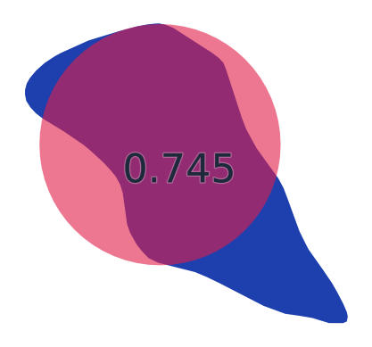

## 112. 河北潟 （石川県）

- スコア: 0.73964 （11 iterations）
- 円形度: 0.28314
- 面積: 4km&sup2;, 周囲長: 14km

## 113. 久種湖 （北海道）

- スコア: 0.73909 （14 iterations）
- 円形度: 0.57919
- 面積: 533,735m&sup2;, 周囲長: 3km

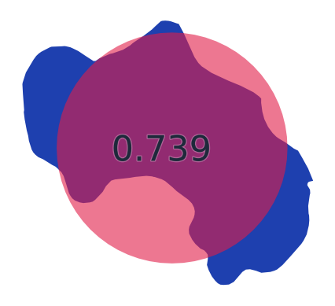

## 114. 城山湖 （神奈川県）

- スコア: 0.73825 （14 iterations）
- 円形度: 0.35081
- 面積: 192,979m&sup2;, 周囲長: 3km

## 115. 半月湖 （北海道）

- スコア: 0.73658 （13 iterations）
- 円形度: 0.60080
- 面積: 45,354m&sup2;, 周囲長: 974m

## 116. 蓼ノ湖 （栃木県）

- スコア: 0.73346 （13 iterations）
- 円形度: 0.47992
- 面積: 7,113m&sup2;, 周囲長: 432m

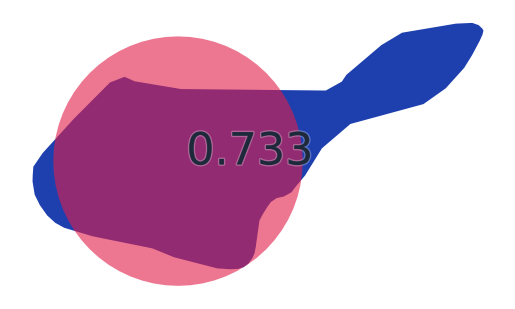

## 117. 二湖（知床五湖） （北海道）

- スコア: 0.73238 （26 iterations）
- 円形度: 0.22251
- 面積: 43,252m&sup2;, 周囲長: 2km

## 118. 西の湖 （滋賀県）

- スコア: 0.73148 （14 iterations）
- 円形度: 0.09657
- 面積: 2km&sup2;, 周囲長: 17km

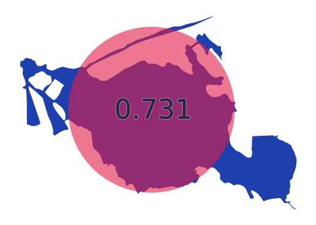

## 119. 達古武湖 （北海道）

- スコア: 0.73009 （12 iterations）
- 円形度: 0.51643
- 面積: 1km&sup2;, 周囲長: 6km

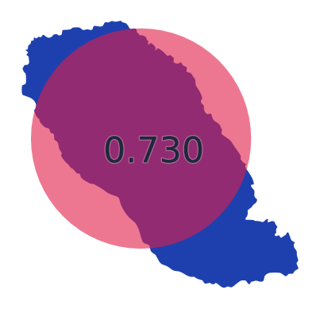

## 120. ポンテシオ湖 （北海道）

- スコア: 0.72998 （15 iterations）
- 円形度: 0.47551
- 面積: 183,720m&sup2;, 周囲長: 2km

## 121. 日暮ノ池（十二湖） （青森県）

- スコア: 0.72854 （18 iterations）
- 円形度: 0.60589
- 面積: 10,701m&sup2;, 周囲長: 471m

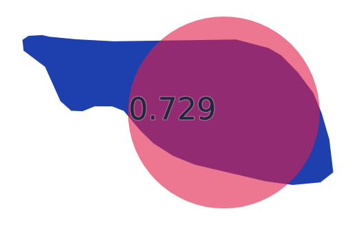

## 122. オコタンペ湖 （北海道）

- スコア: 0.72452 （12 iterations）
- 円形度: 0.31762
- 面積: 410,548m&sup2;, 周囲長: 4km

## 123. 南湖 （福島県）

- スコア: 0.72387 （17 iterations）
- 円形度: 0.50844
- 面積: 154,232m&sup2;, 周囲長: 2km

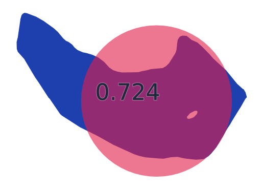

## 124. みずがき湖 （山梨県）

- スコア: 0.72342 （19 iterations）
- 円形度: 0.38138
- 面積: 228,325m&sup2;, 周囲長: 3km

## 125. 破池（十二湖） （青森県）

- スコア: 0.72336 （12 iterations）
- 円形度: 0.57208
- 面積: 27,795m&sup2;, 周囲長: 781m

## 126. 鳥の海 （宮城県）

- スコア: 0.72227 （18 iterations）
- 円形度: 0.28927
- 面積: 1km&sup2;, 周囲長: 8km

## 127. 三湖（知床五湖） （北海道）

- スコア: 0.71979 （12 iterations）
- 円形度: 0.38133
- 面積: 30,557m&sup2;, 周囲長: 1km

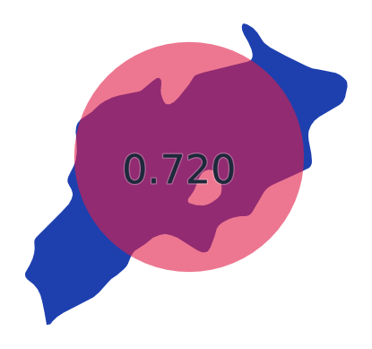

## 128. 入鹿池 （愛知県）

- スコア: 0.71684 （16 iterations）
- 円形度: 0.12500
- 面積: 1km&sup2;, 周囲長: 12km

## 129. 暑寒湖 （北海道）

- スコア: 0.71676 （19 iterations）
- 円形度: 0.23363
- 面積: 720,679m&sup2;, 周囲長: 6km

## 130. 鳴沢湖 （群馬県）

- スコア: 0.71628 （16 iterations）
- 円形度: 0.29733
- 面積: 125,458m&sup2;, 周囲長: 2km

## 131. 浜名湖 （静岡県）

- スコア: 0.71546 （16 iterations）
- 円形度: 0.04633
- 面積: 65km&sup2;, 周囲長: 132km

## 132. ウトナイ湖 （北海道）

- スコア: 0.71369 （23 iterations）
- 円形度: 0.17305
- 面積: 2km&sup2;, 周囲長: 12km

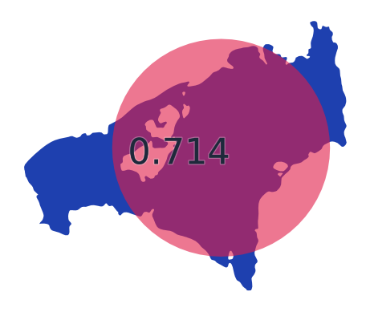

## 133. 碓氷湖 （群馬県）

- スコア: 0.71243 （16 iterations）
- 円形度: 0.34305
- 面積: 58,826m&sup2;, 周囲長: 1km

## 134. えばら湖 （愛媛県）

- スコア: 0.71075 （12 iterations）
- 円形度: 0.56996
- 面積: 22,753m&sup2;, 周囲長: 708m

## 135. 精進湖 （山梨県）

- スコア: 0.70881 （16 iterations）
- 円形度: 0.11181
- 面積: 455,985m&sup2;, 周囲長: 7km

## 136. くりやま湖 （北海道）

- スコア: 0.70847 （19 iterations）
- 円形度: 0.18418
- 面積: 230,924m&sup2;, 周囲長: 4km

## 137. 美笹湖 （長野県）

- スコア: 0.70742 （30 iterations）
- 円形度: 0.69603
- 面積: 14,692m&sup2;, 周囲長: 515m

## 138. 朱鞠内湖 （北海道）

- スコア: 0.70713 （20 iterations）
- 円形度: 0.01824
- 面積: 22km&sup2;, 周囲長: 123km

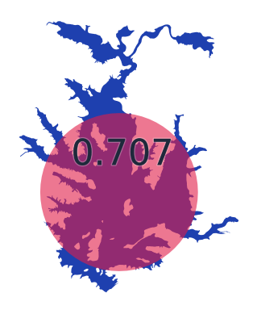

## 139. 福林湖 （岡山県）

- スコア: 0.70678 （17 iterations）
- 円形度: 0.44663
- 面積: 48,191m&sup2;, 周囲長: 1km

## 140. 鶏頭場ノ池（十二湖） （青森県）

- スコア: 0.70556 （16 iterations）
- 円形度: 0.36634
- 面積: 41,141m&sup2;, 周囲長: 1km

## 141. 志高湖 （大分県）

- スコア: 0.70537 （14 iterations）
- 円形度: 0.58146
- 面積: 82,717m&sup2;, 周囲長: 1km

## 142. 山中湖 （山梨県）

- スコア: 0.70529 （13 iterations）
- 円形度: 0.42979
- 面積: 6km&sup2;, 周囲長: 14km

## 143. 曽原湖 （福島県）

- スコア: 0.70504 （15 iterations）
- 円形度: 0.31564
- 面積: 310,583m&sup2;, 周囲長: 4km

## 144. 禅淡湖 （大分県）

- スコア: 0.70464 （15 iterations）
- 円形度: 0.52318
- 面積: 10,477m&sup2;, 周囲長: 502m

## 145. 尾駮沼 （青森県）

- スコア: 0.70352 （12 iterations）
- 円形度: 0.25629
- 面積: 4km&sup2;, 周囲長: 13km

## 146. 菅平湖 （長野県）

- スコア: 0.70334 （20 iterations）
- 円形度: 0.27879
- 面積: 174,344m&sup2;, 周囲長: 3km

## 147. 湯ノ湖 （栃木県）

- スコア: 0.70275 （16 iterations）
- 円形度: 0.35850
- 面積: 320,106m&sup2;, 周囲長: 3km

## 148. 久美浜湾 （京都府）

- スコア: 0.70062 （11 iterations）
- 円形度: 0.16104
- 面積: 7km&sup2;, 周囲長: 24km

## 149. 蓼科湖 （長野県）

- スコア: 0.69943 （17 iterations）
- 円形度: 0.48476
- 面積: 65,472m&sup2;, 周囲長: 1km

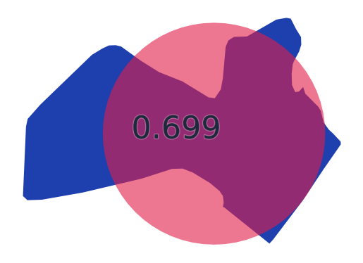

## 150. 青池（十二湖） （青森県）

- スコア: 0.69927 （13 iterations）
- 円形度: 0.63584
- 面積: 429m&sup2;, 周囲長: 92m

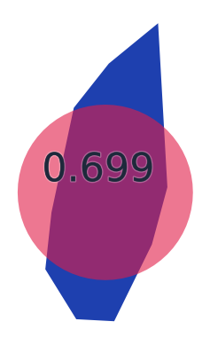

## 151. 十三湖 （青森県）

- スコア: 0.69908 （12 iterations）
- 円形度: 0.24890
- 面積: 18km&sup2;, 周囲長: 30km

## 152. 満濃池 （香川県）

- スコア: 0.69902 （18 iterations）
- 円形度: 0.05221
- 面積: 1km&sup2;, 周囲長: 18km

## 153. 椛ノ湖 （岐阜県）

- スコア: 0.69780 （16 iterations）
- 円形度: 0.45869
- 面積: 105,904m&sup2;, 周囲長: 2km

## 154. シュンクシタカラ湖 （北海道）

- スコア: 0.69672 （13 iterations）
- 円形度: 0.38315
- 面積: 116,651m&sup2;, 周囲長: 2km

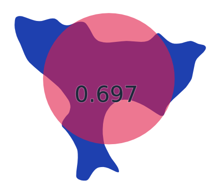

## 155. 瀬月内ダム湖 （岩手県）

- スコア: 0.69659 （21 iterations）
- 円形度: 0.28503
- 面積: 110,393m&sup2;, 周囲長: 2km

## 156. 大池（十二湖） （青森県）

- スコア: 0.69570 （16 iterations）
- 円形度: 0.38182
- 面積: 85,808m&sup2;, 周囲長: 2km

## 157. 火散布沼 （北海道）

- スコア: 0.69495 （18 iterations）
- 円形度: 0.12313
- 面積: 4km&sup2;, 周囲長: 19km

## 158. 離湖 （京都府）

- スコア: 0.69481 （22 iterations）
- 円形度: 0.30609
- 面積: 367,785m&sup2;, 周囲長: 4km

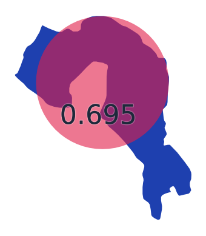

## 159. 石淵湖 （岩手県）

- スコア: 0.69466 （23 iterations）
- 円形度: 0.13220
- 面積: 690,853m&sup2;, 周囲長: 8km

## 160. 木崎湖 （長野県）

- スコア: 0.69404 （19 iterations）
- 円形度: 0.39161
- 面積: 2km&sup2;, 周囲長: 7km

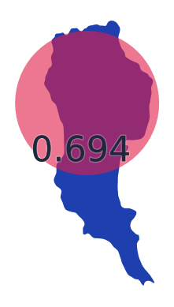

## 161. 早霧湖 （静岡県）

- スコア: 0.69382 （19 iterations）
- 円形度: 0.36338
- 面積: 41,566m&sup2;, 周囲長: 1km

## 162. 四湖（知床五湖） （北海道）

- スコア: 0.69256 （24 iterations）
- 円形度: 0.53922
- 面積: 18,981m&sup2;, 周囲長: 665m

## 163. 然別湖 （北海道）

- スコア: 0.69209 （21 iterations）
- 円形度: 0.21476
- 面積: 4km&sup2;, 周囲長: 15km

## 164. 小沼 （北海道）

- スコア: 0.69159 （16 iterations）
- 円形度: 0.13245
- 面積: 4km&sup2;, 周囲長: 19km

## 165. 琵琶湖 （滋賀県）

- スコア: 0.69123 （18 iterations）
- 円形度: 0.12408
- 面積: 669km&sup2;, 周囲長: 260km

## 166. 頓田第一貯水池 （福岡県）

- スコア: 0.68984 （14 iterations）
- 円形度: 0.06206
- 面積: 434,442m&sup2;, 周囲長: 9km

## 167. 宮沢湖 （埼玉県）

- スコア: 0.68896 （19 iterations）
- 円形度: 0.40112
- 面積: 100,277m&sup2;, 周囲長: 2km

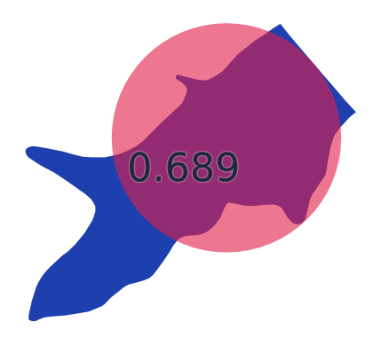

## 168. 相沼湖 （北海道）

- スコア: 0.68788 （20 iterations）
- 円形度: 0.18956
- 面積: 179,794m&sup2;, 周囲長: 3km

## 169. 奈良田湖 （山梨県）

- スコア: 0.68768 （19 iterations）
- 円形度: 0.30785
- 面積: 69,937m&sup2;, 周囲長: 2km

## 170. ポロト湖 （北海道）

- スコア: 0.68649 （16 iterations）
- 円形度: 0.50647
- 面積: 343,940m&sup2;, 周囲長: 3km

## 171. 洞源湖 （長野県）

- スコア: 0.68634 （21 iterations）
- 円形度: 0.64645
- 面積: 18,391m&sup2;, 周囲長: 598m

## 172. 須川湖 （秋田県）

- スコア: 0.68622 （11 iterations）
- 円形度: 0.58835
- 面積: 71,029m&sup2;, 周囲長: 1km

## 173. 浅内沼 （秋田県）

- スコア: 0.68580 （19 iterations）
- 円形度: 0.53147
- 面積: 1km&sup2;, 周囲長: 5km

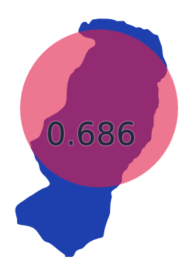

## 174. 室蘭工業用水池 （北海道）

- スコア: 0.68550 （15 iterations）
- 円形度: 0.45201
- 面積: 1km&sup2;, 周囲長: 5km

## 175. 秋葉湖 （新潟県）

- スコア: 0.68460 （18 iterations）
- 円形度: 0.33999
- 面積: 8,742m&sup2;, 周囲長: 568m

## 176. 北竜湖 （長野県）

- スコア: 0.68438 （17 iterations）
- 円形度: 0.46012
- 面積: 155,005m&sup2;, 周囲長: 2km

## 177. 生花苗沼 （北海道）

- スコア: 0.68418 （21 iterations）
- 円形度: 0.07949
- 面積: 2km&sup2;, 周囲長: 15km

## 178. 大沼湖 （長野県）

- スコア: 0.68406 （19 iterations）
- 円形度: 0.67980
- 面積: 16,090m&sup2;, 周囲長: 545m

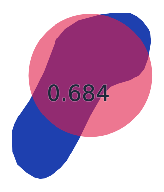

## 179. 野岳湖 （長崎県）

- スコア: 0.68402 （17 iterations）
- 円形度: 0.29884
- 面積: 118,972m&sup2;, 周囲長: 2km

## 180. 千波湖 （茨城県）

- スコア: 0.68400 （14 iterations）
- 円形度: 0.46562
- 面積: 290,066m&sup2;, 周囲長: 3km

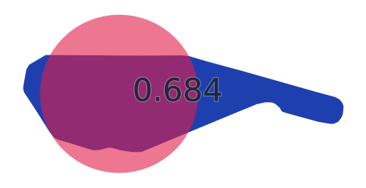

## 181. 田光沼 （青森県）

- スコア: 0.68305 （19 iterations）
- 円形度: 0.32582
- 面積: 1km&sup2;, 周囲長: 7km

## 182. 宍道湖 （島根県）

- スコア: 0.68120 （8 iterations）
- 円形度: 0.40249
- 面積: 79km&sup2;, 周囲長: 50km

## 183. 長節湖 （北海道）

- スコア: 0.68018 （13 iterations）
- 円形度: 0.31399
- 面積: 454,087m&sup2;, 周囲長: 4km

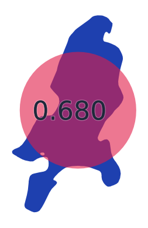

## 184. 八丁湖 （埼玉県）

- スコア: 0.67992 （17 iterations）
- 円形度: 0.25624
- 面積: 39,131m&sup2;, 周囲長: 1km

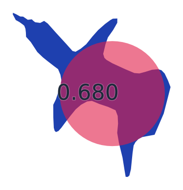

## 185. 王池（十二湖） （青森県）

- スコア: 0.67963 （18 iterations）
- 円形度: 0.29459
- 面積: 46,003m&sup2;, 周囲長: 1km

## 186. 高峰湖 （岐阜県）

- スコア: 0.67880 （24 iterations）
- 円形度: 0.33222
- 面積: 57,367m&sup2;, 周囲長: 1km

## 187. なめり湖 （三重県）

- スコア: 0.67628 （19 iterations）
- 円形度: 0.18353
- 面積: 109,931m&sup2;, 周囲長: 3km

## 188. 西湖 （山梨県）

- スコア: 0.67545 （17 iterations）
- 円形度: 0.27338
- 面積: 2km&sup2;, 周囲長: 10km

## 189. さまに湖 （北海道）

- スコア: 0.67529 （13 iterations）
- 円形度: 0.26042
- 面積: 197,840m&sup2;, 周囲長: 3km

## 190. 駒鳥池 （静岡県）

- スコア: 0.67517 （17 iterations）
- 円形度: 0.68618
- 面積: 903m&sup2;, 周囲長: 129m

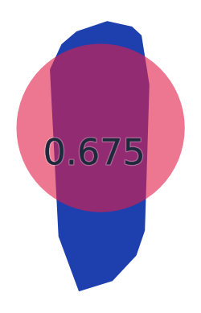

## 191. 常盤池 （山口県）

- スコア: 0.67277 （25 iterations）
- 円形度: 0.08912
- 面積: 812,200m&sup2;, 周囲長: 11km

## 192. 三重湖 （北海道）

- スコア: 0.66567 （17 iterations）
- 円形度: 0.58107
- 面積: 77,658m&sup2;, 周囲長: 1km

## 193. 金山ノ池（十二湖） （青森県）

- スコア: 0.66532 （14 iterations）
- 円形度: 0.47422
- 面積: 29,941m&sup2;, 周囲長: 891m

## 194. 愛知池 （愛知県）

- スコア: 0.66475 （15 iterations）
- 円形度: 0.20480
- 面積: 938,704m&sup2;, 周囲長: 8km

## 195. 松野湖 （岐阜県）

- スコア: 0.66464 （23 iterations）
- 円形度: 0.09940
- 面積: 297,649m&sup2;, 周囲長: 6km

## 196. 竜吟湖 （岐阜県）

- スコア: 0.66401 （12 iterations）
- 円形度: 0.29529
- 面積: 51,132m&sup2;, 周囲長: 1km

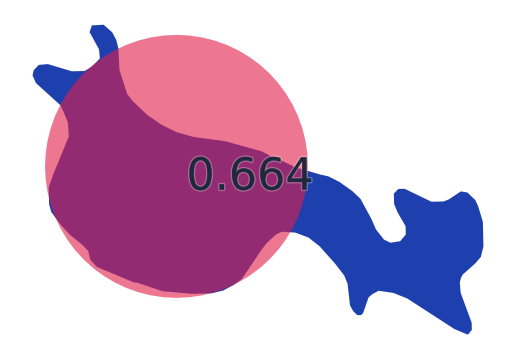

## 197. 夏海湖 （茨城県）

- スコア: 0.66258 （25 iterations）
- 円形度: 0.10366
- 面積: 112,074m&sup2;, 周囲長: 4km

## 198. 青海湖 （山口県）

- スコア: 0.66225 （20 iterations）
- 円形度: 0.38721
- 面積: 234,205m&sup2;, 周囲長: 3km

## 199. 頓田第二貯水池 （福岡県）

- スコア: 0.66218 （19 iterations）
- 円形度: 0.08458
- 面積: 528,194m&sup2;, 周囲長: 9km

## 200. 加茂湖 （新潟県）

- スコア: 0.65773 （15 iterations）
- 円形度: 0.20476
- 面積: 5km&sup2;, 周囲長: 17km

## 201. 長節湖 （北海道）

- スコア: 0.65690 （17 iterations）
- 円形度: 0.05732
- 面積: 1km&sup2;, 周囲長: 16km

## 202. 八景ノ池（十二湖） （青森県）

- スコア: 0.65427 （31 iterations）
- 円形度: 0.37505
- 面積: 9,256m&sup2;, 周囲長: 557m

## 203. 松川湖 （静岡県）

- スコア: 0.65388 （15 iterations）
- 円形度: 0.20922
- 面積: 163,307m&sup2;, 周囲長: 3km

## 204. 藤枝溜池 （青森県）

- スコア: 0.65016 （23 iterations）
- 円形度: 0.09452
- 面積: 381,786m&sup2;, 周囲長: 7km

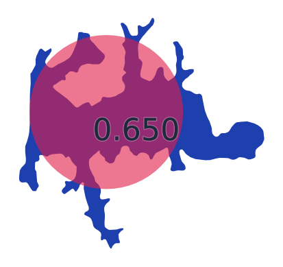

## 205. サロマ湖 （北海道）

- スコア: 0.64938 （15 iterations）
- 円形度: 0.19103
- 面積: 153km&sup2;, 周囲長: 100km

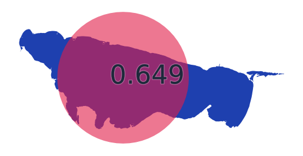

## 206. 野反湖 （群馬県）

- スコア: 0.64936 （12 iterations）
- 円形度: 0.26027
- 面積: 2km&sup2;, 周囲長: 9km

## 207. 東山湖 （静岡県）

- スコア: 0.64852 （21 iterations）
- 円形度: 0.63379
- 面積: 31,661m&sup2;, 周囲長: 792m

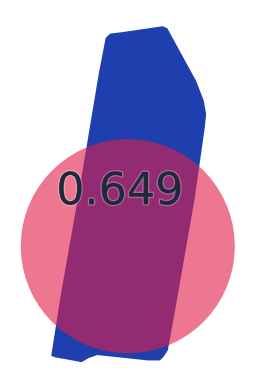

## 208. 七ッ森湖 （宮城県）

- スコア: 0.64714 （20 iterations）
- 円形度: 0.09710
- 面積: 667,272m&sup2;, 周囲長: 9km

## 209. 入笠湖 （長野県）

- スコア: 0.64697 （17 iterations）
- 円形度: 0.45333
- 面積: 17,055m&sup2;, 周囲長: 688m

## 210. 水嶺湖 （岐阜県）

- スコア: 0.64577 （17 iterations）
- 円形度: 0.04384
- 面積: 222,419m&sup2;, 周囲長: 8km

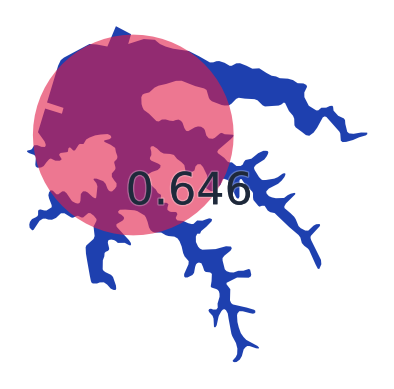

## 211. 黒瀬湖 （愛媛県）

- スコア: 0.64555 （16 iterations）
- 円形度: 0.14414
- 面積: 1km&sup2;, 周囲長: 10km

## 212. 阿蘇海 （京都府）

- スコア: 0.64528 （19 iterations）
- 円形度: 0.28512
- 面積: 5km&sup2;, 周囲長: 15km

## 213. 鳥屋野潟 （新潟県）

- スコア: 0.64486 （11 iterations）
- 円形度: 0.24540
- 面積: 1km&sup2;, 周囲長: 8km

## 214. 野花南湖 （北海道）

- スコア: 0.64328 （14 iterations）
- 円形度: 0.11035
- 面積: 595,786m&sup2;, 周囲長: 8km

## 215. 網走湖 （北海道）

- スコア: 0.64290 （18 iterations）
- 円形度: 0.19446
- 面積: 33km&sup2;, 周囲長: 46km

## 216. 薩摩湖 （鹿児島県）

- スコア: 0.64264 （15 iterations）
- 円形度: 0.37791
- 面積: 107,527m&sup2;, 周囲長: 2km

## 217. 山口貯水池（狭山湖） （埼玉県）

- スコア: 0.64157 （15 iterations）
- 円形度: 0.05969
- 面積: 2km&sup2;, 周囲長: 18km

## 218. 八郎潟調整池 （秋田県）

- スコア: 0.64131 （18 iterations）
- 円形度: 0.31920
- 面積: 28km&sup2;, 周囲長: 33km

## 219. 美笠湖 （長野県）

- スコア: 0.64118 （17 iterations）
- 円形度: 0.63916
- 面積: 8,911m&sup2;, 周囲長: 419m

## 220. 田面木沼 （青森県）

- スコア: 0.64087 （12 iterations）
- 円形度: 0.26700
- 面積: 2km&sup2;, 周囲長: 9km

## 221. 千代田湖 （山梨県）

- スコア: 0.64080 （22 iterations）
- 円形度: 0.33379
- 面積: 215,021m&sup2;, 周囲長: 3km

## 222. コックリ湖 （北海道）

- スコア: 0.63990 （22 iterations）
- 円形度: 0.57381
- 面積: 43,054m&sup2;, 周囲長: 971m

## 223. 面河ダム貯水池 （愛媛県）

- スコア: 0.63685 （20 iterations）
- 円形度: 0.04365
- 面積: 1km&sup2;, 周囲長: 18km

## 224. 只見湖 （福島県）

- スコア: 0.63375 （21 iterations）
- 円形度: 0.51099
- 面積: 616,440m&sup2;, 周囲長: 4km

## 225. 金仙寺湖 （兵庫県）

- スコア: 0.63359 （18 iterations）
- 円形度: 0.18306
- 面積: 199,988m&sup2;, 周囲長: 4km

## 226. 中禅寺湖 （栃木県）

- スコア: 0.63352 （9 iterations）
- 円形度: 0.23612
- 面積: 12km&sup2;, 周囲長: 25km

## 227. オタルナイ湖 （北海道）

- スコア: 0.63185 （16 iterations）
- 円形度: 0.39239
- 面積: 299,800m&sup2;, 周囲長: 3km

## 228. 湧洞沼 （北海道）

- スコア: 0.63160 （23 iterations）
- 円形度: 0.11765
- 面積: 4km&sup2;, 周囲長: 22km

## 229. 幌内ダム貯水池 （北海道）

- スコア: 0.63114 （18 iterations）
- 円形度: 0.17787
- 面積: 409,006m&sup2;, 周囲長: 5km

## 230. 佐鳴湖 （静岡県）

- スコア: 0.63008 （20 iterations）
- 円形度: 0.46574
- 面積: 1km&sup2;, 周囲長: 6km

## 231. 糸畑ノ池（十二湖） （青森県）

- スコア: 0.62875 （19 iterations）
- 円形度: 0.26546
- 面積: 24,448m&sup2;, 周囲長: 1km

## 232. 漫湖 （沖縄県）

- スコア: 0.62349 （16 iterations）
- 円形度: 0.15498
- 面積: 677,580m&sup2;, 周囲長: 7km

## 233. 白樺湖 （長野県）

- スコア: 0.62286 （16 iterations）
- 円形度: 0.22566
- 面積: 334,062m&sup2;, 周囲長: 4km

## 234. 姉沼 （青森県）

- スコア: 0.61886 （15 iterations）
- 円形度: 0.30640
- 面積: 2km&sup2;, 周囲長: 8km

## 235. 相模湖 （神奈川県）

- スコア: 0.61829 （19 iterations）
- 円形度: 0.14803
- 面積: 2km&sup2;, 周囲長: 12km

## 236. 牛久沼 （茨城県）

- スコア: 0.61821 （17 iterations）
- 円形度: 0.09223
- 面積: 3km&sup2;, 周囲長: 21km

## 237. 白石湖 （三重県）

- スコア: 0.61226 （23 iterations）
- 円形度: 0.30053
- 面積: 456,399m&sup2;, 周囲長: 4km

## 238. 伊自良湖 （岐阜県）

- スコア: 0.61196 （26 iterations）
- 円形度: 0.29426
- 面積: 85,439m&sup2;, 周囲長: 2km

## 239. 下湯平成湖 （青森県）

- スコア: 0.61090 （16 iterations）
- 円形度: 0.15733
- 面積: 270,387m&sup2;, 周囲長: 5km

## 240. 神流湖 （群馬県/埼玉県）

- スコア: 0.61023 （19 iterations）
- 円形度: 0.16058
- 面積: 2km&sup2;, 周囲長: 12km

## 241. 糠平湖 （北海道）

- スコア: 0.60943 （19 iterations）
- 円形度: 0.12783
- 面積: 8km&sup2;, 周囲長: 28km

## 242. 江津湖 （熊本県）

- スコア: 0.60938 （15 iterations）
- 円形度: 0.08619
- 面積: 479,278m&sup2;, 周囲長: 8km

## 243. 徳良湖 （山形県）

- スコア: 0.60748 （14 iterations）
- 円形度: 0.38558
- 面積: 227,965m&sup2;, 周囲長: 3km

## 244. 活込貯水池 （北海道）

- スコア: 0.60734 （19 iterations）
- 円形度: 0.27304
- 面積: 1km&sup2;, 周囲長: 8km

## 245. 河口湖 （山梨県）

- スコア: 0.60731 （19 iterations）
- 円形度: 0.15871
- 面積: 6km&sup2;, 周囲長: 21km

## 246. 赤谷湖 （群馬県）

- スコア: 0.60704 （19 iterations）
- 円形度: 0.19296
- 面積: 706,946m&sup2;, 周囲長: 7km

## 247. 木場潟 （石川県）

- スコア: 0.60632 （15 iterations）
- 円形度: 0.37339
- 面積: 1km&sup2;, 周囲長: 6km

## 248. 白川湖 （山形県）

- スコア: 0.60460 （12 iterations）
- 円形度: 0.34157
- 面積: 368,627m&sup2;, 周囲長: 4km

## 249. 長老湖 （宮城県）

- スコア: 0.60369 （15 iterations）
- 円形度: 0.26740
- 面積: 63,822m&sup2;, 周囲長: 2km

## 250. 伊豆沼 （宮城県）

- スコア: 0.60315 （14 iterations）
- 円形度: 0.33692
- 面積: 3km&sup2;, 周囲長: 11km

## 251. うらら湖 （北海道）

- スコア: 0.60306 （18 iterations）
- 円形度: 0.21443
- 面積: 371,609m&sup2;, 周囲長: 5km

## 252. 小平蘂湖 （北海道）

- スコア: 0.60158 （19 iterations）
- 円形度: 0.08271
- 面積: 1km&sup2;, 周囲長: 13km

## 253. 阿部池 （岡山県）

- スコア: 0.60053 （17 iterations）
- 円形度: 0.38278
- 面積: 593,809m&sup2;, 周囲長: 4km

## 254. 盃湖 （山形県）

- スコア: 0.59923 （22 iterations）
- 円形度: 0.45763
- 面積: 19,881m&sup2;, 周囲長: 739m

## 255. 刈込湖（切込湖） （栃木県）

- スコア: 0.59809 （27 iterations）
- 円形度: 0.25790
- 面積: 86,969m&sup2;, 周囲長: 2km

## 256. 釜房湖 （宮城県）

- スコア: 0.59766 （21 iterations）
- 円形度: 0.07797
- 面積: 3km&sup2;, 周囲長: 23km

## 257. 幌満湖 （北海道）

- スコア: 0.59741 （16 iterations）
- 円形度: 0.23674
- 面積: 973,295m&sup2;, 周囲長: 7km

## 258. まほろば湖 （奈良県）

- スコア: 0.59723 （10 iterations）
- 円形度: 0.19716
- 面積: 161,998m&sup2;, 周囲長: 3km

## 259. りんどう湖 （栃木県）

- スコア: 0.59417 （12 iterations）
- 円形度: 0.39657
- 面積: 74,899m&sup2;, 周囲長: 2km

## 260. サホロ湖 （北海道）

- スコア: 0.59373 （19 iterations）
- 円形度: 0.22007
- 面積: 276,472m&sup2;, 周囲長: 4km

## 261. 涸沼 （茨城県）

- スコア: 0.59353 （20 iterations）
- 円形度: 0.30464
- 面積: 9km&sup2;, 周囲長: 20km

## 262. 芦ノ湖 （神奈川県）

- スコア: 0.59162 （15 iterations）
- 円形度: 0.21424
- 面積: 7km&sup2;, 周囲長: 20km

## 263. 田代湖 （三重県）

- スコア: 0.59143 （20 iterations）
- 円形度: 0.32980
- 面積: 95,175m&sup2;, 周囲長: 2km

## 264. 五瀬ノ湖 （山口県）

- スコア: 0.59050 （17 iterations）
- 円形度: 0.21767
- 面積: 29,505m&sup2;, 周囲長: 1km

## 265. 霞ヶ浦 （茨城県）

- スコア: 0.58787 （20 iterations）
- 円形度: 0.13188
- 面積: 168km&sup2;, 周囲長: 127km

## 266. 大沼 （北海道）

- スコア: 0.58611 （13 iterations）
- 円形度: 0.07844
- 面積: 5km&sup2;, 周囲長: 29km

## 267. 米泉湖 （山口県）

- スコア: 0.58603 （21 iterations）
- 円形度: 0.13098
- 面積: 437,820m&sup2;, 周囲長: 6km

## 268. 朱鞠内湖（宇津内湖） （北海道）

- スコア: 0.58569 （33 iterations）
- 円形度: 0.08321
- 面積: 1km&sup2;, 周囲長: 15km

## 269. 久々子湖（三方五湖） （福井県）

- スコア: 0.58486 （19 iterations）
- 円形度: 0.26874
- 面積: 1km&sup2;, 周囲長: 8km

## 270. 乙見湖 （新潟県）

- スコア: 0.58325 （30 iterations）
- 円形度: 0.16741
- 面積: 767,177m&sup2;, 周囲長: 8km

## 271. 明神湖 （岐阜県）

- スコア: 0.58301 （14 iterations）
- 円形度: 0.16547
- 面積: 77,325m&sup2;, 周囲長: 2km

## 272. 鳴滝湖 （岡山県）

- スコア: 0.58299 （19 iterations）
- 円形度: 0.14799
- 面積: 107,607m&sup2;, 周囲長: 3km

## 273. 藤ノ湖 （青森県）

- スコア: 0.58280 （16 iterations）
- 円形度: 0.30098
- 面積: 107,661m&sup2;, 周囲長: 2km

## 274. 保古ノ湖 （岐阜県）

- スコア: 0.58244 （13 iterations）
- 円形度: 0.29833
- 面積: 120,619m&sup2;, 周囲長: 2km

## 275. 高滝湖 （千葉県）

- スコア: 0.58173 （21 iterations）
- 円形度: 0.11917
- 面積: 1km&sup2;, 周囲長: 11km

## 276. 温根沼 （北海道）

- スコア: 0.57755 （19 iterations）
- 円形度: 0.28980
- 面積: 6km&sup2;, 周囲長: 16km

## 277. 豊沢湖 （岩手県）

- スコア: 0.57717 （23 iterations）
- 円形度: 0.12960
- 面積: 799,742m&sup2;, 周囲長: 9km

## 278. シラルトロ沼 （北海道）

- スコア: 0.57540 （19 iterations）
- 円形度: 0.15304
- 面積: 2km&sup2;, 周囲長: 12km

## 279. 小川原湖 （青森県）

- スコア: 0.57522 （12 iterations）
- 円形度: 0.27354
- 面積: 62km&sup2;, 周囲長: 54km

## 280. 高遠湖 （長野県）

- スコア: 0.57246 （24 iterations）
- 円形度: 0.16693
- 面積: 209,859m&sup2;, 周囲長: 4km

## 281. かんな湖 （沖縄県）

- スコア: 0.57144 （20 iterations）
- 円形度: 0.09758
- 面積: 436,578m&sup2;, 周囲長: 7km

## 282. 有峰湖 （富山県）

- スコア: 0.56685 （16 iterations）
- 円形度: 0.06315
- 面積: 4km&sup2;, 周囲長: 30km

## 283. 海鼠池 （鹿児島県）

- スコア: 0.56516 （20 iterations）
- 円形度: 0.15061
- 面積: 518,068m&sup2;, 周囲長: 7km

## 284. 小野川湖 （福島県）

- スコア: 0.56416 （16 iterations）
- 円形度: 0.09762
- 面積: 2km&sup2;, 周囲長: 15km

## 285. 荒沢湖 （山形県）

- スコア: 0.56392 （18 iterations）
- 円形度: 0.12736
- 面積: 1km&sup2;, 周囲長: 11km

## 286. 能泉湖 （山梨県）

- スコア: 0.56222 （21 iterations）
- 円形度: 0.19687
- 面積: 229,651m&sup2;, 周囲長: 4km

## 287. みどり湖 （長野県）

- スコア: 0.56219 （24 iterations）
- 円形度: 0.25643
- 面積: 43,318m&sup2;, 周囲長: 1km

## 288. 日中ひざわ湖 （福島県）

- スコア: 0.56056 （19 iterations）
- 円形度: 0.07485
- 面積: 742,252m&sup2;, 周囲長: 11km

## 289. 立岩湖 （長野県）

- スコア: 0.55964 （21 iterations）
- 円形度: 0.35198
- 面積: 36,952m&sup2;, 周囲長: 1km

## 290. おけと湖 （北海道）

- スコア: 0.55826 （19 iterations）
- 円形度: 0.16935
- 面積: 1km&sup2;, 周囲長: 10km

## 291. 大沢内溜池 （青森県）

- スコア: 0.55731 （14 iterations）
- 円形度: 0.03757
- 面積: 434,249m&sup2;, 周囲長: 12km

## 292. 名栗湖 （埼玉県）

- スコア: 0.55617 （23 iterations）
- 円形度: 0.15876
- 面積: 259,685m&sup2;, 周囲長: 5km

## 293. 内の倉湖 （新潟県）

- スコア: 0.55610 （15 iterations）
- 円形度: 0.16860
- 面積: 772,553m&sup2;, 周囲長: 8km

## 294. 千振湖 （栃木県）

- スコア: 0.55243 （24 iterations）
- 円形度: 0.25971
- 面積: 40,710m&sup2;, 周囲長: 1km

## 295. 羽鳥湖 （福島県）

- スコア: 0.55136 （21 iterations）
- 円形度: 0.07602
- 面積: 2km&sup2;, 周囲長: 16km

## 296. 白水湖 （岐阜県）

- スコア: 0.55036 （33 iterations）
- 円形度: 0.23458
- 面積: 627,118m&sup2;, 周囲長: 6km

## 297. 豊英湖 （千葉県）

- スコア: 0.55036 （13 iterations）
- 円形度: 0.08999
- 面積: 251,799m&sup2;, 周囲長: 6km

## 298. 大日湖 （石川県）

- スコア: 0.55026 （29 iterations）
- 円形度: 0.07504
- 面積: 1km&sup2;, 周囲長: 14km

## 299. 窓竜湖 （広島県）

- スコア: 0.54705 （23 iterations）
- 円形度: 0.29843
- 面積: 121,825m&sup2;, 周囲長: 2km

## 300. ホロピリ湖 （北海道）

- スコア: 0.54492 （10 iterations）
- 円形度: 0.08170
- 面積: 3km&sup2;, 周囲長: 20km

## 301. 八幡湖 （千葉県）

- スコア: 0.54381 （12 iterations）
- 円形度: 0.35502
- 面積: 52,127m&sup2;, 周囲長: 1km

## 302. 龍神湖 （長野県）

- スコア: 0.54286 （21 iterations）
- 円形度: 0.11293
- 面積: 499,765m&sup2;, 周囲長: 7km

## 303. さくら湖 （福島県）

- スコア: 0.54244 （18 iterations）
- 円形度: 0.03085
- 面積: 2km&sup2;, 周囲長: 26km

## 304. 青竜湖 （広島県）

- スコア: 0.53992 （19 iterations）
- 円形度: 0.16130
- 面積: 150,799m&sup2;, 周囲長: 3km

## 305. 東山湖 （北海道）

- スコア: 0.53976 （16 iterations）
- 円形度: 0.26590
- 面積: 166,893m&sup2;, 周囲長: 3km

## 306. 野木和湖 （青森県）

- スコア: 0.53753 （20 iterations）
- 円形度: 0.11142
- 面積: 87,496m&sup2;, 周囲長: 3km

## 307. 翠明湖 （兵庫県）

- スコア: 0.53722 （16 iterations）
- 円形度: 0.12464
- 面積: 754,319m&sup2;, 周囲長: 9km

## 308. 三面貯水池 （新潟県）

- スコア: 0.53718 （25 iterations）
- 円形度: 0.07518
- 面積: 910,789m&sup2;, 周囲長: 12km

## 309. 神楽女湖 （大分県）

- スコア: 0.53659 （17 iterations）
- 円形度: 0.39235
- 面積: 29,205m&sup2;, 周囲長: 967m

## 310. 青山貯水池 （北海道）

- スコア: 0.53650 （23 iterations）
- 円形度: 0.09397
- 面積: 1km&sup2;, 周囲長: 13km

## 311. 龍ヶ鼻湖 （福井県）

- スコア: 0.53632 （22 iterations）
- 円形度: 0.12040
- 面積: 282,258m&sup2;, 周囲長: 5km

## 312. 太平湖 （秋田県）

- スコア: 0.53591 （21 iterations）
- 円形度: 0.03469
- 面積: 1km&sup2;, 周囲長: 21km

## 313. 花山湖 （宮城県）

- スコア: 0.53525 （20 iterations）
- 円形度: 0.12204
- 面積: 2km&sup2;, 周囲長: 13km

## 314. いなさ湖 （静岡県）

- スコア: 0.53501 （19 iterations）
- 円形度: 0.09906
- 面積: 466,784m&sup2;, 周囲長: 8km

## 315. 鎌北湖 （埼玉県）

- スコア: 0.53491 （21 iterations）
- 円形度: 0.17327
- 面積: 26,354m&sup2;, 周囲長: 1km

## 316. 阿木川湖 （岐阜県）

- スコア: 0.53483 （24 iterations）
- 円形度: 0.07543
- 面積: 1km&sup2;, 周囲長: 14km

## 317. 通天湖 （京都府）

- スコア: 0.53388 （21 iterations）
- 円形度: 0.15547
- 面積: 33,158m&sup2;, 周囲長: 2km

## 318. 御所湖 （岩手県）

- スコア: 0.53343 （20 iterations）
- 円形度: 0.09187
- 面積: 5km&sup2;, 周囲長: 26km

## 319. 銀山湖 （兵庫県）

- スコア: 0.53303 （19 iterations）
- 円形度: 0.07230
- 面積: 670,083m&sup2;, 周囲長: 11km

## 320. 沓沢湖 （長野県）

- スコア: 0.53216 （17 iterations）
- 円形度: 0.14930
- 面積: 73,498m&sup2;, 周囲長: 2km

## 321. 塘路湖 （北海道）

- スコア: 0.53129 （20 iterations）
- 円形度: 0.20429
- 面積: 6km&sup2;, 周囲長: 20km

## 322. 薗原湖 （群馬県）

- スコア: 0.53054 （22 iterations）
- 円形度: 0.08648
- 面積: 622,620m&sup2;, 周囲長: 10km

## 323. 奥いび湖 （岐阜県）

- スコア: 0.52681 （20 iterations）
- 円形度: 0.24902
- 面積: 338,069m&sup2;, 周囲長: 4km

## 324. 秋元湖 （福島県）

- スコア: 0.52676 （17 iterations）
- 円形度: 0.08875
- 面積: 4km&sup2;, 周囲長: 23km

## 325. 鷹架沼 （青森県）

- スコア: 0.52601 （14 iterations）
- 円形度: 0.15040
- 面積: 6km&sup2;, 周囲長: 21km

## 326. チミケップ湖 （北海道）

- スコア: 0.52500 （23 iterations）
- 円形度: 0.17947
- 面積: 1km&sup2;, 周囲長: 9km

## 327. 水窪湖 （静岡県）

- スコア: 0.52448 （23 iterations）
- 円形度: 0.12643
- 面積: 668,324m&sup2;, 周囲長: 8km

## 328. 美山湖 （青森県）

- スコア: 0.52124 （25 iterations）
- 円形度: 0.09599
- 面積: 2km&sup2;, 周囲長: 15km

## 329. 神之瀬湖 （広島県）

- スコア: 0.52087 （22 iterations）
- 円形度: 0.08431
- 面積: 1km&sup2;, 周囲長: 13km

## 330. 雨畑湖 （山梨県）

- スコア: 0.52018 （23 iterations）
- 円形度: 0.14645
- 面積: 300,004m&sup2;, 周囲長: 5km

## 331. パンケトー （北海道）

- スコア: 0.52014 （11 iterations）
- 円形度: 0.23058
- 面積: 3km&sup2;, 周囲長: 13km

## 332. 聖湖 （広島県）

- スコア: 0.51858 （20 iterations）
- 円形度: 0.04439
- 面積: 1km&sup2;, 周囲長: 17km

## 333. 秋扇湖 （秋田県）

- スコア: 0.51838 （16 iterations）
- 円形度: 0.09849
- 面積: 1km&sup2;, 周囲長: 12km

## 334. 本宮湖 （兵庫県）

- スコア: 0.51819 （18 iterations）
- 円形度: 0.16927
- 面積: 163,139m&sup2;, 周囲長: 3km

## 335. 蜂の巣湖 （熊本県/大分県）

- スコア: 0.51800 （22 iterations）
- 円形度: 0.12816
- 面積: 1km&sup2;, 周囲長: 10km

## 336. 涛沸湖 （北海道）

- スコア: 0.51779 （27 iterations）
- 円形度: 0.09660
- 面積: 8km&sup2;, 周囲長: 33km

## 337. 赤石ダム湖 （静岡県）

- スコア: 0.51746 （19 iterations）
- 円形度: 0.12629
- 面積: 149,830m&sup2;, 周囲長: 4km

## 338. 宮ヶ瀬湖 （神奈川県）

- スコア: 0.51676 （23 iterations）
- 円形度: 0.04803
- 面積: 3km&sup2;, 周囲長: 30km

## 339. 小安峡湖 （秋田県）

- スコア: 0.51644 （23 iterations）
- 円形度: 0.03695
- 面積: 1km&sup2;, 周囲長: 20km

## 340. 岩尾内湖 （北海道）

- スコア: 0.51638 （30 iterations）
- 円形度: 0.08949
- 面積: 5km&sup2;, 周囲長: 27km

## 341. 松川浦 （福島県）

- スコア: 0.51576 （20 iterations）
- 円形度: 0.10354
- 面積: 6km&sup2;, 周囲長: 27km

## 342. 芹川ダム貯水池 （大分県）

- スコア: 0.51431 （16 iterations）
- 円形度: 0.03305
- 面積: 1km&sup2;, 周囲長: 21km

## 343. 長柄湖 （香川県）

- スコア: 0.51323 （17 iterations）
- 円形度: 0.05852
- 面積: 314,996m&sup2;, 周囲長: 8km

## 344. 津久井湖 （神奈川県）

- スコア: 0.51203 （27 iterations）
- 円形度: 0.07086
- 面積: 2km&sup2;, 周囲長: 20km

## 345. 桂沢湖 （北海道）

- スコア: 0.51172 （25 iterations）
- 円形度: 0.02695
- 面積: 4km&sup2;, 周囲長: 46km

## 346. 間瀬湖 （埼玉県）

- スコア: 0.51112 （24 iterations）
- 円形度: 0.26716
- 面積: 46,815m&sup2;, 周囲長: 1km

## 347. 三浦貯水池 （長野県）

- スコア: 0.51103 （26 iterations）
- 円形度: 0.07854
- 面積: 2km&sup2;, 周囲長: 19km

## 348. 中山湖 （山口県）

- スコア: 0.51043 （19 iterations）
- 円形度: 0.11292
- 面積: 480,580m&sup2;, 周囲長: 7km

## 349. 震生湖 （神奈川県）

- スコア: 0.50998 （17 iterations）
- 円形度: 0.26947
- 面積: 14,512m&sup2;, 周囲長: 823m

## 350. 北山貯水池 （佐賀県）

- スコア: 0.50963 （29 iterations）
- 円形度: 0.03200
- 面積: 2km&sup2;, 周囲長: 26km

## 351. 七ヶ宿湖 （宮城県）

- スコア: 0.50913 （28 iterations）
- 円形度: 0.06488
- 面積: 3km&sup2;, 周囲長: 25km

## 352. 内沼 （青森県）

- スコア: 0.50894 （15 iterations）
- 円形度: 0.14561
- 面積: 913,691m&sup2;, 周囲長: 9km

## 353. 村山貯水池（多摩湖） （東京都）

- スコア: 0.50890 （27 iterations）
- 円形度: 0.05459
- 面積: 1km&sup2;, 周囲長: 18km

## 354. ホロカヤントウ （北海道）

- スコア: 0.50390 （12 iterations）
- 円形度: 0.15800
- 面積: 654,343m&sup2;, 周囲長: 7km

## 355. 菊川湖 （山口県）

- スコア: 0.50387 （18 iterations）
- 円形度: 0.09794
- 面積: 505,670m&sup2;, 周囲長: 8km

## 356. 天間ダム貯水池 （青森県）

- スコア: 0.50314 （25 iterations）
- 円形度: 0.14152
- 面積: 773,205m&sup2;, 周囲長: 8km

## 357. 幌尻湖 （北海道）

- スコア: 0.50291 （23 iterations）
- 円形度: 0.19504
- 面積: 287,533m&sup2;, 周囲長: 4km

## 358. 桧原湖 （福島県）

- スコア: 0.50042 （14 iterations）
- 円形度: 0.05751
- 面積: 11km&sup2;, 周囲長: 48km

## 359. 米山湖 （新潟県）

- スコア: 0.49960 （23 iterations）
- 円形度: 0.15992
- 面積: 101,711m&sup2;, 周囲長: 3km

## 360. 菅生沼 （茨城県）

- スコア: 0.49951 （25 iterations）
- 円形度: 0.01501
- 面積: 533,526m&sup2;, 周囲長: 21km

## 361. かわうち湖 （青森県）

- スコア: 0.49781 （24 iterations）
- 円形度: 0.05052
- 面積: 1km&sup2;, 周囲長: 18km

## 362. 錫杖湖 （三重県）

- スコア: 0.49352 （13 iterations）
- 円形度: 0.11287
- 面積: 355,975m&sup2;, 周囲長: 6km

## 363. 深山湖 （栃木県）

- スコア: 0.49281 （17 iterations）
- 円形度: 0.18481
- 面積: 907,308m&sup2;, 周囲長: 8km

## 364. 知明湖 （兵庫県/大阪府）

- スコア: 0.49157 （20 iterations）
- 円形度: 0.04277
- 面積: 1km&sup2;, 周囲長: 18km

## 365. 菅野湖 （山口県）

- スコア: 0.49017 （25 iterations）
- 円形度: 0.02746
- 面積: 2km&sup2;, 周囲長: 34km

## 366. 川俣湖 （栃木県）

- スコア: 0.48940 （19 iterations）
- 円形度: 0.05798
- 面積: 2km&sup2;, 周囲長: 20km

## 367. 八千代湖 （広島県）

- スコア: 0.48900 （25 iterations）
- 円形度: 0.10945
- 面積: 2km&sup2;, 周囲長: 14km

## 368. 神農湖 （広島県）

- スコア: 0.48835 （16 iterations）
- 円形度: 0.08034
- 面積: 493,882m&sup2;, 周囲長: 9km

## 369. 定山湖 （北海道）

- スコア: 0.48692 （18 iterations）
- 円形度: 0.11071
- 面積: 1km&sup2;, 周囲長: 13km

## 370. 南部片富士湖 （岩手県）

- スコア: 0.48659 （20 iterations）
- 円形度: 0.08861
- 面積: 3km&sup2;, 周囲長: 20km

## 371. 長沼 （宮城県）

- スコア: 0.48655 （15 iterations）
- 円形度: 0.10964
- 面積: 4km&sup2;, 周囲長: 20km

## 372. 東古屋湖 （栃木県）

- スコア: 0.48527 （21 iterations）
- 円形度: 0.04420
- 面積: 138,368m&sup2;, 周囲長: 6km

## 373. 笠間湖 （茨城県）

- スコア: 0.48510 （25 iterations）
- 円形度: 0.05469
- 面積: 162,922m&sup2;, 周囲長: 6km

## 374. 豊田湖 （山口県）

- スコア: 0.48467 （17 iterations）
- 円形度: 0.03675
- 面積: 1km&sup2;, 周囲長: 20km

## 375. 円良田湖 （埼玉県）

- スコア: 0.48434 （20 iterations）
- 円形度: 0.16022
- 面積: 86,051m&sup2;, 周囲長: 3km

## 376. 畑薙湖 （静岡県）

- スコア: 0.48382 （16 iterations）
- 円形度: 0.06560
- 面積: 2km&sup2;, 周囲長: 20km

## 377. 恩原湖 （岡山県）

- スコア: 0.48376 （11 iterations）
- 円形度: 0.22150
- 面積: 234,960m&sup2;, 周囲長: 4km

## 378. 梅林湖 （熊本県/大分県）

- スコア: 0.48199 （21 iterations）
- 円形度: 0.10613
- 面積: 1km&sup2;, 周囲長: 13km

## 379. 奥相模湖 （神奈川県）

- スコア: 0.48148 （25 iterations）
- 円形度: 0.14778
- 面積: 74,924m&sup2;, 周囲長: 3km

## 380. 早明浦湖 （高知県）

- スコア: 0.48124 （21 iterations）
- 円形度: 0.03621
- 面積: 4km&sup2;, 周囲長: 37km

## 381. 刀利ダム貯水池 （富山県/石川県）

- スコア: 0.47925 （24 iterations）
- 円形度: 0.09623
- 面積: 812,003m&sup2;, 周囲長: 10km

## 382. 三河湖 （愛知県）

- スコア: 0.47816 （19 iterations）
- 円形度: 0.07039
- 面積: 685,650m&sup2;, 周囲長: 11km

## 383. 大原湖 （山口県）

- スコア: 0.47798 （21 iterations）
- 円形度: 0.09203
- 面積: 874,218m&sup2;, 周囲長: 11km

## 384. 富里湖 （北海道）

- スコア: 0.47769 （22 iterations）
- 円形度: 0.23495
- 面積: 197,889m&sup2;, 周囲長: 3km

## 385. 白竜湖 （広島県）

- スコア: 0.47711 （33 iterations）
- 円形度: 0.08592
- 面積: 553,045m&sup2;, 周囲長: 9km

## 386. 湯原湖 （岡山県）

- スコア: 0.47547 （21 iterations）
- 円形度: 0.02496
- 面積: 4km&sup2;, 周囲長: 44km

## 387. 玉川湖 （愛媛県）

- スコア: 0.47518 （19 iterations）
- 円形度: 0.08164
- 面積: 496,783m&sup2;, 周囲長: 9km

## 388. 下小鳥ダム貯水池 （岐阜県）

- スコア: 0.47506 （27 iterations）
- 円形度: 0.08948
- 面積: 3km&sup2;, 周囲長: 19km

## 389. 音水湖 （兵庫県）

- スコア: 0.47439 （24 iterations）
- 円形度: 0.11816
- 面積: 720,267m&sup2;, 周囲長: 9km

## 390. 草木湖 （群馬県）

- スコア: 0.47438 （22 iterations）
- 円形度: 0.11678
- 面積: 2km&sup2;, 周囲長: 14km

## 391. ならまた湖 （群馬県）

- スコア: 0.47401 （19 iterations）
- 円形度: 0.07554
- 面積: 2km&sup2;, 周囲長: 16km

## 392. 大隅湖 （鹿児島県）

- スコア: 0.47378 （18 iterations）
- 円形度: 0.18911
- 面積: 886,133m&sup2;, 周囲長: 8km

## 393. 風蓮湖 （北海道）

- スコア: 0.47296 （17 iterations）
- 円形度: 0.07076
- 面積: 60km&sup2;, 周囲長: 103km

## 394. 朝日貯水池 （岐阜県）

- スコア: 0.47286 （26 iterations）
- 円形度: 0.11752
- 面積: 635,575m&sup2;, 周囲長: 8km

## 395. びばい湖 （北海道）

- スコア: 0.47147 （20 iterations）
- 円形度: 0.08532
- 面積: 89,797m&sup2;, 周囲長: 4km

## 396. 蟠竜湖 （島根県）

- スコア: 0.47118 （24 iterations）
- 円形度: 0.04630
- 面積: 94,440m&sup2;, 周囲長: 5km

## 397. 牛旁ノ池（十二湖） （青森県）

- スコア: 0.46697 （21 iterations）
- 円形度: 0.24408
- 面積: 8,518m&sup2;, 周囲長: 662m

## 398. 錦鶏湖 （山口県）

- スコア: 0.46638 （20 iterations）
- 円形度: 0.20987
- 面積: 70,564m&sup2;, 周囲長: 2km

## 399. 三島湖 （千葉県）

- スコア: 0.46603 （15 iterations）
- 円形度: 0.03403
- 面積: 414,373m&sup2;, 周囲長: 12km

## 400. 妙義湖 （群馬県）

- スコア: 0.46567 （24 iterations）
- 円形度: 0.13766
- 面積: 93,152m&sup2;, 周囲長: 3km

## 401. 高瀬湖 （山口県）

- スコア: 0.46530 （16 iterations）
- 円形度: 0.06477
- 面積: 494,154m&sup2;, 周囲長: 10km

## 402. シューパロ湖（シュウパロ湖） （北海道）

- スコア: 0.46472 （19 iterations）
- 円形度: 0.08466
- 面積: 3km&sup2;, 周囲長: 21km

## 403. 大雪湖 （北海道）

- スコア: 0.46388 （22 iterations）
- 円形度: 0.12926
- 面積: 2km&sup2;, 周囲長: 15km

## 404. 蛭沢湖 （山形県）

- スコア: 0.46126 （16 iterations）
- 円形度: 0.17562
- 面積: 170,475m&sup2;, 周囲長: 3km

## 405. 小野湖 （宮崎県）

- スコア: 0.45887 （19 iterations）
- 円形度: 0.04174
- 面積: 1km&sup2;, 周囲長: 19km

## 406. 北浦 （茨城県）

- スコア: 0.45861 （21 iterations）
- 円形度: 0.09223
- 面積: 35km&sup2;, 周囲長: 69km

## 407. 八汐湖 （栃木県）

- スコア: 0.45810 （16 iterations）
- 円形度: 0.07901
- 面積: 2km&sup2;, 周囲長: 16km

## 408. 緑水湖 （鳥取県）

- スコア: 0.45735 （27 iterations）
- 円形度: 0.07738
- 面積: 373,260m&sup2;, 周囲長: 8km

## 409. 小渋湖 （長野県）

- スコア: 0.45622 （17 iterations）
- 円形度: 0.05760
- 面積: 1km&sup2;, 周囲長: 17km

## 410. 御岳湖 （長野県）

- スコア: 0.45463 （18 iterations）
- 円形度: 0.12845
- 面積: 2km&sup2;, 周囲長: 15km

## 411. 高見湖 （北海道）

- スコア: 0.45454 （21 iterations）
- 円形度: 0.04431
- 面積: 5km&sup2;, 周囲長: 38km

## 412. 富栖湖 （兵庫県）

- スコア: 0.45184 （36 iterations）
- 円形度: 0.10794
- 面積: 89,280m&sup2;, 周囲長: 3km

## 413. 芦田湖 （広島県）

- スコア: 0.45152 （21 iterations）
- 円形度: 0.04971
- 面積: 1km&sup2;, 周囲長: 19km

## 414. 田子倉湖 （福島県）

- スコア: 0.44849 （20 iterations）
- 円形度: 0.01968
- 面積: 10km&sup2;, 周囲長: 81km

## 415. クイナ湖 （沖縄県）

- スコア: 0.44741 （23 iterations）
- 円形度: 0.04707
- 面積: 574,180m&sup2;, 周囲長: 12km

## 416. 仙水湖 （広島県）

- スコア: 0.44723 （21 iterations）
- 円形度: 0.02356
- 面積: 1km&sup2;, 周囲長: 23km

## 417. 丹沢湖 （神奈川県）

- スコア: 0.44594 （23 iterations）
- 円形度: 0.05077
- 面積: 2km&sup2;, 周囲長: 22km

## 418. 池原貯水池 （奈良県）

- スコア: 0.44497 （29 iterations）
- 円形度: 0.02476
- 面積: 5km&sup2;, 周囲長: 49km

## 419. 阿武湖 （山口県）

- スコア: 0.44494 （21 iterations）
- 円形度: 0.02443
- 面積: 3km&sup2;, 周囲長: 39km

## 420. フンガー湖 （沖縄県）

- スコア: 0.44284 （28 iterations）
- 円形度: 0.03675
- 面積: 136,830m&sup2;, 周囲長: 7km

## 421. 洞庭湖 （千葉県）

- スコア: 0.44146 （14 iterations）
- 円形度: 0.16052
- 面積: 32,136m&sup2;, 周囲長: 2km

## 422. 若郷湖 （福島県）

- スコア: 0.44070 （20 iterations）
- 円形度: 0.21795
- 面積: 829,248m&sup2;, 周囲長: 7km

## 423. 新冠湖 （北海道）

- スコア: 0.44046 （22 iterations）
- 円形度: 0.06626
- 面積: 3km&sup2;, 周囲長: 25km

## 424. 上津ダム湖 （奈良県）

- スコア: 0.43958 （23 iterations）
- 円形度: 0.07009
- 面積: 265,023m&sup2;, 周囲長: 7km

## 425. 明神湖 （兵庫県）

- スコア: 0.43909 （21 iterations）
- 円形度: 0.16253
- 面積: 48,986m&sup2;, 周囲長: 2km

## 426. 奥只見湖 （福島県/新潟県）

- スコア: 0.43829 （16 iterations）
- 円形度: 0.01910
- 面積: 11km&sup2;, 周囲長: 83km

## 427. 井川湖 （静岡県）

- スコア: 0.43756 （22 iterations）
- 円形度: 0.06805
- 面積: 4km&sup2;, 周囲長: 26km

## 428. 鳩山ダム貯水池 （岐阜県）

- スコア: 0.43716 （23 iterations）
- 円形度: 0.16835
- 面積: 1km&sup2;, 周囲長: 10km

## 429. 滝里湖 （北海道）

- スコア: 0.43711 （13 iterations）
- 円形度: 0.18072
- 面積: 4km&sup2;, 周囲長: 17km

## 430. 魚梁瀬貯水池 （高知県）

- スコア: 0.43575 （19 iterations）
- 円形度: 0.02782
- 面積: 2km&sup2;, 周囲長: 34km

## 431. 奥利根湖 （群馬県）

- スコア: 0.43554 （30 iterations）
- 円形度: 0.02334
- 面積: 4km&sup2;, 周囲長: 49km

## 432. 伏美湖 （北海道）

- スコア: 0.43517 （18 iterations）
- 円形度: 0.14537
- 面積: 8,872m&sup2;, 周囲長: 876m

## 433. 二風谷湖（にぶたに湖） （北海道）

- スコア: 0.43404 （19 iterations）
- 円形度: 0.13469
- 面積: 3km&sup2;, 周囲長: 17km

## 434. 宮野湖 （山口県）

- スコア: 0.43223 （18 iterations）
- 円形度: 0.09342
- 面積: 170,250m&sup2;, 周囲長: 5km

## 435. 東大雪湖 （北海道）

- スコア: 0.43123 （21 iterations）
- 円形度: 0.14653
- 面積: 2km&sup2;, 周囲長: 13km

## 436. 猿田貯水池 （新潟県）

- スコア: 0.42779 （22 iterations）
- 円形度: 0.05573
- 面積: 677,842m&sup2;, 周囲長: 12km

## 437. 市津湖 （千葉県）

- スコア: 0.42634 （15 iterations）
- 円形度: 0.05076
- 面積: 562,510m&sup2;, 周囲長: 12km

## 438. 芦別湖 （北海道）

- スコア: 0.42589 （18 iterations）
- 円形度: 0.07501
- 面積: 132,565m&sup2;, 周囲長: 5km

## 439. 伊集の湖 （沖縄県）

- スコア: 0.42413 （26 iterations）
- 円形度: 0.01839
- 面積: 281,739m&sup2;, 周囲長: 14km

## 440. さっぽろ湖 （北海道）

- スコア: 0.42401 （26 iterations）
- 円形度: 0.07521
- 面積: 2km&sup2;, 周囲長: 17km

## 441. 笠堀湖 （新潟県）

- スコア: 0.42308 （23 iterations）
- 円形度: 0.15225
- 面積: 364,490m&sup2;, 周囲長: 5km

## 442. 印旛沼 （千葉県）

- スコア: 0.42271 （19 iterations）
- 円形度: 0.06624
- 面積: 9km&sup2;, 周囲長: 42km

## 443. 北潟湖 （石川県/福井県）

- スコア: 0.42151 （16 iterations）
- 円形度: 0.07372
- 面積: 2km&sup2;, 周囲長: 19km

## 444. 母畑湖 （福島県）

- スコア: 0.42020 （20 iterations）
- 円形度: 0.03994
- 面積: 725,427m&sup2;, 周囲長: 15km

## 445. 東仙峡金山湖 （岐阜県）

- スコア: 0.41902 （21 iterations）
- 円形度: 0.03970
- 面積: 4km&sup2;, 周囲長: 33km

## 446. 青蓮寺湖 （三重県）

- スコア: 0.41792 （19 iterations）
- 円形度: 0.07105
- 面積: 789,440m&sup2;, 周囲長: 12km

## 447. 桂湖 （富山県/岐阜県）

- スコア: 0.41764 （22 iterations）
- 円形度: 0.09789
- 面積: 1km&sup2;, 周囲長: 12km

## 448. 黒又川第一ダム貯水池 （新潟県）

- スコア: 0.41722 （22 iterations）
- 円形度: 0.03129
- 面積: 1km&sup2;, 周囲長: 22km

## 449. 奥矢作湖 （岐阜県/愛知県）

- スコア: 0.41619 （18 iterations）
- 円形度: 0.08358
- 面積: 2km&sup2;, 周囲長: 17km

## 450. ひなち湖 （三重県）

- スコア: 0.41535 （23 iterations）
- 円形度: 0.14678
- 面積: 335,401m&sup2;, 周囲長: 5km

## 451. 千歳湖 （北海道）

- スコア: 0.41461 （19 iterations）
- 円形度: 0.09421
- 面積: 38,110m&sup2;, 周囲長: 2km

## 452. 白鷺湖 （愛媛県）

- スコア: 0.41278 （16 iterations）
- 円形度: 0.07607
- 面積: 320,390m&sup2;, 周囲長: 7km

## 453. 黒又川第二ダム貯水池 （新潟県）

- スコア: 0.41250 （28 iterations）
- 円形度: 0.03750
- 面積: 2km&sup2;, 周囲長: 22km

## 454. 奥多摩湖 （東京都/山梨県）

- スコア: 0.41180 （24 iterations）
- 円形度: 0.02607
- 面積: 4km&sup2;, 周囲長: 43km

## 455. 五十里湖 （栃木県）

- スコア: 0.41093 （30 iterations）
- 円形度: 0.05940
- 面積: 2km&sup2;, 周囲長: 21km

## 456. もみじ湖 （長野県）

- スコア: 0.41069 （26 iterations）
- 円形度: 0.09050
- 面積: 286,256m&sup2;, 周囲長: 6km

## 457. 境水道 （鳥取県/島根県）

- スコア: 0.40937 （22 iterations）
- 円形度: 0.16067
- 面積: 2km&sup2;, 周囲長: 12km

## 458. 天子湖 （山梨県）

- スコア: 0.40816 （29 iterations）
- 円形度: 0.19233
- 面積: 379,738m&sup2;, 周囲長: 5km

## 459. 春採湖 （北海道）

- スコア: 0.40733 （21 iterations）
- 円形度: 0.21531
- 面積: 348,509m&sup2;, 周囲長: 5km

## 460. 秩父湖 （埼玉県）

- スコア: 0.40687 （23 iterations）
- 円形度: 0.08220
- 面積: 382,521m&sup2;, 周囲長: 8km

## 461. 天若湖 （京都府）

- スコア: 0.40484 （24 iterations）
- 円形度: 0.05497
- 面積: 2km&sup2;, 周囲長: 20km

## 462. 秩父さくら湖 （埼玉県）

- スコア: 0.40339 （18 iterations）
- 円形度: 0.09048
- 面積: 1km&sup2;, 周囲長: 13km

## 463. 大迫貯水池 （奈良県）

- スコア: 0.40303 （23 iterations）
- 円形度: 0.05615
- 面積: 623,415m&sup2;, 周囲長: 12km

## 464. 藤原湖 （群馬県）

- スコア: 0.40183 （26 iterations）
- 円形度: 0.08247
- 面積: 915,488m&sup2;, 周囲長: 12km

## 465. 八久和ダム貯水池 （山形県）

- スコア: 0.40112 （25 iterations）
- 円形度: 0.04656
- 面積: 2km&sup2;, 周囲長: 21km

## 466. 宝仙湖 （秋田県）

- スコア: 0.40001 （31 iterations）
- 円形度: 0.05404
- 面積: 6km&sup2;, 周囲長: 39km

## 467. 御母衣湖 （岐阜県）

- スコア: 0.39906 （28 iterations）
- 円形度: 0.03015
- 面積: 8km&sup2;, 周囲長: 59km

## 468. 内川湖 （石川県）

- スコア: 0.39906 （33 iterations）
- 円形度: 0.07190
- 面積: 280,226m&sup2;, 周囲長: 7km

## 469. 津風呂湖 （奈良県）

- スコア: 0.39782 （23 iterations）
- 円形度: 0.01896
- 面積: 1km&sup2;, 周囲長: 26km

## 470. 黒部湖 （富山県）

- スコア: 0.39658 （24 iterations）
- 円形度: 0.05944
- 面積: 3km&sup2;, 周囲長: 25km

## 471. 長池（十二湖） （青森県）

- スコア: 0.39619 （24 iterations）
- 円形度: 0.25011
- 面積: 3,421m&sup2;, 周囲長: 415m

## 472. 鳳来湖 （愛知県）

- スコア: 0.39572 （22 iterations）
- 円形度: 0.04328
- 面積: 1km&sup2;, 周囲長: 18km

## 473. 船明ダム湖 （静岡県）

- スコア: 0.39550 （21 iterations）
- 円形度: 0.10388
- 面積: 1km&sup2;, 周囲長: 12km

## 474. 日南湖 （鳥取県）

- スコア: 0.39474 （25 iterations）
- 円形度: 0.09406
- 面積: 482,856m&sup2;, 周囲長: 8km

## 475. 美穀湖 （岡山県）

- スコア: 0.39465 （30 iterations）
- 円形度: 0.05935
- 面積: 600,991m&sup2;, 周囲長: 11km

## 476. 亀山湖 （千葉県）

- スコア: 0.39390 （20 iterations）
- 円形度: 0.03605
- 面積: 673,701m&sup2;, 周囲長: 15km

## 477. みどり湖 （愛知県）

- スコア: 0.39271 （24 iterations）
- 円形度: 0.04857
- 面積: 1km&sup2;, 周囲長: 18km

## 478. 梅田湖 （群馬県）

- スコア: 0.39261 （15 iterations）
- 円形度: 0.10662
- 面積: 322,764m&sup2;, 周囲長: 6km

## 479. 小瀬川貯水池 （山口県/広島県）

- スコア: 0.38997 （27 iterations）
- 円形度: 0.08689
- 面積: 324,319m&sup2;, 周囲長: 7km

## 480. 新川湖 （沖縄県）

- スコア: 0.38797 （31 iterations）
- 円形度: 0.04693
- 面積: 106,635m&sup2;, 周囲長: 5km

## 481. 留久貯水池 （北海道）

- スコア: 0.38453 （16 iterations）
- 円形度: 0.13915
- 面積: 500,044m&sup2;, 周囲長: 7km

## 482. 梓湖 （長野県）

- スコア: 0.38437 （26 iterations）
- 円形度: 0.04247
- 面積: 3km&sup2;, 周囲長: 27km

## 483. 四万湖 （群馬県）

- スコア: 0.38357 （17 iterations）
- 円形度: 0.07980
- 面積: 85,222m&sup2;, 周囲長: 4km

## 484. 奥物部湖 （高知県）

- スコア: 0.38305 （22 iterations）
- 円形度: 0.05643
- 面積: 1km&sup2;, 周囲長: 16km

## 485. 虹の湖 （青森県）

- スコア: 0.38295 （20 iterations）
- 円形度: 0.05385
- 面積: 2km&sup2;, 周囲長: 20km

## 486. つくはら湖 （兵庫県）

- スコア: 0.38275 （26 iterations）
- 円形度: 0.08522
- 面積: 723,512m&sup2;, 周囲長: 10km

## 487. 市房ダム貯水池 （熊本県）

- スコア: 0.38258 （21 iterations）
- 円形度: 0.07312
- 面積: 1km&sup2;, 周囲長: 13km

## 488. 井土浦 （宮城県）

- スコア: 0.38073 （17 iterations）
- 円形度: 0.11509
- 面積: 326,348m&sup2;, 周囲長: 6km

## 489. 月山湖 （山形県）

- スコア: 0.37927 （25 iterations）
- 円形度: 0.07776
- 面積: 3km&sup2;, 周囲長: 20km

## 490. 弥栄湖 （山口県/広島県）

- スコア: 0.37784 （28 iterations）
- 円形度: 0.03241
- 面積: 2km&sup2;, 周囲長: 25km

## 491. 朝霧湖 （愛媛県）

- スコア: 0.37678 （25 iterations）
- 円形度: 0.04375
- 面積: 867,919m&sup2;, 周囲長: 16km

## 492. 手賀沼 （千葉県）

- スコア: 0.37646 （21 iterations）
- 円形度: 0.14771
- 面積: 4km&sup2;, 周囲長: 18km

## 493. 来島湖 （島根県）

- スコア: 0.37572 （28 iterations）
- 円形度: 0.03334
- 面積: 1km&sup2;, 周囲長: 21km

## 494. 美和湖 （長野県）

- スコア: 0.37432 （23 iterations）
- 円形度: 0.13594
- 面積: 2km&sup2;, 周囲長: 12km

## 495. 岩松湖 （北海道）

- スコア: 0.37403 （20 iterations）
- 円形度: 0.06735
- 面積: 743,722m&sup2;, 周囲長: 12km

## 496. 猿飛湖 （鳥取県）

- スコア: 0.37331 （23 iterations）
- 円形度: 0.08449
- 面積: 349,784m&sup2;, 周囲長: 7km

## 497. えにわ湖 （北海道）

- スコア: 0.37269 （23 iterations）
- 円形度: 0.12446
- 面積: 554,716m&sup2;, 周囲長: 7km

## 498. 三日月湖 （福岡県）

- スコア: 0.37243 （21 iterations）
- 円形度: 0.06781
- 面積: 204,849m&sup2;, 周囲長: 6km

## 499. 府中湖 （香川県）

- スコア: 0.37238 （18 iterations）
- 円形度: 0.02572
- 面積: 1km&sup2;, 周囲長: 23km

## 500. 奥香肌湖 （三重県）

- スコア: 0.36354 （21 iterations）
- 円形度: 0.06247
- 面積: 913,137m&sup2;, 周囲長: 14km

## 501. 高根乗鞍湖 （岐阜県）

- スコア: 0.36283 （17 iterations）
- 円形度: 0.06995
- 面積: 1km&sup2;, 周囲長: 14km

## 502. 長沢貯水池 （高知県）

- スコア: 0.36280 （21 iterations）
- 円形度: 0.03186
- 面積: 1km&sup2;, 周囲長: 22km

## 503. 大森川貯水池 （高知県）

- スコア: 0.36274 （30 iterations）
- 円形度: 0.02771
- 面積: 674,565m&sup2;, 周囲長: 17km

## 504. 渡川ダム貯水池 （宮崎県）

- スコア: 0.36060 （20 iterations）
- 円形度: 0.03316
- 面積: 1km&sup2;, 周囲長: 21km

## 505. 大鶴湖 （鹿児島県）

- スコア: 0.36019 （27 iterations）
- 円形度: 0.03172
- 面積: 2km&sup2;, 周囲長: 30km

## 506. 一ツ瀬ダム貯水池 （宮崎県）

- スコア: 0.35847 （18 iterations）
- 円形度: 0.01899
- 面積: 4km&sup2;, 周囲長: 54km

## 507. 穴内川ダム貯水池 （高知県）

- スコア: 0.35705 （21 iterations）
- 円形度: 0.03051
- 面積: 1km&sup2;, 周囲長: 23km

## 508. 厚真ダム貯水池 （北海道）

- スコア: 0.35244 （21 iterations）
- 円形度: 0.06977
- 面積: 709,083m&sup2;, 周囲長: 11km

## 509. 邑知潟 （石川県）

- スコア: 0.35231 （22 iterations）
- 円形度: 0.20993
- 面積: 622,493m&sup2;, 周囲長: 6km

## 510. みやび湖 （島根県）

- スコア: 0.34985 （27 iterations）
- 円形度: 0.04071
- 面積: 259,819m&sup2;, 周囲長: 9km

## 511. 双珠別湖 （北海道）

- スコア: 0.34934 （23 iterations）
- 円形度: 0.09595
- 面積: 192,121m&sup2;, 周囲長: 5km

## 512. 肥後みどりかわ湖 （熊本県）

- スコア: 0.34496 （23 iterations）
- 円形度: 0.07636
- 面積: 1km&sup2;, 周囲長: 14km

## 513. 風屋貯水池 （奈良県）

- スコア: 0.34399 （23 iterations）
- 円形度: 0.02881
- 面積: 3km&sup2;, 周囲長: 39km

## 514. 長安口貯水池 （徳島県）

- スコア: 0.34341 （30 iterations）
- 円形度: 0.02507
- 面積: 2km&sup2;, 周囲長: 30km

## 515. 笹生川貯水池 （福井県）

- スコア: 0.34295 （24 iterations）
- 円形度: 0.03482
- 面積: 2km&sup2;, 周囲長: 25km

## 516. 山代湖 （山口県）

- スコア: 0.34196 （23 iterations）
- 円形度: 0.04093
- 面積: 912,347m&sup2;, 周囲長: 17km

## 517. 洞元湖 （群馬県）

- スコア: 0.34031 （27 iterations）
- 円形度: 0.04691
- 面積: 1km&sup2;, 周囲長: 17km

## 518. 荒雄湖 （宮城県）

- スコア: 0.33830 （18 iterations）
- 円形度: 0.09575
- 面積: 877,711m&sup2;, 周囲長: 11km

## 519. 日向椎葉湖 （宮崎県）

- スコア: 0.33577 （22 iterations）
- 円形度: 0.03044
- 面積: 2km&sup2;, 周囲長: 31km

## 520. 金砂湖 （愛媛県）

- スコア: 0.33020 （22 iterations）
- 円形度: 0.05370
- 面積: 1km&sup2;, 周囲長: 17km

## 521. 宮川貯水池 （三重県）

- スコア: 0.32935 （25 iterations）
- 円形度: 0.02164
- 面積: 2km&sup2;, 周囲長: 36km

## 522. 椿原ダム貯水池 （岐阜県）

- スコア: 0.32738 （16 iterations）
- 円形度: 0.08701
- 面積: 562,387m&sup2;, 周囲長: 9km

## 523. 神竜湖 （広島県）

- スコア: 0.32724 （28 iterations）
- 円形度: 0.03453
- 面積: 469,649m&sup2;, 周囲長: 13km

## 524. 竜神湖 （茨城県）

- スコア: 0.32654 （23 iterations）
- 円形度: 0.04938
- 面積: 73,608m&sup2;, 周囲長: 4km

## 525. 室生湖 （奈良県）

- スコア: 0.32209 （26 iterations）
- 円形度: 0.03589
- 面積: 798,607m&sup2;, 周囲長: 17km

## 526. 九頭竜湖 （福井県）

- スコア: 0.31803 （18 iterations）
- 円形度: 0.02120
- 面積: 7km&sup2;, 周囲長: 66km

## 527. 備中湖 （岡山県/広島県）

- スコア: 0.31494 （22 iterations）
- 円形度: 0.03688
- 面積: 2km&sup2;, 周囲長: 29km

## 528. 旭川湖 （岡山県）

- スコア: 0.31437 （26 iterations）
- 円形度: 0.03928
- 面積: 2km&sup2;, 周囲長: 25km

## 529. 麻那姫湖 （福井県）

- スコア: 0.31419 （21 iterations）
- 円形度: 0.05834
- 面積: 927,997m&sup2;, 周囲長: 14km

## 530. 野尻湖 （宮崎県）

- スコア: 0.31367 （34 iterations）
- 円形度: 0.00747
- 面積: 2km&sup2;, 周囲長: 58km

## 531. 向道湖 （山口県）

- スコア: 0.31266 （27 iterations）
- 円形度: 0.06524
- 面積: 565,874m&sup2;, 周囲長: 10km

## 532. 合川貯水池 （和歌山県）

- スコア: 0.31248 （29 iterations）
- 円形度: 0.04044
- 面積: 704,568m&sup2;, 周囲長: 15km

## 533. 素波里湖 （秋田県）

- スコア: 0.31203 （23 iterations）
- 円形度: 0.06451
- 面積: 2km&sup2;, 周囲長: 18km

## 534. 秋葉湖 （静岡県）

- スコア: 0.30791 （23 iterations）
- 円形度: 0.11638
- 面積: 638,465m&sup2;, 周囲長: 8km

## 535. 大鳥ダム貯水池 （福島県/新潟県）

- スコア: 0.30558 （24 iterations）
- 円形度: 0.05535
- 面積: 955,980m&sup2;, 周囲長: 15km

## 536. 兼山ダム貯水池 （岐阜県）

- スコア: 0.30284 （28 iterations）
- 円形度: 0.06143
- 面積: 958,519m&sup2;, 周囲長: 14km

## 537. 坂本貯水池 （奈良県）

- スコア: 0.29957 （30 iterations）
- 円形度: 0.02134
- 面積: 2km&sup2;, 周囲長: 36km

## 538. 犀川湖 （石川県）

- スコア: 0.29881 （24 iterations）
- 円形度: 0.05818
- 面積: 280,354m&sup2;, 周囲長: 8km

## 539. 福上湖 （沖縄県）

- スコア: 0.29687 （28 iterations）
- 円形度: 0.01286
- 面積: 2km&sup2;, 周囲長: 47km

## 540. かなやま湖 （北海道）

- スコア: 0.29645 （20 iterations）
- 円形度: 0.05937
- 面積: 6km&sup2;, 周囲長: 35km

## 541. 鹿野川湖 （愛媛県）

- スコア: 0.29222 （20 iterations）
- 円形度: 0.04124
- 面積: 1km&sup2;, 周囲長: 19km

## 542. 田瀬湖 （岩手県）

- スコア: 0.29138 （35 iterations）
- 円形度: 0.05095
- 面積: 3km&sup2;, 周囲長: 26km

## 543. 佐久間湖 （静岡県/愛知県）

- スコア: 0.28914 （34 iterations）
- 円形度: 0.02524
- 面積: 5km&sup2;, 周囲長: 48km

## 544. 岩洞湖 （岩手県）

- スコア: 0.28175 （17 iterations）
- 円形度: 0.05064
- 面積: 5km&sup2;, 周囲長: 35km

## 545. 二川ダム貯水池 （和歌山県）

- スコア: 0.27315 （19 iterations）
- 円形度: 0.06190
- 面積: 766,281m&sup2;, 周囲長: 12km

## 546. 千丈寺湖 （兵庫県）

- スコア: 0.26305 （18 iterations）
- 円形度: 0.06453
- 面積: 1km&sup2;, 周囲長: 15km

## 547. しのつ湖 （北海道）

- スコア: 0.25845 （28 iterations）
- 円形度: 0.12042
- 面積: 313,586m&sup2;, 周囲長: 6km

## 548. 小野湖 （山口県）

- スコア: 0.25705 （23 iterations）
- 円形度: 0.03600
- 面積: 2km&sup2;, 周囲長: 23km

## 549. 琅鶴湖 （長野県）

- スコア: 0.24990 （35 iterations）
- 円形度: 0.05309
- 面積: 729,124m&sup2;, 周囲長: 13km

## 550. 虹の湖 （京都府）

- スコア: 0.24712 （32 iterations）
- 円形度: 0.02253
- 面積: 1km&sup2;, 周囲長: 25km

## 551. 塚原ダム貯水池 （宮崎県）

- スコア: 0.24423 （23 iterations）
- 円形度: 0.05080
- 面積: 963,173m&sup2;, 周囲長: 15km

## 552. 犬吼湖 （北海道）

- スコア: 0.23685 （20 iterations）
- 円形度: 0.18427
- 面積: 22,752m&sup2;, 周囲長: 1km

## 553. 丸山蘇水湖 （岐阜県）

- スコア: 0.23332 （31 iterations）
- 円形度: 0.03373
- 面積: 1km&sup2;, 周囲長: 22km

## 554. 七色貯水池 （和歌山県/三重県/奈良県）

- スコア: 0.20560 （35 iterations）
- 円形度: 0.03722
- 面積: 1km&sup2;, 周囲長: 22km

## 555. 神戸水道千刈水源池 （兵庫県）

- スコア: 0.15737 （16 iterations）
- 円形度: 0.04536
- 面積: 929,349m&sup2;, 周囲長: 16km

## 556. 錦秋湖 （岩手県）

- スコア: 0.08447 （16 iterations）
- 円形度: 0.04535
- 面積: 4km&sup2;, 周囲長: 33km

